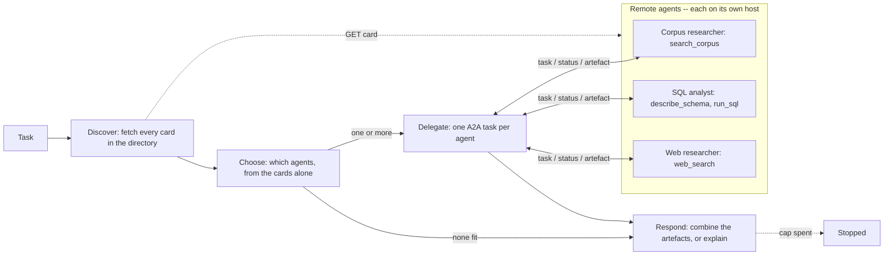
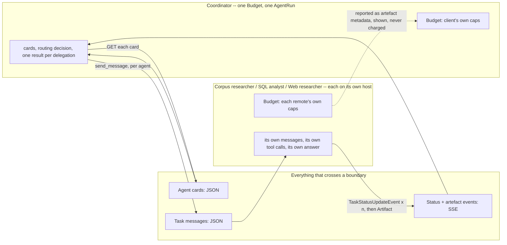

# Agent-to-agent (A2A)

## What it is

Every multi-agent technique earlier in this catalogue -- sub-agent delegation,
supervisor-worker, swarm -- assumes the agents involved share one runtime: one
process, one message bus, one set of Python objects a router or a parent can
pass around. That assumption holds as long as you control every agent in the
system. It stops holding the moment one of the agents is built and deployed by
someone else: a different team, a different company, a different stack
entirely. Agent-to-agent (A2A) is the protocol for that case -- interoperability
between *independently built and deployed* agents that agree on nothing but the
wire format.

The protocol has four moving parts. An **agent card** is a small JSON document
a server publishes at a well-known path, listing what it is, what transport it
speaks, and its **skills** -- named capabilities with a description, tags and
example prompts. A client fetches the card before it does anything else, and
everything it can safely assume about the remote agent comes from that
document, not from reading the remote's code (which it typically can't). A
**task** is what a client creates by sending the remote agent a message; it
moves through a small state machine -- `submitted` -> `working` -> (
`input-required` or `auth-required`, if the remote needs something back) ->
a terminal state, `completed`, `failed` or `canceled`. While a task is
`working`, the remote can stream **status updates**, each optionally carrying a
short human-readable message, so a client watching a long-running task sees
real progress rather than one opaque wait. When the task finishes, the remote
returns an **artefact** -- typed content (text, structured data, a file
reference) that is the actual deliverable, distinct from the status messages
along the way.

The design choice worth noticing is what a task carries and what it doesn't.
A message to a remote agent has to be self-contained -- there is no shared
context to lean on, so anything the remote needs has to be stated in the
message itself. And a client can only ever act on what a remote's card claims
and what its artefact reports; it has no way to inspect the remote's reasoning,
its intermediate tool calls, or whether its answer is actually correct. Trust
in a card's claims, and trust in an artefact's content, is the whole basis of
the interaction -- which is exactly the trade-off that makes A2A a genuinely
different technique from anything that shares a process, not just a more
elaborate version of one.

## Control flow

The dotted edge is the card fetches, one per host; the solid two-way edges
are A2A tasks -- a message out, then status updates and an artefact back -- and
the page's map lights up only the agents a run actually sent a task to.
`discover` makes no model call at all -- it is one plain HTTP request per
address in the directory, and an address that doesn't answer is simply an
agent whose card was never read. `choose` is the one decision every A2A client
has to make that a single-agent loop never does: given only what the cards
list, which part of the task goes to which agent, with what self-contained
message -- or does nothing fit at all? `delegate` is the protocol leg proper,
once per chosen agent: send the message, then consume status and artefact
events as they stream back until that task reaches a terminal state or the
client's own deadline runs out. `respond` writes the final answer from
everything that came back -- artefacts, failures, and agents that were never
reachable -- and says which part of the task each one covers or couldn't.

## State and memory

Nothing is checkpointed and nothing pauses -- this demo never resumes from a
gate, unlike HITL gates or Escalation, so there is no `resume()` and no
MongoDB saver. Every `Budget` -- the client's and each remote's -- lives only for one
`run()` call. The important separation isn't Python scope, though -- it's that
a remote's `messages` list, its tool calls, and its own `Budget` are never
Python objects the client -- or another remote -- can see or touch, even though (in this demo) they
happen to live in the same process. The only channel between the two is the
serialized JSON on the arrows above, exactly as it would be if `wire` were a
real HTTP connection between separate hosts. The three remotes don't know each
other exist: only the coordinator reads all three cards.

## Strengths

- **The only multi-agent technique in this catalogue that doesn't require
  controlling both agents.** Every other multi-agent demo here assumes one
  team builds every agent in the system; A2A is what lets a client built today
  delegate to a remote agent built next year, by someone else, as long as both
  sides speak the protocol.
- **The card makes capability discovery explicit and inspectable.** A client
  doesn't need to read the remote's code, guess at its prompt, or hard-code
  what it can do -- the card states it, and `choose` in this demo routes from
  exactly those documents. Which agent gets the sales-database half of a
  question and which gets the public-guidance half is visibly grounded in what
  each card says it can and can't do, not in a hard-coded rule.
- **Specialists stay independent.** Adding a fourth agent is adding a host to
  the directory; nothing in the coordinator or the other three changes.
- **Streaming status makes a long remote call legible instead of opaque.**
  A client watching `submitted -> working -> working -> completed` knows the
  remote is making progress, not stuck -- the same reason a human on a support
  call wants to hear "still looking into it" rather than silence.

## Limitations

- **Latency and an extra network hop, on every single delegated call.** A
  protocol round trip -- serialize, send, deserialize, and back -- costs more
  than an in-process function call or even an in-process sub-agent handoff,
  and that cost is paid whether or not the remote's actual work is fast.
- **Trust in a card's claims is unenforced.** Nothing stops a card from
  listing a skill the remote agent doesn't actually deliver well, or from
  going stale after the remote changes -- A2A defines how capabilities are
  *announced*, not how they're *verified*.
- **No shared context means every message has to be self-contained.** A
  subtask that quietly depends on context the client has but didn't think to
  pass along fails inside the remote agent in a way that's much harder to
  debug than an in-process miss, because there's no shared history to inspect
  afterwards -- only the message that was actually sent.
- **Error semantics across a process boundary are coarser than a local
  exception.** A remote agent that's down, a remote agent that fails mid-task,
  and a remote agent that succeeds but answers badly all have to be told apart
  from the client side using only what the protocol reports -- there's no
  stack trace to read, only a task state and, if the remote bothered to
  provide one, a status message.
- **Routing from cards over-delegates.** A card says what an agent *can* do,
  and a coordinator reading three helpful-sounding cards tends to find a way to
  use them. Asked to book a meeting room -- which no card can do -- the
  coordinator in this demo repeatedly sent "research about booking rooms" to the
  corpus and web agents rather than delegating nothing, even when its prompt
  said not to. Every such call costs a remote's whole budget.
- **A client can act only on what an artefact reports, never on how the
  remote got there.** This is the same limitation Sub-agent delegation (Step
  8) has for its own sub-agents, sharper here: at least an in-process
  sub-agent's failure mode is visible in the same codebase; a remote agent's
  is not visible at all.

## Where to use it

Anywhere the agents that need to cooperate are not going to be built, deployed
or owned by the same team -- a marketplace of specialist agents, a vendor's
agent your own system needs to call, an internal platform team publishing a
shared capability for other teams' agents to discover and use without a
shared codebase. It is a poor fit for anything that's actually one team's
system with an artificial process boundary drawn through it: if you own both
sides, Sub-agent delegation or Supervisor-worker give you the same
capability-isolation benefits without paying a network hop and a serialization
boundary for no real independence.

## In this demo

- **`a2a-sdk[http-server]==1.1.5`** (the official Python SDK), pinned
  alongside this repo's other dependencies. This SDK version's protocol types
  are protobuf messages (`a2a.types.a2a_pb2`), not the plain-JSON dataclasses
  older (0.x) examples use, and `a2a.server.apps` -- what older examples build
  a server from -- does not exist in 1.x; the server is assembled instead from
  `a2a.server.routes` (`create_agent_card_routes`, `create_jsonrpc_routes`)
  mounted on a plain Starlette app.
- **In-process transport, not four processes.** Each remote's Starlette app
  (`remote.build_app(key)`) answers on its own host name
  (`corpus-researcher.a2a.local`, `sql-analyst.a2a.local`,
  `web-researcher.a2a.local`); `HostRouterTransport` in `agent.py` plays DNS,
  handing each request to the right app through `httpx.ASGITransport` -- no
  port, no thread, no `uvicorn`. This is the one place this demo differs from a
  real deployment, where each agent is its own service; here the "network" is
  one Python call stack. Everything above
  that line -- the card, the task lifecycle, the message format, the
  streaming events -- is the real protocol, unchanged.
- **`remote.py` holds the three remote agents end to end**, each described once
  as a `RemoteSpec`: its `AgentCard` (exactly one skill, and a description that
  says what it *can't* do as well as what it can), its tools (`search_corpus`;
  `describe_schema` + `run_sql`; `web_search`), its prompt, and what it reports
  as evidence (source files; the SQL that returned rows; URLs). One shared
  hand-built LangGraph tool loop runs each, wrapped in an `AgentExecutor` that
  publishes one `working` update per tool call, then `completed` with an
  `Artifact` (answer text plus an evidence data part) or `failed` with a plain
  reason. `agent.py` imports only `remote.DIRECTORY` -- the list of addresses,
  the one thing a real client is given up front -- and `remote.build_app()`.
- **A last step kept for the answer.** On its final step a remote calls the
  model with no tools bound and is told to answer from what it has. Without
  this the web researcher kept rephrasing its search until its own step cap
  failed the task, with nothing to show for five searches.
- **Separate budgets.** Each remote's `Budget` is built from its own
  `a2a_remote_max_steps` cap (default 6, `A2A_REMOTE_MAX_STEPS` in the
  environment file) plus the shared token/deadline defaults -- never anything
  carved from the client's. Its spend is reported as metadata on its final
  artefact and shown on the page, but never added to the client's own budget
  strip; a remote cap ends its task `failed` with the cap named in the status
  message. The client's own budget covers its two model calls (`choose`,
  `respond`) as usual, plus one `tool_calls` charge per delegated round trip; the wait for a terminal status is bounded by the
  client's own remaining deadline (`asyncio.wait_for`), and a timeout there
  becomes an `ERROR[timeout]` observation, not a crash.
- **The raw protocol log is the subject of the page.** `RecordingTransport`
  (in `agent.py`) wraps whichever transport the client is using and records
  every exchange -- method, path, JSON request body, and every SSE `data:`
  frame as it streams -- without altering what the SDK actually sees; it
  passes bytes through rather than buffering and replaying them, because an
  earlier, simpler version that did buffer-and-replay silently dropped the
  final SSE frame. The page renders this log beside the trajectory (two
  columns on wide screens), each entry numbered, with `st.json` for the
  bodies. `AgentRun` has no field for a second transcript, so the log is
  carried in the `args` of one `observe` row (`tool="protocol_log"`) and
  pulled back out by `agent.protocol_log()` -- the same rebuild-from-the-track
  approach Swarm's `custody_table` uses, rather than a new core field.
- **Trajectory rows.** Client rows use `agent="coordinator"`. Remote rows
  arrive only as protocol data, never shared memory: each status-update event
  becomes an `observe` row and the artefact's arrival becomes a `decide` row,
  each tagged with that remote's key (`corpus-researcher`, `sql-analyst`,
  `web-researcher`) and `parent_index` set to its `handoff` row's index, so
  they render indented under the delegation that produced them. Delegations
  run one after another rather than concurrently for exactly that reason: each
  remote's rows stay together under its own handoff. `agent.status_chips()`
  rebuilds one `submitted -> working (n) -> completed` strip per remote from
  those rows' own `args`. A delegation naming an agent no reachable card
  carries is skipped as an `ERROR[bad_argument]` observation.
- **Two sidebar settings.** *Offline* (any of the three): that host's
  transport raises `httpx.ConnectError` on every request, so its card is
  never read; `choose` is told which addresses didn't answer and has to route
  around them, and the answer says which part of the task went unanswered --
  no traceback (ground rule 10). *Fails mid-task* (one agent, or nobody): that
  remote's executor raises after its first tool call and catches the
  exception itself, publishing `failed` through `TaskUpdater` rather than
  letting the connection die -- confirmed against the SDK directly: an
  *uncaught* exception inside `AgentExecutor.execute()` surfaces to the client
  as a JSON-RPC transport error, not as a terminal status event.
- **Presets**, each chosen for the route it should produce: (1) corpus + SQL
  -- 374 Metal tracks in `chinook.db` against the HX-40's 840 samples/hour
  sustained (`fsb-114-thermal-derating.md`); (2) corpus + web -- the 840/h
  planning figure plus public room-temperature guidance; (3) all three -- the
  FSB-114 figure, the top billing country (USA, 523.06) and public guidance;
  (4) SQL only -- 412 invoices. Preset 1 with *SQL analyst* offline shows the
  coordinator declining to push a database question onto an agent whose card
  says it has no database.
- **Storage:** `a2a_runs` only. No checkpointer, `thread_id=None` -- this
  demo never pauses and never resumes. `Clear my data` empties it.
- **Tracing:** `run()` carries Langfuse's `@observe` decorator, a no-op
  passthrough when no Langfuse keys are set.
