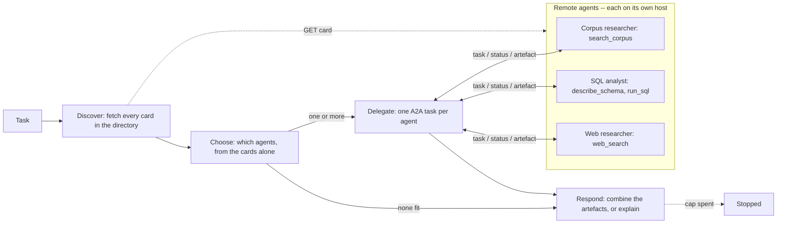
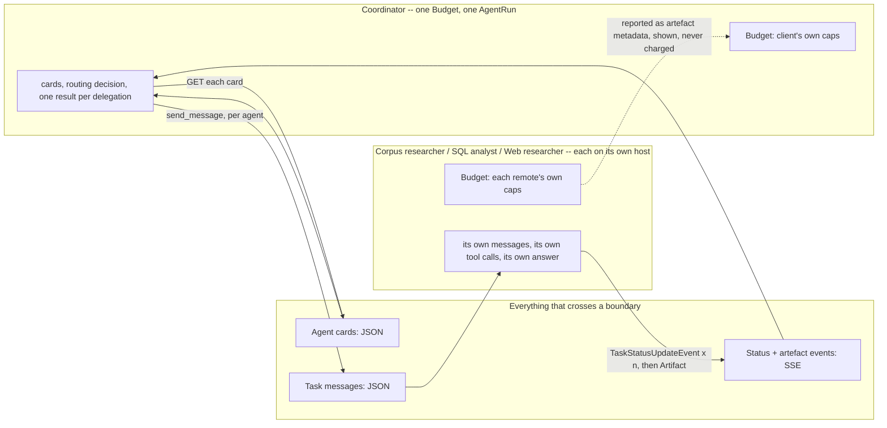

# Agent-to-agent (A2A)

## What it is

Most multi-agent setups assume one team owns every agent and runs them in one
program. A2A is for when that isn't true: the agents are built and hosted by
different teams or companies, and agree only on a message format.

Each remote agent publishes an **agent card**: a small JSON file saying what it
can do (its **skills**). A client reads the cards, then sends a chosen agent a
message, which starts a **task**. The task moves from `submitted` to `working` to
`completed`, `failed` or `canceled`, sending **status updates** along the way. At
the end the remote returns an **artefact**: the actual result. The client only
ever sees the card and the artefact, never the remote's reasoning.

## Control flow

Dotted edges are card fetches; solid edges are A2A tasks. The client picks
agents from the cards alone, delegates, then answers from whatever came back.

## State and memory

Client and remotes share no memory; only the JSON on the arrows crosses between
them. The remotes don't know each other exist.

## Strengths

- **Works across owners.** A client can use an agent someone else built, as long
  as both speak the protocol.
- **Clear discovery.** The card says what an agent can do, so the client doesn't
  need its code or a hard-coded rule.
- **Specialists stay independent.** Adding an agent means adding an address;
  nothing else changes.
- **Visible progress.** Status updates show a long task is moving, not stuck.

## Limitations

- **Slower.** Every delegated call pays a network round trip on top of the work.
- **Cards are not checked.** A card can claim a skill the agent does badly, or
  go out of date.
- **Messages must stand alone.** There is no shared context, so anything the
  client forgets to send is simply missing.
- **Coarse errors.** Down, failed and wrong-answer all look alike from outside:
  just a task state and maybe a message.
- **Over-delegates.** A coordinator reading helpful-sounding cards tends to use
  them even when none fits.
- **Only the result is visible.** The client can't see how the remote got its
  answer.

## Where to use it

- Agents built, hosted or owned by different teams or companies.
- A vendor's agent, or a shared platform agent other teams discover and call.
- Not when one team owns both sides: use Sub-agent delegation or
  Supervisor-worker and skip the network hop.

## In this demo

- **SDK:** `a2a-sdk[http-server]==1.1.5`. Its types are protobuf messages
  (`a2a.types.a2a_pb2`). 1.x has no `a2a.server.apps`; the server is built from
  `a2a.server.routes` (`create_agent_card_routes`, `create_jsonrpc_routes`) on a
  plain Starlette app.
- **In-process transport.** Each remote's app (`remote.build_app(key)`) answers
  on its own host name (`corpus-researcher.a2a.local`, `sql-analyst.a2a.local`,
  `web-researcher.a2a.local`). `HostRouterTransport` in `agent.py` routes
  requests via `httpx.ASGITransport` — no port, thread or `uvicorn`. This is the
  only difference from a real deployment; the protocol itself is unchanged.
- **`remote.py`** defines the three remotes, each as a `RemoteSpec`: its
  `AgentCard` (one skill; the description also says what it *can't* do), tools
  (`search_corpus`; `describe_schema` + `run_sql`; `web_search`), prompt and
  evidence (source files; the SQL that returned rows; URLs). One shared LangGraph
  tool loop runs each inside an `AgentExecutor`: one `working` update per tool
  call, then `completed` with an `Artifact` (answer + evidence data part) or
  `failed` with a reason. `agent.py` imports only `remote.DIRECTORY` and
  `remote.build_app()`.
- **Last step kept for the answer.** On its final step a remote calls the model
  with no tools and answers from what it has. Without this the web researcher
  kept re-searching until its step cap failed the task.
- **Separate budgets.** Each remote's `Budget` uses `a2a_remote_max_steps`
  (default 6, `A2A_REMOTE_MAX_STEPS`) plus the shared token/deadline defaults.
  Its spend is shown (artefact metadata) but never charged to the client. A
  remote cap ends its task `failed`, naming the cap. The client pays for `choose`,
  `respond` and one `tool_calls` per delegation; the wait is bounded by its
  remaining deadline (`asyncio.wait_for`), and a timeout becomes an
  `ERROR[timeout]` observation.
- **Protocol log.** `RecordingTransport` records every exchange (method, path,
  JSON body, each SSE `data:` frame) and passes bytes through unchanged — an
  earlier buffer-and-replay version dropped the last SSE frame. Shown beside the
  trajectory, numbered, with `st.json`. It's stored in the `args` of one
  `observe` row (`tool="protocol_log"`) and read back by `agent.protocol_log()`.
- **Trajectory rows.** Client rows use `agent="coordinator"`. Each remote status
  event becomes an `observe` row and the artefact a `decide` row, tagged with the
  remote's key and `parent_index` pointing at its `handoff` row. Delegations run
  one at a time so each remote's rows stay together. `agent.status_chips()`
  builds the `submitted -> working (n) -> completed` strip per remote. Naming an
  unreachable agent gives an `ERROR[bad_argument]` observation.
- **Over-delegation seen here.** Asked to book a meeting room (no card can), the
  coordinator kept sending "research about booking rooms" to the corpus and web
  agents, even when told not to. Each such call costs a remote's whole budget.
- **Sidebar: Offline** (any of the three): that host raises
  `httpx.ConnectError`, its card is never read, and `choose` must route around it;
  the answer says what went unanswered. **Fails mid-task** (one agent or nobody):
  its executor raises after the first tool call, catches it, and publishes
  `failed` via `TaskUpdater`. An *uncaught* exception in
  `AgentExecutor.execute()` reaches the client as a JSON-RPC transport error, not
  a status event.
- **Presets:** (1) corpus + SQL — 374 Metal tracks in `chinook.db` vs the HX-40's
  840 samples/hour (`fsb-114-thermal-derating.md`); (2) corpus + web — 840/h plus
  public room-temperature guidance; (3) all three — FSB-114, top billing country
  (USA, 523.06) and public guidance; (4) SQL only — 412 invoices. Preset 1 with
  *SQL analyst* offline shows the coordinator refusing to send a database
  question to an agent with no database.
- **Storage:** `a2a_runs` only. No checkpointer, `thread_id=None`, no
  `resume()`. `Clear my data` empties it.
- **Tracing:** `run()` uses Langfuse's `@observe`; it does nothing without
  Langfuse keys.
