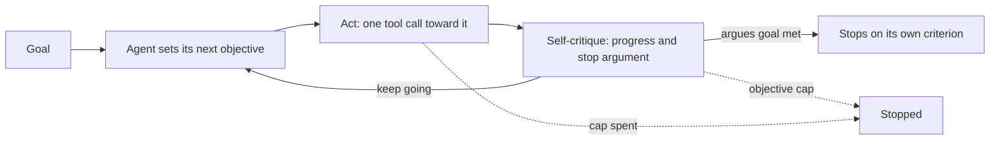
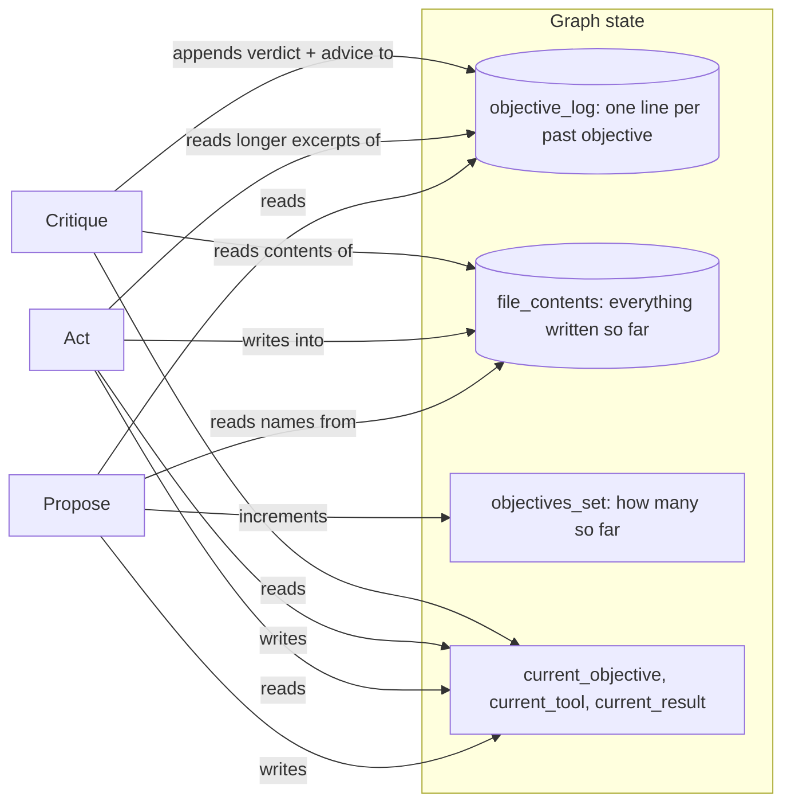

# Autonomous goal loop

## What it is

The AutoGPT / BabyAGI lineage: instead of a task, the agent is given a goal, and
it writes its own task list one item at a time. Each cycle has three parts. The
agent proposes the single next objective that would move it toward the goal.
It acts on that objective, ordinarily with one tool call. Then it critiques its
own result — did this actually advance the goal, and, if so, is the goal now met?
If the critique argues the goal is met, with something specific to point to, the
run stops. If not, it proposes the next objective and goes again.

The defining feature of this technique is not the loop — every agentic pattern in
this app loops — it is where the stopping signal comes from. Reflexion's
evaluator judges an attempt against the task. Plan-and-Execute's replanner judges
a step against a plan someone else wrote first. Here, the same model that is
pursuing the goal is also the only judge of whether it has reached it, on every
cycle, with no plan, no external evaluator and no ground truth to check against.
That is what makes this the failure mode as much as the technique: a model
grading its own homework, forever, is a well-known way to get a run that never
honestly stops.

Two more choices push in the same direction, deliberately, because they are what
real AutoGPT-style agents do and why they spin. First, the agent's memory between
cycles is not the full conversation — it is a compressed objective log, one line
per past objective: what it was, a one-line result, the critique's verdict. A
compressed log forgets the texture of what was tried, which is exactly how a
model ends up proposing something it effectively already tried. Second, nothing
external ever tells the loop it is done — no test suite, no human, no checkable
fact it doesn't already control the checking of. Both are true to the technique
as it is normally built, and both are why it needs a budget more than it needs a
smarter model.

## Control flow

## State and memory

There is no checkpoint and no long-term memory across runs — the graph runs start
to finish in one call, and everything above lives only in `StateGraph` state for
the duration of that one run. What makes this demo's memory worth diagramming
separately from every other single-run demo is what it deliberately leaves out:
`propose` never sees the raw tool outputs, the raw critiques, or the message
history that produced `objective_log` — only the compressed one-line-per-objective
summary. That compression is not a limitation of the implementation; it is the
mechanism this demo exists to show failing.

## Strengths

- **No plan required up front.** Unlike Plan-and-Execute, nothing has to be
  known about the shape of the task before starting — useful when the shape
  genuinely cannot be known yet.
- **Self-correcting in the short run.** A critique that catches "no_change" and
  says what to focus on next can meaningfully improve the following objective,
  the same verbal-feedback mechanism Reflexion uses for a single attempt,
  applied across a whole open-ended goal.
- **The spin is legible, not hidden.** Every repeated action, near-duplicate
  objective and no-progress streak lands on the track as its own row, with the
  pair it matches — a reader watches the failure happen instead of only seeing
  a budget number climb.
- **Degrades to a bounded cost.** Whatever else goes wrong, the objective cap
  and the shared budget caps guarantee the run ends and says why.

## Limitations

- **No external signal of done, ever.** The critique is the only judge, and it
  is the same model that just did the work being judged — it shares whatever
  the actor got wrong, including believing something is finished when it isn't.
  This is inherent to the technique, not a bug in this implementation.
- **Compressed memory forgets the texture of what was tried.** A one-line
  result per objective is enough to avoid a byte-for-byte repeat, not enough to
  avoid rephrasing the same objective in different words — which is exactly
  what the near-duplicate tally is built to catch.
- **Objectives drift.** With no plan to check against, each objective is only
  as anchored to the goal as the last one's critique managed to keep it; over
  enough cycles a goal like "find every interesting pattern" has no natural
  edge to stop at, so the objectives wander rather than converge.
- **A plausible stop argument is not a correct one.** `goal_met` requires a
  citation of what was produced, which rules out an empty or vague claim, but
  it does not verify the citation is actually true — the critic can be
  confidently wrong the same way the actor can.
- **Cost scales with how long the goal resists being finished.** Three model
  calls per objective, times however many objectives it takes to either
  satisfy the critique or exhaust the cap — for an open-ended goal, that is
  always the cap, spent in full.
- **The honest fix is not "make the model smarter."** The budget, not the
  agent, is the real stop — Preset 2 and Preset 3 exist to make that failure
  visible rather than to be solved by a better prompt.

## Where to use it

Use it for bounded exploration where the value is in what the agent finds along
the way and a hard budget is an acceptable price for not having to write a plan
first — triage of an unfamiliar dataset, a first pass over a document set, a
scratch investigation you would otherwise do by hand in a notebook. Do not use
it for anything that needs a checkable definition of done: reach for
Plan-and-Execute (Step 3) when the shape of the task is knowable up front, for
Reflexion (Step 4) when there is one attempt worth judging rather than an
open-ended goal, or for escalation (Step 7) when the honest move on an
unresolvable task is to stop and ask a person rather than let a model keep
grading itself.

## In this demo

- **LangGraph `StateGraph`, hand-built**, the same choice Steps 3 and 4 made:
  propose, act and critique are three distinct prompts with three distinct
  jobs. `act` calls `Toolbox.call()` directly, the same way every other
  hand-built demo's executor does.
- **What each step sees.** `propose` reads the one-line log plus the critic's
  advice from the last turn (`next_focus`) -- the critique → next-objective
  hand-off that makes the loop a loop. `act` reads the same log with longer
  result excerpts, so a file it writes carries facts found earlier instead of a
  placeholder. `critique` reads the current contents of every file written, and
  is told to judge the goal as a whole against something concrete that exists
  now -- not the objective it just saw. Without those three, a first build of this
  demo declared an open-ended goal "met" after listing search hits, and declared
  the tractable one met while `summary.md` still said the answer was unknown.
- **Structured output** for `propose` (`Objective`) and `critique`
  (`Critique`); `.bind_tools(...)` for `act`. Provider fallback follows the
  `StateGraph` variant from `AGENTIC_IMPLEMENTATION_PLAN.md`: each model is
  bound to its schema or its tools first, then the bound models are chained
  with `.with_fallbacks(...)`.
- **Tools:** `search_corpus`, `describe_schema`, `run_sql`, `write_file`,
  `read_file`, `list_files` — the file tools are this demo's scratch memory,
  the only place a fact survives past its own objective's critique. **Allow
  web search** (sidebar, off by default) adds `web_search`; it is off by
  default so the three presets stay reproducible run to run.
- **The spin tally** is computed live, not only after the run: `act_node`
  recomputes `repeated_actions()` over every `act` row so far each time a tool
  call lands, and `propose_node` recomputes `near_duplicates()` over every
  objective so far each time a new one is proposed — each announcing only the
  pair that newly matches, as a `decide` row from `agent="monitor"`. The page
  recomputes both from the finished run's steps for the panel, plus
  `progress_streak()` for the third metric.
  - **Repeated action:** an `act` row whose `(tool, normalised args)` — lowercase,
    whitespace collapsed, trailing punctuation stripped, dict keys sorted —
    equals an earlier one.
  - **Near-duplicate objective:** cosine similarity between two objectives'
    `core.embeddings` (local bge-small) vectors at or above
    `AUTONOMOUS_DUP_THRESHOLD` (default `0.9`). Tuned against eight hand-written
    objective pairs drawn from this demo's own presets (four genuine paraphrases,
    four genuinely distinct objectives from the same run): the paraphrases
    scored **0.91–0.99**, the distinct pairs scored **0.44–0.65** — a clean gap,
    and `0.9` sits just above the top of it, so `0.9` was kept as the default.
    The gap is not absolute, though: a looser paraphrase ("find the throughput
    figure from the bulletin" vs. "look up the throughput from FSB-114") scored
    only **0.77** in the same check — a real near-duplicate the default
    threshold would miss. That asymmetry is closer to safe than not: this
    tally is a signal for a reader to notice, not a gate that stops anything,
    so a missed duplicate costs nothing but a slightly quieter panel, while a
    false positive would misreport an objective that was actually new work.
  - **No-progress streak:** the longest run of consecutive `no_change`
    critiques in the objective log.
  - None of the three stop the run — the budget does. The tally is the
    evidence of *why* it needed to.
- **Stopping.** The agent's own criterion: `critique` returns `goal_met=True`
  with a non-empty `stop_argument` that cites what was produced — an empty or
  vague `stop_argument` is treated as not met and said so on the track. The
  final answer is that `stop_argument` plus a summary of the files written;
  no extra "compose the final answer" model call is made, to keep an
  already-argued stop cheap. **`AUTONOMOUS_MAX_OBJECTIVES`** (default `8`) is
  this demo's own cap: once an objective that didn't argue the goal was met
  would otherwise loop back to `propose` past the cap, `critique_node` raises
  the same `BudgetExceeded` the shared caps use, with the reason
  "Stopped on the objective cap: 8 of 8 objectives set." — so it shows up on
  the track and in `AgentRun.stop_reason` exactly like a step, token or
  deadline cap would.
- **Budget:** every model call — propose, act, critique — is one step, so one
  objective costs three. The page's own default step cap,
  `AUTONOMOUS_MAX_STEPS` (`30`), gives the objective cap room to be the thing
  that actually stops an open-ended run (`8 × 3 = 24`); lowering the step cap
  in the sidebar shows that cap being named instead.
- **No checkpointer.** Nothing in this demo pauses — a run is one call to
  `compiled.invoke()` start to finish — so there is no `resume()`.
- **Storage:** finished runs go to the `autonomous_runs` collection in
  `genai_agentic_lab`. `Clear my data` empties it.
- **Tracing:** `run()` carries Langfuse's `@observe` decorator, a no-op
  passthrough when no Langfuse keys are set.
