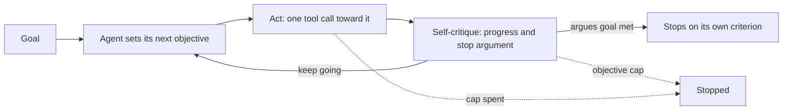
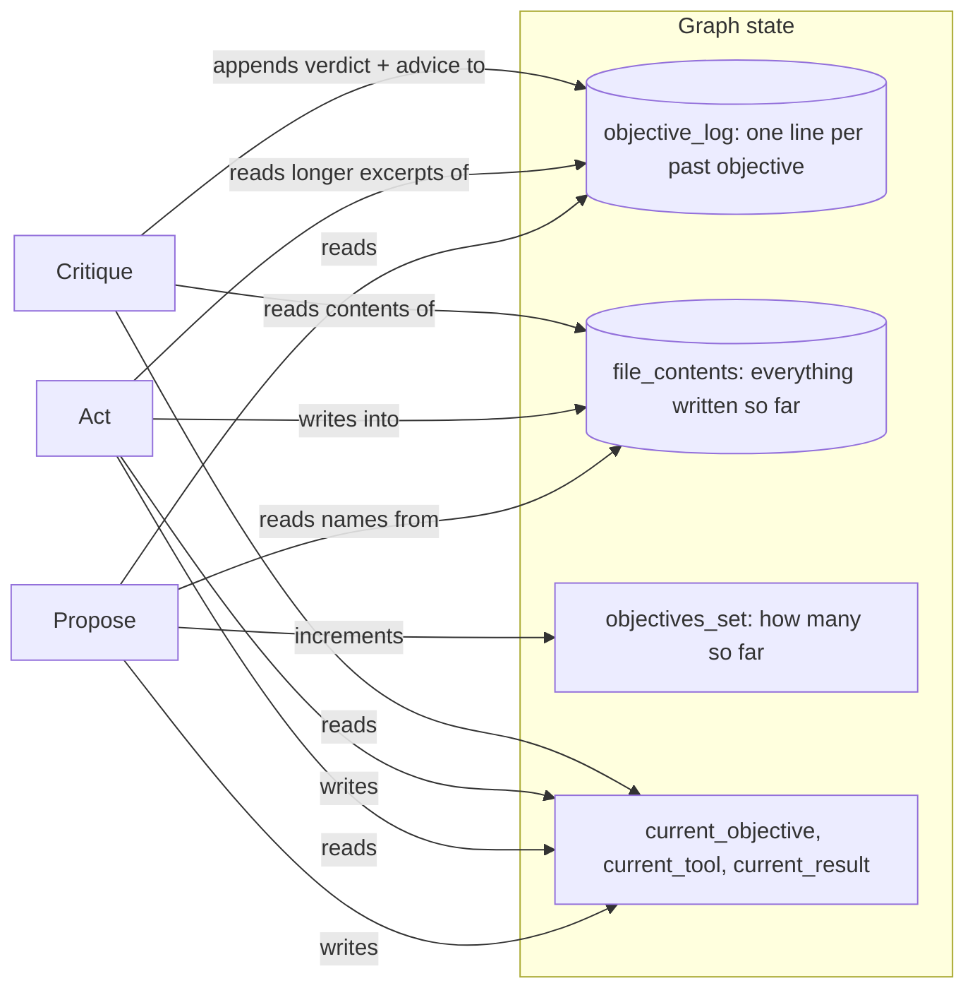

# Autonomous goal loop

## What it is

An autonomous agent (the AutoGPT / BabyAGI style) gets a goal, not a task, and
writes its own to-do list one item at a time. Each cycle it **proposes** the next
objective, **acts** on it (usually one tool call), then **critiques** its own
result: did that help, and is the goal now met? If it can point to something
concrete that meets the goal, it stops. If not, it goes again.

The catch is who decides it's done: the same model doing the work, with no plan,
no outside checker and no ground truth. Its memory is usually a short log, one
line per past objective, so it easily forgets what it already tried. That is why
it needs a budget more than a smarter model.

## Control flow

## State and memory

Memory lives only for one run. `propose` sees just the one-line-per-objective
log, never the raw tool outputs or critiques — and that loss is what makes it
repeat itself.

## Strengths

- **No plan needed.** It can start when the shape of the task isn't known yet.
- **Short-term self-correction.** A critique that says "no progress, try this"
  can improve the next objective.
- **Bounded cost.** With caps in place, the run always ends and says why.

## Limitations

- **No outside signal of done.** The judge is the same model that did the work,
  so it can believe something is finished when it isn't.
- **Short memory repeats itself.** A one-line log stops exact repeats, not the
  same idea in new words.
- **Objectives drift.** With no plan, an open goal like "find every interesting
  pattern" has no edge, so the objectives wander.
- **A convincing stop can be wrong.** Asking for evidence rules out vague claims,
  but the critic can still be confidently wrong.
- **The budget is the real stop.** Three calls per cycle; an open-ended goal
  spends the whole cap, and a better prompt doesn't fix that.

## Where to use it

- Bounded exploration where what it finds on the way is the value: triaging an
  unfamiliar dataset, a first pass over documents, a scratch investigation.
- Not when you need a checkable "done". Use Plan-and-Execute (Step 3) if the
  task's shape is known, Reflexion (Step 4) for judging one attempt, or
  Escalation (Step 7) when the right move is to stop and ask a person.

## In this demo

- **Hand-built LangGraph `StateGraph`**, as in Steps 3 and 4: propose, act and
  critique are three separate prompts. `act` calls `Toolbox.call()` directly.
- **What each step sees.** `propose`: the one-line log plus the critic's last
  advice (`next_focus`). `act`: the same log with longer result excerpts, so
  files carry real facts. `critique`: the current contents of every file, and it
  judges the whole goal against something that exists now. Without these, an
  early build called an open goal "met" after listing search hits, and the
  tractable one met while `summary.md` still said the answer was unknown.
- **Structured output** for `propose` (`Objective`) and `critique` (`Critique`);
  `.bind_tools(...)` for `act`. Fallback follows the `StateGraph` variant in
  `AGENTIC_IMPLEMENTATION_PLAN.md`: bind each model to its schema or tools
  first, then chain with `.with_fallbacks(...)`.
- **Tools:** `search_corpus`, `describe_schema`, `run_sql`, `write_file`,
  `read_file`, `list_files`. Files are the only place a fact outlives its
  objective. **Allow web search** (sidebar, off by default) adds `web_search`;
  off keeps the presets reproducible.
- **Spin tally**, computed live: `act_node` reruns `repeated_actions()` after
  each tool call and `propose_node` reruns `near_duplicates()` after each new
  objective, each posting only the newly matched pair as a `decide` row from
  `agent="monitor"`. The page recomputes both after the run, plus
  `progress_streak()`. This makes the spin visible on the track, not just a
  climbing budget number.
  - **Repeated action:** an `act` row whose `(tool, normalised args)` matches an
    earlier one (lowercased, whitespace collapsed, trailing punctuation
    stripped, dict keys sorted).
  - **Near-duplicate objective:** cosine similarity of `core.embeddings` (local
    bge-small) vectors at or above `AUTONOMOUS_DUP_THRESHOLD` (default `0.9`).
    On eight hand-written pairs from the presets, four paraphrases scored
    **0.91–0.99** and four distinct objectives **0.44–0.65**, so `0.9` was kept.
    A looser paraphrase ("find the throughput figure from the bulletin" vs.
    "look up the throughput from FSB-114") scored only **0.77** and would be
    missed. That's the safer side: the tally is a signal, not a gate.
  - **No-progress streak:** the longest run of consecutive `no_change`
    critiques.
  - None of these stop the run; the budget does.
- **Stopping.** `critique` returns `goal_met=True` with a non-empty
  `stop_argument` citing what was produced; an empty or vague one counts as not
  met, said on the track. It doesn't check the citation is true. The answer is
  that `stop_argument` plus a summary of the files — no extra model call.
  **`AUTONOMOUS_MAX_OBJECTIVES`** (default `8`): past the cap, `critique_node`
  raises the shared `BudgetExceeded` with "Stopped on the objective cap: 8 of 8
  objectives set.", shown on the track and in `AgentRun.stop_reason` like any
  cap.
- **Budget:** each model call is one step, so one objective costs three.
  `AUTONOMOUS_MAX_STEPS` (`30`) leaves room for the objective cap to stop first
  (`8 × 3 = 24`); lower the step cap in the sidebar to see it named instead.
  Presets 2 and 3 exist to show the budget, not the agent, doing the stopping.
- **No checkpointer.** A run is one `compiled.invoke()` call; no `resume()`.
- **Storage:** runs go to `autonomous_runs` in `genai_agentic_lab`. `Clear my
  data` empties it.
- **Tracing:** `run()` uses Langfuse's `@observe`; it does nothing without
  Langfuse keys.
