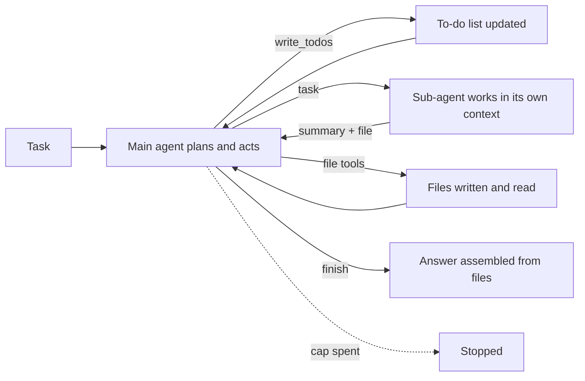
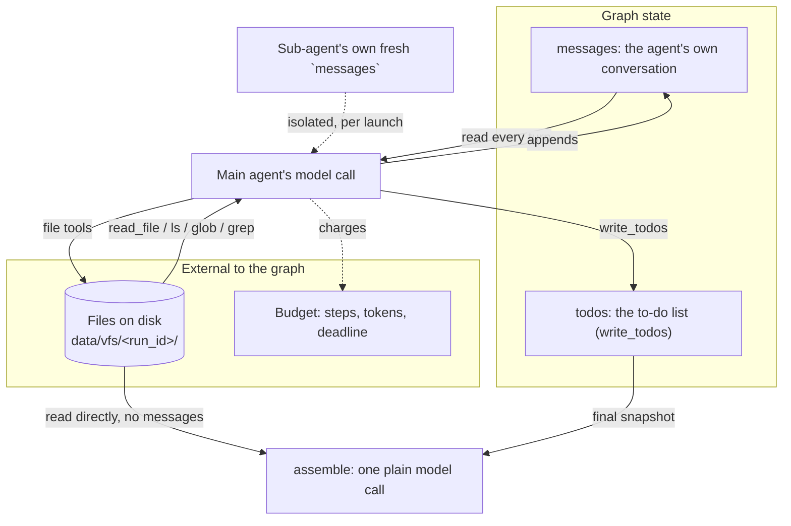

# Deep agents

## What it is

A deep agent is built for long tasks: tens of steps and several kinds of work.
"Deep" means long, not a deep neural network. It adds four things to a plain
agent loop: a **to-do list** it writes and keeps up to date, **files** to hold
detail that won't fit in the prompt, **sub-agents** that do a piece of work in
their own fresh context and send back a short summary, and a **long system
prompt** telling it to use all three.

None of these ideas is new. The name just means using all four together as the
default shape for a long task.

## Control flow

The main agent loops, updating its to-do list, using files and delegating to
sub-agents. When it stops calling tools, a separate step builds the answer from
the files.

## State and memory

Three kinds of memory: the conversation (grows fastest; sub-agents never see
it), the to-do list (replaced whole on each update), and files (the lasting
record the answer is built from).

## Strengths

- **Handles long tasks.** Files carry the detail; the prompt carries only what
  the next decision needs.
- **Visible plan.** The to-do list shows what's done, in progress or dropped, so
  you can check it against what actually happened.
- **Cheaper context.** A sub-agent's many tool calls cost the parent one short
  summary.
- **A known shape.** It's easier to compare with other deep agents than a
  custom long-running loop.

## Limitations

- **Depends on the prompt.** Nothing forces the agent to plan, use files or
  delegate; smaller models often ignore parts of a long prompt.
- **Many calls.** Each to-do update, delegation and file write is a separate
  call, so it costs more than a plain loop.
- **The list can lie.** An item marked done that wasn't is a silent failure.
- **Files go stale.** A file written early isn't re-checked if later work makes
  it wrong.
- **Summaries lose detail.** The parent never sees what a sub-agent left out.

## Where to use it

- Long, multi-part tasks with lots of intermediate material: a research brief
  from several sources, an audit across several systems, anything shaped like a
  checklist.
- Not for a short lookup: for two or three tool calls, a plain ReAct loop is
  cheaper.

## In this demo

- **Library:** `deepagents==0.7.15`, the newest that fits `langchain==1.4.1` /
  `langchain-core==1.6.3` (0.7.16+ needs `langchain>=1.4.2`, a separate
  decision). `create_deep_agent()` builds a `langgraph` graph on
  `langchain.agents.create_agent`. It's a fast-moving 0.x library: its default
  tools changed between minor versions and several APIs are beta, so pin hard and
  read the installed source, not the online docs.
- **Default tools in 0.7.15** (checked in the source; online docs are ahead of
  this pin): `ls`, `read_file`, `write_file`, `edit_file`, `glob`, `grep`,
  `execute`, `task`. **`write_todos` is no longer default** — it now lives in
  `langchain.agents.middleware.TodoListMiddleware`, wired in for the main agent
  only.
- **`execute` (shell) is never offered.** It's only registered when the backend
  implements `SandboxBackendProtocol`; the plain `FilesystemBackend` doesn't. As
  a second layer, every `FilesystemMiddleware` gets an explicit `tools=` list
  without it. Verified LLM-free with a `GenericFakeChatModel` subclass recording
  `bind_tools()`: absent for main, `researcher`, `analyst` and the auto-added
  `general-purpose` sub-agent.
- **Auto-added `general-purpose` sub-agent.** Disabling it needs a
  provider-specific `HarnessProfile`, fragile across the four-provider chain
  (Gemini, Groq, OpenAI, Ollama) and not checkable without live keys. Instead,
  the demo's `task` middleware refuses any `subagent_type` other than
  `researcher` / `analyst`, so it's registered but never runs.
- **Summarization middleware** is always attached and 0.7.15 can't remove it
  except via `HarnessProfile.excluded_middleware`. Left in place, disclosed: it
  fires at 85% of the model's context window, unlikely under the caps, but a high
  token budget on a small-context model could trigger an uncharged call.
- **File tools:** `core.tools`' `write_file` / `read_file` / `list_files` are not
  used. The library's own run on `FilesystemBackend(root_dir=<run's toolbox
  directory>, virtual_mode=True, max_file_size_mb=1)`. `virtual_mode` blocks `..`
  and roots absolute paths (`/etc/passwd`) at `root_dir` (verified LLM-free). The
  1 MB limit replaces core's 256 KB / 50-file caps here only — a documented
  exception to ground rule 5.
- **Sub-agents:** `researcher` (`search_corpus`) and `analyst`
  (`describe_schema`, `run_sql`), both plus the library file tools on the same
  backend. Tools come from `core.tools.Toolbox.as_langchain_tools(...)`, so
  failures arrive as `ERROR[kind]: ...`. At most `DEEP_AGENT_MAX_SUBAGENTS`
  (default 4) launches per run; beyond that `task` returns `ERROR[refused]:
  sub-agent cap reached ...`. Each launch is capped at `SUBAGENT_MAX_STEPS`
  (default 6) in its own `before_model` hook, stops gracefully and reports what
  it had. The sidebar "Sub-agent step cap" slider overrides it.
- **Finish guard:** an `after_model` middleware on the main agent. If the reply
  has no tool calls while any to-do is `pending` or `in_progress`, it names the
  open items and sends the model back. It never checks that a `completed` item
  is true. The schema has no `abandoned` status, so the prompt asks for
  `ABANDONED: <reason>`. The shared budget is still the hard stop.
- **`assemble`:** one plain model call after the loop, with **no message
  history** — only the task, the final to-do snapshot and the run's files from
  `data/vfs/<run_id>/` (`report.md` first, then by name, 12,000 characters max
  with a truncation note). If `report.md` is missing the answer says so. Budgeted
  like any call.
- **Trajectory:** rows come from middleware hooks (`before_model`,
  `wrap_model_call`, `wrap_tool_call`), one bundle per agent from
  `make_middleware(agent_name, ...)`, sharing one `Budget` and step list.
  `write_todos` → a `decide` row with the full snapshot in `args`; `task` → a
  `handoff` row, then an `observe` row. Sub-agent rows get `parent_index` via a
  `contextvars.ContextVar`, in case `task` calls run concurrently (none were
  seen).
- **Caps and env vars:** `deep_agent_max_subagents` / `DEEP_AGENT_MAX_SUBAGENTS`
  (4); `deep_agent_max_steps` / `DEEP_AGENT_MAX_STEPS` (30, sidebar can
  override); `subagent_max_steps` / `SUBAGENT_MAX_STEPS` (6);
  `deep_agent_max_tokens` / `DEEP_AGENT_MAX_TOKENS` (150000). The deadline
  reuses `agent_deadline_s`. Budget spent by any
  agent is charged by the demo's own middleware, not by `deepagents`.
- **Storage:** `deep_agent_runs`. No checkpointer
  (`create_deep_agent(checkpointer=None)`), no pause or resume. `Clear my data`
  also deletes this demo's `data/vfs/<run_id>/` folders, matched by run ids read
  first (never a glob-delete of `data/vfs/`).
- **Caveat:** the work tools are real, but the LLM-free check scripted
  sub-agents to call `write_file` directly, since the MongoDB corpus index and
  SQLite file weren't running in the worktree build.
- **See also:** Step 3 (Plan-and-Execute) builds the plan by hand and Step 8
  (Sub-agent delegation) builds delegation by hand, both without files.
