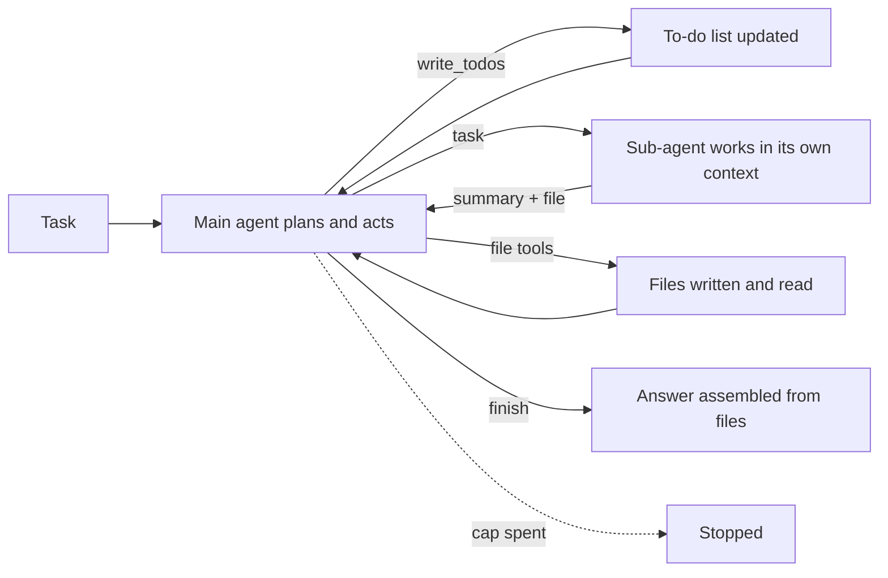
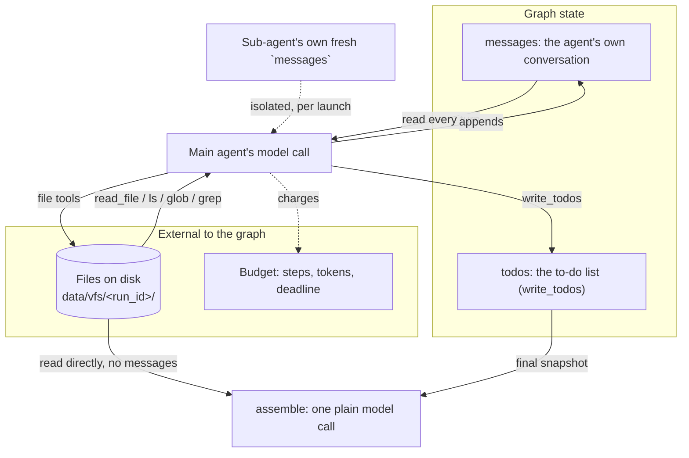

# Deep agents

## What it is

"Deep" here means long-horizon, not deep in the neural-network sense: a task
that takes tens of steps and several kinds of work, not one that a single
think-act-observe loop finishes in a handful of calls. The pattern popularised
by Claude Code, Manus and the deep-research agents combines four ingredients
that each solve a different failure mode of a plain ReAct loop on a long task:

1. **An explicit plan held in state**, not just implied by the conversation --
   a to-do list the agent writes, updates and is expected to keep honest as
   work proceeds, so a reader (and the agent itself) can see what is done,
   what is in progress, and what was dropped and why.
2. **A file system used as external memory.** A long task generates more
   intermediate detail than comfortably fits in a context window, and more
   than a reader wants replayed in every later prompt. Files hold that detail;
   the conversation holds only what the next decision needs.
3. **Sub-agents for context isolation.** A bounded piece of work -- a lookup,
   a calculation, a narrow investigation -- runs in its own fresh context with
   its own tools, and reports back a short summary rather than flooding the
   parent's history with every intermediate tool call it made.
4. **A long, specific system prompt** that spells out the operating
   discipline above -- plan first, delegate what can be delegated, write
   before you reply, don't stop with the list half-finished -- because none of
   the first three ingredients enforce themselves; the prompt is what asks the
   model to actually use them.

None of these four ideas is new on its own -- planning, external memory and
delegation all predate the term "deep agent" -- what the label names is
running all four together, deliberately, as the default shape for a
long-horizon task. `deepagents` is LangChain's packaging of that shape: one
function, `create_deep_agent()`, that wires up a to-do tool, file tools, a
sub-agent dispatch tool and a base harness, so an application builds the task
-specific pieces (the system prompt, the sub-agent specs, the tools they use)
rather than the scaffolding underneath them.

## Control flow

The main agent loops on its own: think, maybe call a tool (`write_todos`, a
file tool, or `task` to delegate), read the result, decide again. A launched
sub-agent runs the same shape in a context of its own -- its own messages, its
own tools, no visibility into the parent's conversation -- until it has an
answer, which comes back to the parent as one short result. Only once the
model stops calling tools does the run move to `assemble`, a step outside the
agent's own loop entirely (see "State and memory" below).

## State and memory

Three memory tiers, deliberately not one:

- **`messages`** is the main agent's own conversation -- what it thought,
  which tools it called, what came back -- and it is what grows fastest and
  is read on every model call. A sub-agent gets none of it; it starts from a
  fresh `messages` list holding only the delegated task description.
- **`todos`** is a separate piece of graph state, not a message -- a
  structured list the model replaces wholesale on every `write_todos` call,
  which is what makes "show every version" and "check the list is fully
  closed out" possible without parsing prose out of the conversation.
- **Files** live outside the graph's own state entirely, on disk under
  `data/vfs/<run_id>/`, written and read through tool calls the same way any
  other tool result is. `assemble` (see below) reads them directly, bypassing
  `messages` altogether -- the point of the technique is that the file system,
  not the conversation, is the durable record of what was found.

`Budget` is bookkeeping the agent never sees; every model and tool call the
library makes -- main agent, every sub-agent, including ones the library adds
automatically -- is charged against it by this demo's own middleware, not by
`deepagents` itself.

## Strengths

- Scales past what fits in one context window: files carry the detail, the
  conversation carries only what the next decision needs.
- The to-do list is a running, inspectable commitment device -- a reader (and
  the model, via the finish guard) can check whether the plan matches what
  actually happened, not just trust a closing summary.
- Sub-agents genuinely isolate cost: a five-tool-call lookup costs the parent
  one short result, not five tool calls' worth of context.
- Because the four ingredients are now a named, packaged idiom, the resulting
  agent is easier to compare against other deep-agent implementations than a
  bespoke long-horizon loop would be.

## Limitations

- **Prompt-heavy and brittle to prompt edits.** Nothing about `write_todos`,
  file discipline or delegation is enforced by the graph itself -- it all
  rests on the system prompt asking for it, and a smaller or less capable
  model routinely ignores parts of a prompt this long.
- **Many calls.** A to-do write, a delegation, and a file write are each a
  separate model or tool call; the same task done in one hand-written ReAct
  loop is usually cheaper in steps and tokens, at the cost of the isolation
  and durability this pattern buys.
- **The to-do list can drift from reality** -- an item marked `completed`
  that was not actually finished is a silent failure the graph cannot catch;
  this demo's finish guard only checks that nothing is left `pending` or
  `in_progress`, never that a `completed` item is true.
- **Files go stale.** A sub-agent's file reflects what was true when it wrote
  it; nothing re-checks it later in the same run, and a long run can easily
  end up assembling an answer from a file that a subsequent step quietly
  invalidated.
- **Sub-agent summaries are lossy by design** -- the isolation that keeps the
  parent's context small also means the parent never sees whatever the
  sub-agent discarded on the way to its one-paragraph reply.
- **A fast-moving 0.x library.** `deepagents` changed its own default tool
  set between minor versions during this build (see "In this demo"), and its
  own docs note the beta status of several of the APIs this demo relies on.
  Pinning hard, and re-reading the installed source rather than trusting
  online docs, is not optional at this stage of the library's life.

## Where to use it

Tasks that are long, multi-part, and produce more intermediate material than
a reader wants to see inline: a research brief drawn from several sources, an
audit that touches several unrelated systems, anything with a natural
checklist shape. Not a good fit for a short, single-purpose lookup -- the
planning and delegation overhead costs more than a plain ReAct loop for a
task that finishes in two or three tool calls.

## In this demo

**Library and pin.** `deepagents==0.7.15` -- the newest release that still
fits this repo's `langchain==1.4.1` / `langchain-core==1.6.3` pins (0.7.16+
need `langchain>=1.4.2`, a separate decision). `create_deep_agent()` builds a
compiled `langgraph` graph on top of `langchain.agents.create_agent`.

**What the installed 0.7.15 API actually gives, verified by reading the
source rather than the online docs (which are ahead of this pin):**
`create_deep_agent()`'s default tool set is file tools (`ls`, `read_file`,
`write_file`, `edit_file`, `glob`, `grep`), `execute`, and `task` --
**`write_todos` is no longer included by default.** It moved out of
`deepagents` and into `langchain.agents.middleware.TodoListMiddleware`
sometime before this release, so this demo wires it in explicitly (only for
the main agent -- the sub-agents plan nothing of their own).

**What was removed or overridden, and how:**

- **`execute` (the shell tool).** Never offered to any model. `deepagents`
  only registers `execute` when the configured backend implements
  `SandboxBackendProtocol` (`deepagents/backends/protocol.py`); this demo's
  backend is a plain `FilesystemBackend`, which does not, so the tool is
  never added in the first place -- for the main agent, both sub-agents, and
  the library's own auto-added general-purpose sub-agent (it shares the same
  backend). As a second, redundant layer, every `FilesystemMiddleware` this
  demo builds is also constructed with an explicit `tools=` list that omits
  `execute` by name. Verified LLM-free: a graph built on a scripted
  `GenericFakeChatModel` subclass that records every `bind_tools()` call
  shows `execute` absent from the main agent, `researcher`, `analyst`, and
  the auto-added `general-purpose` sub-agent.
- **The auto-added `general-purpose` sub-agent.** `create_deep_agent()` adds
  one automatically unless a spec named `general-purpose` is supplied or a
  provider-specific `HarnessProfile` disables it. Registering that profile
  reliably across this app's four-provider fallback chain (Gemini, Groq,
  OpenAI, local Ollama) is fragile and cannot be verified without live
  provider credentials, which are unavailable in a worktree build. Instead,
  this demo's own `task`-tool middleware refuses any `subagent_type` other
  than `researcher` or `analyst` before dispatch -- the general-purpose
  sub-agent is registered by the library but never actually runs. It still
  inherits the no-`execute` guard above regardless, verified the same way.
- **Summarization middleware.** `create_deep_agent()` always attaches one
  (main agent, each sub-agent, and the general-purpose sub-agent), and 0.7.15
  has no caller-facing parameter to remove it -- only a provider-keyed
  `HarnessProfile.excluded_middleware`, the same fragility as above. It is
  left in place, undisclosed cost accepted rather than hidden: its default
  trigger is 85% of the model's own context window, far above what this
  demo's capped runs are likely to reach, but if a run's token budget is
  raised high enough on a small-context model it could still fire an
  uncharged model call. This is a known, disclosed gap, not a silent one.
- **Core's own file tools (`core.tools`' `write_file` / `read_file` /
  `list_files`) are not used by this demo at all.** The library's own file
  tools replace them, backed by `FilesystemBackend(root_dir=<this run's
  toolbox directory>, virtual_mode=True, max_file_size_mb=1)`. `virtual_mode`
  blocks `..` traversal outright and treats an absolute-looking path
  (`/etc/passwd`) as rooted at `root_dir`, not the real filesystem -- verified
  LLM-free by calling the backend directly. The library's own per-file limit
  (1 MB) replaces core's 256 KB / 50-file caps for this demo only; that is a
  documented exception to ground rule 5, not an oversight (see the plan).

**Sub-agents.** `researcher` (tool: `search_corpus`) and `analyst` (tools:
`describe_schema`, `run_sql`) -- both also get the library's file tools on
the same confined backend, so a sub-agent's findings reach the parent as a
file plus a one-paragraph summary, not a wall of tool output. Both work tools
come from `core.tools.Toolbox.as_langchain_tools(...)`, so a tool failure
still arrives as the same `ERROR[kind]: ...` observation every other demo
produces. Launches are capped at `DEEP_AGENT_MAX_SUBAGENTS` total per run
(config `deep_agent_max_subagents`, default 4); beyond the cap, `task`
returns `ERROR[refused]: sub-agent cap reached ...` instead of running.
Each launch is separately capped at `SUBAGENT_MAX_STEPS` (config default 6)
steps of its own, enforced in its own `before_model` hook -- a launch that
hits it stops gracefully (not an exception) and reports back whatever it
had. The sidebar's "Sub-agent step cap" slider overrides this per run.

**The finish guard.** A demo-local `after_model` middleware on the main agent
only: when the model's reply carries no tool calls while any to-do is
`pending` or `in_progress`, it appends a message naming the open items and
jumps back to the model instead of letting the run end. This is what makes
"every to-do item ends `completed` or explicitly abandoned" hold by
construction rather than by prompt compliance alone -- the system prompt
asks for the `ABANDONED: <reason>` convention (there is no separate
`abandoned` status; the to-do schema only has `pending` / `in_progress` /
`completed`), and the finish guard is the backstop that keeps the model from
just walking away from an open item. The shared step/token/deadline budget is
still the hard stop if the model and the guard loop for too long.

**`assemble`.** After the deep agent's own loop ends (however it ends), one
plain model call runs with **no access to the agent's own message
history** -- its input is the task, the final to-do snapshot, and the run's
files read fresh from `data/vfs/<run_id>/` (`report.md` first if present,
then the rest by name, capped at 12,000 characters total with a truncation
note if that cuts a file short or drops later ones). This is deliberate: the
point of the technique is that the files are the durable record, so the
answer is built from them, not from whatever the conversation happens to
still contain. If `report.md` is missing, the answer says so and works from
whatever files exist. This call is budgeted like any other model call.

**Trajectory.** Every row comes from middleware hooks (`before_model`,
`wrap_model_call`, `wrap_tool_call`), not from parsing the final message
list -- a `make_middleware(agent_name, ...)` factory builds one three-hook
bundle per agent (`main`, `researcher`, `analyst`), all closing over the same
shared `Budget` and step list. `write_todos` becomes one `decide` row per
call, `args` holding the full snapshot (so every version survives on the
saved record); `task` becomes a `handoff` row followed by an `observe` row
once the sub-agent returns. A sub-agent's own rows get `parent_index` set to
that `handoff` row's index via a `contextvars.ContextVar` holding "whichever
handoff is currently in flight" -- a `ContextVar` rather than a shared
variable because the library's own tool node can in principle run several
`task` calls concurrently; no concurrency was actually observed in this
build's LLM-free verification (every scripted run delegated one sub-agent at
a time), but the mechanism does not depend on that.

**Caps and env vars.** `deep_agent_max_subagents` / `DEEP_AGENT_MAX_SUBAGENTS`
(default 4) -- total sub-agent launches per run. `deep_agent_max_steps` /
`DEEP_AGENT_MAX_STEPS` (default 30) -- this page's own step-cap default (the
sidebar can still override it per run, like every other demo). Sub-agents
reuse the existing `subagent_max_steps` / `SUBAGENT_MAX_STEPS` (default 6) as
their own per-launch cap. Token budget and deadline reuse the shared
`agent_max_tokens` / `agent_deadline_s` defaults.

**Collection.** `deep_agent_runs`. No checkpointer -- this demo does not
pause or resume (`create_deep_agent(checkpointer=None)`); `Clear my data`
also deletes this demo's `data/vfs/<run_id>/` directories, matched against
run ids read from `deep_agent_runs` before the clear (never a glob-delete of
`data/vfs/`).

**Caveats.** Every sub-agent's work tool (`search_corpus`, `describe_schema`,
`run_sql`) is real; the LLM-free verification for this build instead scripted
the sub-agents to call `write_file` directly, since exercising the real
corpus/SQL tools needs the bundled MongoDB corpus index and SQLite file that
a plain worktree build does not have running -- see the implementation
report for what was and was not exercised without a live model.

See Step 3 (Plan-and-Execute) for the hand-built version of the planning
loop, and Step 8 (Sub-agent delegation) for the hand-built version of the
delegation -- both without a file system, which is the one ingredient
neither of those steps needed.
