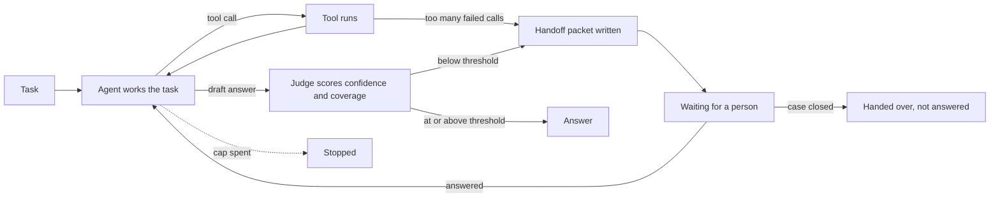
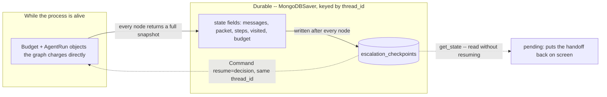

# Escalation and handoff

## What it is

An agent that always answers, even when it has no grounds to, is dangerous.
Escalation lets an agent say "I need help." A separate **judge** checks the draft
against something concrete, such as "is every claim backed by what was found?".
If the draft falls short, or the tools keep failing, the agent stops and hands
the task to a person.

The handoff is a **packet**: what was asked, what was tried, what was found, and
one question that would unblock it. When the person answers, the agent picks up
where it left off, tries again, and is judged again.

## Control flow

Two triggers lead to a handoff: a low judge score, or repeated tool failures. An
answer sends the run back to `act` for a fresh attempt, which is judged again.

## State and memory

Everything about a paused run is saved after every step, so a handoff survives a
refresh, a restart, or a slow reply from the person.

## Strengths

- **Says why it stopped.** "Evidence doesn't support the answer" and "the tools
  keep failing" are reported as different causes.
- **Honest self-check.** A separate judge with a narrow question is harder to
  fool than an agent grading its own answer.
- **Checkable handoff.** A packet can include a mechanical record of the steps
  next to the model's own summary.
- **Keeps the work.** A person's answer is added to what the agent already has;
  nothing restarts.

## Limitations

- **Same blind spots.** A judge built on the same model tends to make the same
  mistakes.
- **One dial does a lot.** Set the threshold too low and bad answers pass; too
  high and people stop reading the packets.
- **Scores aren't calibrated.** 0.3 and 0.6 both just mean "not sure".
- **The summary can still mislead.** A reader who skips the step record is
  trusting the model's prose.
- **Human answers aren't checked.** A wrong answer from a person becomes a
  confidently "supported" wrong result.

## Where to use it

- When a wrong answer costs more than a slow one: money, legal weight, citations
  that must hold up.
- Pair it with human-in-the-loop gates: gate risky *actions*, escalate uncertain
  *answers*.
- Not needed when a quick best guess is fine.

## In this demo

- **LangGraph `StateGraph`, hand-built.** The judge is its own node with its own
  structured-output call (`Assessment`), not a field the actor reports about
  itself (see the module docstring).
- **Triggers:** judge confidence below `ESCALATION_CONFIDENCE_THRESHOLD` (default
  0.7, sidebar slider per run), or `ESCALATION_MAX_TOOL_ERRORS` (default 2) failed
  tool calls in a row. The stop-reason line and the packet's `trigger` field say
  which fired.
- **Packet trail:** the `trail` is built mechanically from the same `Step` records
  the trajectory track shows; the model's `tried`/`found` sits next to it.
- **Checkpointer:** `core.checkpoint.get_checkpointer("escalation")`
  (`MongoDBSaver`), same pattern as Agent memory (Step 5) and Human-in-the-loop
  gates (Step 6).
- **Budget across a pause:** same as Step 6. Every node saves the trajectory,
  graph map and budget into state; `resume()` rebuilds a `Budget` via
  `Budget.start(elapsed_s=...)`, so waiting time doesn't count toward the deadline
  (see `AGENTIC_IMPLEMENTATION_PLAN.md`, "Pausing demos"). `agent.budget_for()`
  reads it back for the budget strip after a resume.
- **Restore on load:** the page calls `agent.pending()` on every load with no
  stored result, like Step 6, but looking for a handoff instead of a gate.
- **`HumanDecision` reused unchanged:** `verdict="approve"` with the answer in
  `reason` resumes into `act`; `verdict="reject"` closes the case and the packet
  (plus the closing reason) becomes the output. No `edit`: there's no action to
  edit.
- **Caveat:** the person's answer is trusted as evidence by the next `judge` pass,
  unchecked.
- **Storage:** `escalation_runs`, `escalation_checkpoints` /
  `escalation_checkpoint_writes`. `Clear my data` empties both.
- **Tracing:** `run()` and `resume()` use Langfuse's `@observe`; it does nothing
  without Langfuse keys.
