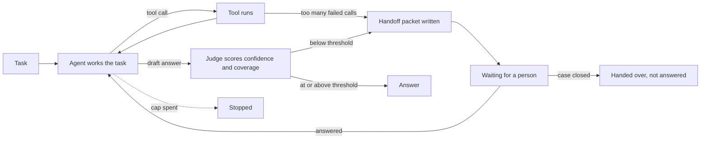
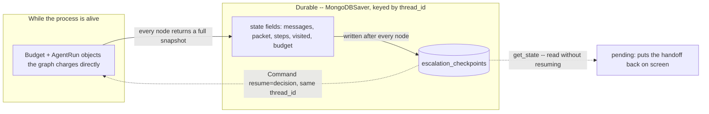

# Escalation and handoff

## What it is

An agent that always produces an answer, whether or not it actually has grounds
for one, is worse than an agent that sometimes says "I can't finish this without
help." Escalation is the design that makes the second behaviour possible: the
agent judges its own work against some standard — not "does this sound right,"
but something checkable — and when it falls short, it stops and hands the task to
a person instead of guessing. The handoff isn't a bare failure message. It's a
packet: what was asked, what was tried, what was actually established, and one
specific question that would let the agent finish if a person answered it.

The judging has to be a separate act from the answering, or it doesn't work. An
agent that both writes an answer and grades its own confidence in the same breath
is grading its own homework — it can rationalize a guess as readily as it can flag
one. A second pass, with its own prompt and its own narrower question ("is every
claim in this draft actually backed by what was retrieved," not "is this a good
answer"), is what keeps the check honest. The same separation is why the trigger
matters: escalating because the evidence doesn't support the answer is a different
failure than escalating because the tools themselves keep failing, and a reader
should be able to tell which one happened.

Once a person answers, the agent doesn't start over — it picks the task back up
with the new information folded into what it already knows, tries again, and gets
judged again. Escalation isn't a dead end; it's a detour that rejoins the same
road.

## Control flow

There are two independent triggers into `escalate`, and the page's stop reason
names which one fired: the judge scoring the draft below the confidence
threshold, or too many tool calls failing in a row without the agent recovering
from any of them. Either way, the run pauses at `wait` until a person answers or
closes the case; answering routes straight back to `act`, not to `judge` — the
agent gets another full attempt with the new information, and that attempt is
judged fresh, the same as the first one was.

## State and memory

Identical shape to Human-in-the-loop gates (Step 6), and for the same reason: a
handoff has to survive exactly the same things a gate does — a browser refresh, an
app restart, a person taking their time. Every node writes the trajectory
(`steps`), the graph map (`visited`) and the budget (`budget`) into checkpointed
state, so `resume()` never depends on anything the process that called `run()`
built — it rebuilds the run entirely from what the checkpoint holds.

## Strengths

- **The trigger is legible, not just the fact of escalating.** "The judge scored
  this 0.3 against a 0.7 threshold, missing the unit price" and "two SQL calls
  failed in a row" are different situations that call for different responses
  from the person reading them, and the packet says which one happened rather
  than presenting a single generic "needs review."
- **The packet can't lie about the trajectory, because part of it isn't written
  by a model.** The `trail` is built mechanically from the same `Step` records the
  page's own trajectory track renders — the model's own `tried`/`found` account
  sits next to it, and a reader can check one against the other.
- **Escalating doesn't throw away the work.** The message history, the tools
  already called, and everything already established carry forward into the next
  attempt — a person's answer is additional evidence, not a restart.

## Limitations

- **A judge built on the same model shares that model's blind spots.** If the
  underlying model consistently overstates support for a certain kind of claim,
  the judge scoring that claim is prone to the same overstatement — a second call
  is a real improvement over self-grading, but it is not an independent check the
  way a second, differently-trained system would be.
- **The threshold is a single dial doing a lot of work.** Too low, and confident
  but ungrounded answers get through anyway; too high, and the agent escalates
  routinely enough that a person stops reading the packets carefully — the same
  alert-fatigue failure Human-in-the-loop gates has, with a slider instead of a
  tool list.
- **The packet's own prose can still misstate what happened**, even with a
  mechanical trail sitting next to it — a reader who doesn't check the trail
  against the summary is trusting the summary anyway.
- **A person's answer is trusted without verification.** Whatever gets typed into
  the answer box becomes evidence the next `judge` pass scores the following draft
  against, with no check that the answer itself is correct — a wrong answer
  produces a confidently *supported* wrong final result.
- **Confidence is not calibrated.** A 0.3 and a 0.6 both mean "the judge wasn't
  sure," not two precisely different degrees of uncertainty — the threshold is a
  useful lever, not a probability with a defensible meaning behind it.

## Where to use it

Anywhere a wrong answer is more expensive than a delayed one: a support agent
handling anything with money or legal weight behind it, a research assistant
whose citations need to hold up, any pipeline where "confidently wrong" is a
worse failure mode than "asked for help." It pairs naturally with Human-in-the-loop
gates — that demo stops a specific *action* before it runs; this one stops an
*answer* before it's delivered. An agent can reasonably use both: gate the writes,
escalate the uncertain reads.

## In this demo

- **LangGraph `StateGraph`, hand-built**, with the judge as its own node and its
  own structured-output call (`Assessment`) rather than a field the actor reports
  about itself — see the module docstring for why that separation is the point.
- **Two triggers into `escalate`:** the judge's confidence
  (`ESCALATION_CONFIDENCE_THRESHOLD`, default 0.7, adjustable per run from the
  sidebar) and repeated tool failure (`ESCALATION_MAX_TOOL_ERRORS`, default 2).
  The page's stop-reason line and the packet's `trigger` field both name which one
  fired.
- **Checkpointer:** `core.checkpoint.get_checkpointer("escalation")`
  (`MongoDBSaver`), the same pattern Agent memory (Step 5) and Human-in-the-loop
  gates (Step 6) use.
- **Budget across a pause:** identical mechanism to Step 6 — every node syncs the
  trajectory, the graph map and the budget into checkpointed state, and
  `resume()` rebuilds a real `Budget` via `Budget.start(elapsed_s=...)`, so the
  deadline excludes the time spent waiting for an answer (see
  `AGENTIC_IMPLEMENTATION_PLAN.md`, "Pausing demos"). `agent.budget_for()` reads
  the checkpoint back for the page's budget strip after a resume.
- **Restore on load:** the page calls `agent.pending()` on every load with no
  stored result, the same mechanism as Step 6, adapted to find a handoff instead
  of a gate.
- **`HumanDecision` reused unchanged:** `verdict="approve"` with `reason` set to
  the person's answer resumes the run into `act`; `verdict="reject"` closes the
  case, and the packet (plus the closing reason) becomes the final output. `edit`
  is never offered — there's no proposed action here to edit, only a question to
  answer or decline.
- **Storage:** `escalation_runs`, `escalation_checkpoints` /
  `escalation_checkpoint_writes`. `Clear my data` empties both.
- **Tracing:** `run()` and `resume()` both carry Langfuse's `@observe` decorator,
  a no-op passthrough when no Langfuse keys are set.
