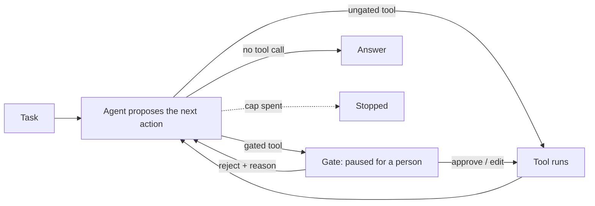
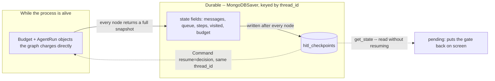

# Human-in-the-loop gates

## What it is

An agent that can take a consequential action is an agent that can take it wrong,
and some actions are expensive enough, or hard enough to undo, that "let it try and
watch the trajectory" isn't good enough. A human-in-the-loop gate stops the agent
*before* the action runs, not after: the run pauses with the proposed call in full —
the tool, the arguments, the reasoning behind it — and a person decides whether it
goes ahead as written, goes ahead changed, or doesn't go ahead at all. The agent
then continues from exactly where it paused, carrying that decision forward as
part of what happened, not as a separate correction bolted on afterwards.

This only works if the pause is real: the process can be killed and restarted, the
browser tab can be closed, days can pass, and the run has to still be sitting there
waiting when someone comes back to it — otherwise "review before it runs" quietly
degrades into "review if you happen to still have the tab open," which is not a
safety property anyone can rely on. That durability is the actual engineering
problem a gate has to solve; the approve/edit/reject UI on top of it is the easy
part.

Which calls get gated is a policy decision, not a technical one: every write,
every write above some cost, only the first write in a session, writes to a
particular resource. The gate itself doesn't have an opinion — it pauses whatever
it's configured to pause, and the interesting design work is deciding that
configuration to begin with.

## Control flow

Every tool call the agent proposes is checked against the gated-tool list before it
runs. A call that isn't gated goes straight to `tools`; one that is stops at `gate`
until a person decides. A rejection doesn't end the run — it feeds back as an
observation (*"REJECTED by a person: \<reason\>"*), and the agent's next proposal is
expected to actually respond to it, the same way it would respond to any other tool
error.

## State and memory

The gate is only as durable as the state backing it, so nothing about a paused run
lives solely in memory. Every node writes a complete snapshot of the trajectory
(`steps`), the graph map (`visited`) and the budget's caps and spend (`budget`)
into graph state, which `MongoDBSaver` checkpoints after every node regardless of
whether that node paused. `resume()` doesn't reuse anything from the process that
called `run()` — it rebuilds the run record and the budget from exactly that
checkpoint, which is what makes an app restart transparent: `run()` and the
process that called it can be gone entirely, and `resume()` still has everything
it needs.

## Strengths

- **The pause is a first-class stop in the graph, not a UI trick.** `interrupt()`
  suspends the actual computation — the graph genuinely isn't running — rather
  than the page merely declining to call a "continue" function until a button is
  clicked. That's what makes surviving a restart free: there's no in-memory thread
  to lose.
- **A rejection is data the agent can act on, not a dead end.** It comes back as
  an observation like any tool error, so the same recovery behaviour this app's
  other demos exercise on `ERROR[...]` strings applies here too — a rejected
  proposal is a reason to try something else, not a reason to stop.
- **The budget survives the pause correctly.** Steps, tokens and tool calls
  already spent don't reset on resume, and the clock excludes the wait — a run
  that took a person five minutes to review is charged for the agent's work, not
  for how long the reviewer took lunch.

## Limitations

- **Approval fatigue.** A person who has approved the last twenty proposals
  without incident is primed to approve the twenty-first without reading it. A
  gate only supplies the *opportunity* for judgement — it can't supply the
  judgement itself, and a reviewer who rubber-stamps everything makes the gate a
  formality with extra latency, not a safety measure.
- **Gates on writes, not on harm.** This demo pauses `write_file`-shaped actions
  by default because that's the toolbox's one destructive tool; nothing stops a
  reader from reasoning "search_corpus is read-only, so it's safe to leave
  ungated" and being wrong about it for a different toolbox — a read that leaks
  something sensitive is exactly as unreviewed as a write nobody gated.
- **A proposal can go stale between being written and being approved.** If
  something in the world (or in the agent's own later steps, on a graph complex
  enough to run other branches concurrently) changes between the pause and the
  decision, "approve what I see" can approve something that's no longer quite
  right — this demo's single-threaded queue doesn't hit that case, but it's a
  real failure mode of the pattern in general.
- **The re-execution gotcha.** LangGraph re-runs an interrupted node from its
  first line on resume — `interrupt()` isn't a bookmark, it's a call that blocks
  until a value exists. Every node in this demo that can pause is written with
  nothing but state reads before its `interrupt()` call for exactly this reason;
  getting that ordering wrong anywhere in a hand-built graph means double-charging
  the budget or double-running a tool call on every resume.
- **One verdict per call, decided in isolation.** There's no "approve everything
  this agent proposes for the rest of the run" and no batch review of several
  pending proposals at once — each gate is its own pause, which is precise but
  doesn't scale to an agent that proposes many gated calls in a row.

## Where to use it

Anywhere an agent's action is expensive to get wrong: sending an email, placing an
order, modifying a production system, anything with a customer or a budget on the
other end of it. It's the right tool specifically for actions, not for judging
whether an *answer* is trustworthy — for that, see Escalation and handoff, which
pauses on low confidence rather than on a particular tool.

## In this demo

- **LangGraph `StateGraph`, hand-built**, with the interrupt as a real node
  (`gate`) rather than `langchain.agents.HumanInTheLoopMiddleware`'s packaged
  version of the same idea — the point here is to make the pause itself visible,
  the same reason every other `StateGraph` demo in this app hand-builds phases
  `create_agent` doesn't separate.
- **Gated tools:** `write_file` by default (`HITL_GATED_TOOLS`), changeable per
  run from the sidebar's multiselect over the demo's four tools (`search_corpus`,
  `list_files`, `read_file`, `write_file`) — gate more of them to watch every call
  stop, or fewer to see the queue skip straight through.
- **Checkpointer:** `core.checkpoint.get_checkpointer("hitl")` (`MongoDBSaver`),
  the same pattern Agent memory (Step 5) introduced.
- **Budget across a pause:** every node returns a snapshot of the trajectory,
  the graph map and the budget into checkpointed state; `resume()` rebuilds a real
  `Budget` from it via `Budget.start(elapsed_s=...)`, so the deadline's clock
  excludes the time spent waiting for a decision (see
  `AGENTIC_IMPLEMENTATION_PLAN.md`, "Pausing demos"). `agent.budget_for()` reads
  the same checkpoint back for the page's budget strip after a resume, since
  `resume()`'s return type carries no budget of its own.
- **Restore on load:** the page calls `agent.pending()` on every load with no
  stored result; it finds the newest `needs_human` run, confirms the checkpoint
  still has a pending interrupt, and puts the gate back on screen with no click —
  this is what the refresh and restart checks in the plan are actually testing.
- **Storage:** `hitl_runs`, `hitl_checkpoints` / `hitl_checkpoint_writes`, plus
  whatever `write_file` calls actually landed in `data/vfs/<run_id>/`. `Clear my
  data` empties the first two; the written files are left on disk (same as every
  other demo that uses the virtual file system).
- **Tracing:** `run()` and `resume()` both carry Langfuse's `@observe` decorator,
  a no-op passthrough when no Langfuse keys are set.
