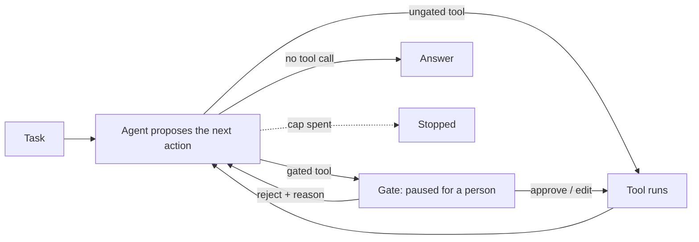
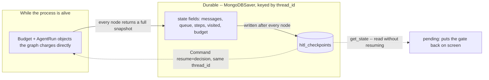

# Human-in-the-loop gates

## What it is

Some actions are too costly or too hard to undo to let an agent just try them. A
**gate** pauses the agent *before* such an action runs. A person sees the proposed
call — tool, arguments and reasoning — and approves it, edits it, or rejects it.
The agent then carries on from where it paused, with that decision as part of its
history.

The hard part is making the pause durable: the run must still be waiting after a
restart, a closed tab, or days later. Which calls to gate is a policy choice, such
as every write or only costly ones.

## Control flow

Gated calls stop at `gate`; others run straight away. A rejection comes back as an
observation (*"REJECTED by a person: \<reason\>"*) that the agent should respond to.

## State and memory

Nothing about a paused run lives only in memory. Every step is saved, so a resume
works even after the original process is gone.

## Strengths

- **A real pause.** The run is actually suspended, not just waiting on a button,
  so it survives restarts.
- **Rejections are useful.** A "no" comes back like a tool error, and the agent can
  try something else.
- **Fair budgets.** Work already spent carries over, and time spent waiting for a
  person isn't charged to the agent.
- **Precise control.** A person can fix the arguments instead of just saying no.

## Limitations

- **Approval fatigue.** After twenty safe approvals, people stop reading the
  twenty-first.
- **Gating by tool isn't gating by harm.** A "read-only" tool can still leak
  something sensitive, and nobody reviews it.
- **Proposals go stale.** Things can change between the pause and the approval.
- **Resume re-runs the paused step.** Any work done before the pause in that step
  can happen twice unless it is written carefully.
- **One call at a time.** No batch review or "approve all", so many gated calls in
  a row get slow.

## Where to use it

- Before actions that are costly to get wrong: sending email, placing orders,
  changing production systems.
- For judging whether an *answer* can be trusted, use escalation instead.
- Not worth it for cheap, easy-to-undo actions.

## In this demo

- **LangGraph `StateGraph`, hand-built.** The pause is a real node (`gate`), not
  `langchain.agents.HumanInTheLoopMiddleware`, so the pause itself is visible.
- **Gated tools:** `write_file` by default (`HITL_GATED_TOOLS`), changeable per run
  in the sidebar multiselect over the demo's four tools (`search_corpus`,
  `list_files`, `read_file`, `write_file`).
- **Checkpointer:** `core.checkpoint.get_checkpointer("hitl")` (`MongoDBSaver`),
  the pattern Agent memory (Step 5) introduced.
- **Pausing:** `interrupt()` in the `gate` node. LangGraph re-runs an interrupted
  node from its first line on resume, so every pausing node does only state reads
  before `interrupt()`, to avoid double-charging the budget or double-running a
  tool.
- **Budget across a pause:** every node saves the trajectory, graph map and budget
  into state; `resume()` rebuilds a `Budget` via `Budget.start(elapsed_s=...)`, so
  waiting time doesn't count toward the deadline (see
  `AGENTIC_IMPLEMENTATION_PLAN.md`, "Pausing demos"). `agent.budget_for()` reads it
  back for the budget strip, since `resume()` returns no budget.
- **Restore on load:** the page calls `agent.pending()` on every load with no
  stored result. It finds the newest `needs_human` run, checks the checkpoint still
  has a pending interrupt, and shows the gate again with no click.
- **Caveats:** one verdict per call, no batch review. The queue is
  single-threaded, so proposals can't go stale here.
- **Storage:** `hitl_runs`, `hitl_checkpoints` / `hitl_checkpoint_writes`, plus
  any files `write_file` wrote to `data/vfs/<run_id>/`. `Clear my data` empties
  the first two and leaves the files on disk.
- **Tracing:** `run()` and `resume()` use Langfuse's `@observe`; it does nothing
  without Langfuse keys.
