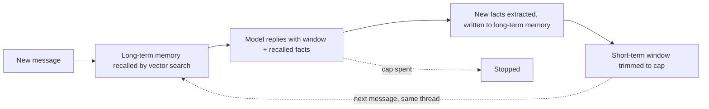
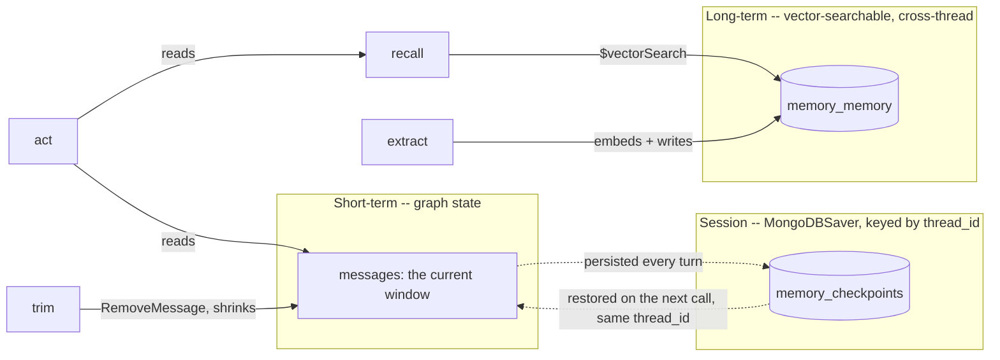

# Agent memory

## What it is

"Memory" in an agent covers at least three different things, and conflating them is
where most memory designs go wrong. **Short-term memory** is the working set inside
one conversation — the messages actually sent to the model on the next turn. It has to
be bounded, because context is not free and does not grow forever just because the
conversation does. **Session memory** is that same working set, but durable across
interruptions: the conversation survives a page reload, a crashed process, a
deployment — anything that would otherwise mean starting over — as long as something
persisted it under an id the next request can find again. **Long-term memory** is
different in kind, not just duration: specific facts, deliberately extracted from a
conversation and written somewhere addressable, that can be pulled back into a
*different* conversation because they're relevant to it — not because that conversation
happens to still be open.

The three exist for different failure modes. Without a bounded short-term window, a
long-running conversation eventually blows the context budget or drowns the model in
irrelevant early turns. Without session memory, an agent that gets restarted mid-task
forgets everything and has to be re-briefed from scratch. Without long-term memory, an
agent is a stranger every time a new conversation starts, no matter how many times the
same user has told it the same thing. A system that only implements one of the three
looks fine in a short demo and fails in exactly the situation that matters: a real
conversation, resumed later, by someone who already explained themselves once.

## Control flow

Every message is one pass through this loop. `trim` runs last, not first — it acts on
the window only after this turn's reply has already been added to it, so what gets
persisted going into the next turn is the true post-exchange window, not a snapshot
that's missing the answer that was just given.

## State and memory

The short-term window lives in `StateGraph` state and is checkpointed after every node
by `MongoDBSaver` — that's what makes it session memory rather than purely in-process
state: a new call to `run()` with the same `thread_id` picks the window back up from
Mongo, whether that call happens a second later or after the app restarted. Long-term
memory is a separate collection entirely, written by `extract` and read by `recall`,
with no `thread_id` in its query — a fact written in one thread is findable from any
other.

## Strengths

- **Each tier fails independently, and visibly.** A conversation that's too long shows
  up as a `trim` step with something actually dropped, not a silently truncated prompt.
  A fact that isn't remembered across threads shows up as an empty `recall` step, not a
  vague "the agent doesn't remember things" — the reader can see *which* tier didn't
  do its job.
- **Session memory needs no extra plumbing per demo.** `MongoDBSaver` is a drop-in
  `checkpointer=` argument; the trimming, recall and extraction logic don't need to
  know or care that the window survives a restart — that's the checkpointer's job
  alone.
- **Long-term recall is genuinely cross-context.** Because it isn't tied to a
  `thread_id`, it's the one tier that can answer "does the agent know this about me"
  independent of which conversation is currently open — the thing a reader actually
  means when they say an agent "remembers."

## Limitations

- **Extraction is a judgement call, made by an LLM, every turn.** What counts as
  "durable and worth keeping" is decided by a prompt, not a rule — it can miss a fact
  that mattered, or save something trivial that will just add noise to a future
  `recall`. There is no correction mechanism here beyond a person deleting the bad
  entry by hand (which this demo's page lets you do, on purpose).
- **No cross-user isolation.** `$vectorSearch` here has no filter on who stated a
  fact — every long-term memory is visible to every recall, because this demo has one
  reader in mind. A real deployment needs a `user_id` (or similar) filter field, the
  same way `core/mongo.py`'s `ensure_indexes()` already supports arbitrary
  `filter_fields` — this demo simply doesn't pass one.
- **A browser refresh doesn't auto-resume.** `st.session_state` doesn't survive a
  fresh page load, so the reader has to explicitly click "Resume last thread" to pick
  the prior conversation back up — the checkpoint itself is intact the whole time, but
  nothing links a fresh browser session to it automatically.
- **Recall quality depends entirely on embedding similarity.** A fact phrased very
  differently from how it's later asked about can fail to surface even though it was
  written correctly — the same limitation every `$vectorSearch`-based tool in this app
  has (see `core/corpus.py`).
- **A just-written fact isn't instantly searchable.** `$vectorSearch` indexes near
  real time, not synchronously with the write — a fact extracted this turn typically
  needs a second or two before a `recall` in a different thread can find it. Normal
  manual use (reading the reply, clicking "New thread", typing the next message)
  comfortably clears that gap; a scripted back-to-back test of the two tiers may not.
- **Cost scales with conversation length in a way that isn't obvious from the token
  cap alone.** Every turn pays for a reply *and* an extraction call, whether or not the
  turn produced anything worth remembering.

## Where to use it

Use it anywhere an agent needs to be more than a single stateless call — a support
assistant, a long-running project companion, anything where "I told it this
yesterday" is a reasonable thing for a user to expect to still be true. Reach for just
the session tier (checkpointing, no extraction) when the only requirement is
"survive a restart" and nothing needs to carry across separate conversations. Reach for
this demo's full three-tier shape when the requirement is closer to "remembers me,"
not just "doesn't lose its place."

## In this demo

- **LangGraph `StateGraph`, hand-built**, for the same reason as Steps 3–4: `recall`,
  `act`, `extract` and `trim` are four distinct phases, not one `create_agent` loop.
  No tools are bound — unlike every other `StateGraph` demo so far, the subject here is
  the memory tiers, not tool use.
- **Checkpointer:** `core.checkpoint.get_checkpointer("memory")` (`MongoDBSaver`),
  compiled onto the graph directly — this is the first demo in the app to actually use
  it. State is checkpointed under `thread_id`, minted fresh (`thread_id_for`) when the
  sidebar's "New thread" is used, or reused when continuing.
- **Short-term window:** capped at `MEMORY_WINDOW_MESSAGES` (default 6) by `trim`,
  which returns `RemoveMessage(id=...)` for everything older — LangGraph's own idiom
  for shrinking checkpointed history, not a display-only slice.
- **Long-term memory:** `memory_memory`, embedded with `BAAI/bge-small-en-v1.5` via
  `core.embeddings.embed()`, indexed with `core.mongo.ensure_indexes()` and queried
  with `core.mongo.vector_search()`, top `MEMORY_RECALL_K` (default 5) hits. Written by
  `extract`'s structured-output call (`ExtractedFacts`), 0 or more facts per turn.
- **Budget:** `recall` and `trim` are free (no model call — a vector search and a list
  operation). `act` and `extract` each spend one step, so a turn costs at most two
  against the shared `AGENT_MAX_STEPS` default of 12 — several turns fit in one
  budget before the sidebar's caps need raising.
- **The page's "Delete" button** on a stored memory is the "recall disappears" check:
  delete one, ask the same recall-dependent question again, and the `recall` step no
  longer finds it. `Clear my data` (generic, from `core/mongo.py`) empties
  `memory_runs`, `memory_checkpoints` (+ `_writes`) and `memory_memory` together.
- **Storage:** `memory_runs`, `memory_checkpoints` / `memory_checkpoint_writes`,
  `memory_memory` — all in `genai_agentic_lab`, all specific to this demo.
- **Tracing:** `run()` carries Langfuse's `@observe` decorator, a no-op passthrough
  when no Langfuse keys are set.
