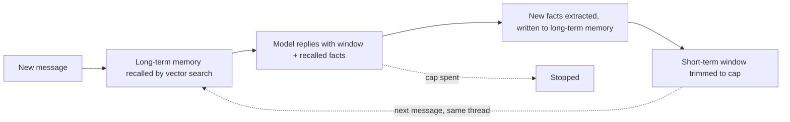
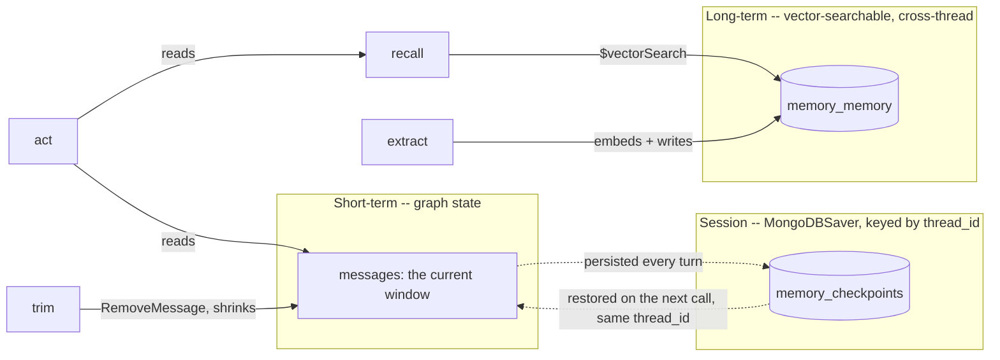

# Agent memory

## What it is

Agent "memory" means three different things. **Short-term memory** is the recent
messages sent to the model each turn; it must be capped, because context is
limited. **Session memory** is that same conversation saved under an id, so it
survives a reload or a restart. **Long-term memory** is facts pulled out of a
conversation and stored, so a *different* conversation can find them later.

Each one fixes a different problem: overflowing context, losing your place, and
forgetting the user between conversations. Most systems need all three.

## Control flow

Each message is one pass. Trimming runs last, so the saved window already includes
the latest reply.

## State and memory

The window is saved per thread, so the same `thread_id` picks it back up. Long-term
facts are stored apart with no thread id, so any thread can find them.

## Strengths

- **You can see which tier failed.** A dropped message or an empty recall shows up
  as its own step.
- **Session memory is cheap.** Saving the conversation is separate from the rest of
  the logic, which doesn't need to know about it.
- **Real cross-conversation memory.** Long-term facts aren't tied to one
  conversation, so the agent can "remember you".
- **Bounded context.** Capping the window keeps long conversations from
  overflowing.

## Limitations

- **The model decides what to keep.** It can miss an important fact or save noise.
- **Recall depends on wording.** A fact phrased very differently from the later
  question may not be found.
- **New facts aren't instantly searchable.** Vector indexes usually lag the write
  by a second or two.
- **Extra cost every turn.** Each turn pays for a reply *and* an extraction call,
  even when nothing is worth keeping.
- **Shared memories leak.** Without a per-user filter, every user's facts are
  visible to every recall.

## Where to use it

- Assistants people come back to, where "I told you this yesterday" should still
  hold.
- If you only need to survive a restart, use session memory alone (no
  extraction).
- Add long-term memory when the goal is "remembers me", not just "doesn't lose its
  place".

## In this demo

- **LangGraph `StateGraph`, hand-built:** `recall`, `act`, `extract` and `trim`
  are four separate phases, not one `create_agent` loop. No tools are bound; the
  subject is memory, not tool use.
- **Checkpointer:** `core.checkpoint.get_checkpointer("memory")` (`MongoDBSaver`),
  compiled onto the graph; the first demo to use it. State is saved under
  `thread_id`, minted fresh (`thread_id_for`) on the sidebar's "New thread", or
  reused when continuing.
- **Short-term window:** capped at `MEMORY_WINDOW_MESSAGES` (default 6) by `trim`,
  which returns `RemoveMessage(id=...)` for older messages — real shrinking of the
  checkpointed history, not a display slice.
- **Long-term memory:** `memory_memory`, embedded with `BAAI/bge-small-en-v1.5` via
  `core.embeddings.embed()`, indexed with `core.mongo.ensure_indexes()`, queried
  with `core.mongo.vector_search()`, top `MEMORY_RECALL_K` (default 5). Written by
  `extract`'s structured-output call (`ExtractedFacts`), 0 or more facts per turn.
- **No per-user filter:** `$vectorSearch` has no filter on who stated a fact.
  `ensure_indexes()` supports `filter_fields`; this demo passes none.
- **Budget:** `recall` and `trim` are free (no model call). `act` and `extract`
  spend one step each, so a turn costs up to two of the `AGENT_MAX_STEPS` default
  of 12.
- **Refresh:** `st.session_state` doesn't survive a fresh page load, so click
  "Resume last thread" to pick the thread back up. The checkpoint is intact.
- **Indexing lag:** a fact extracted this turn may take a second or two to be
  findable from another thread. Normal clicking clears that; a scripted
  back-to-back test may not.
- **Delete button** on a stored memory: delete one, ask again, and `recall` no
  longer finds it. `Clear my data` (generic, from `core/mongo.py`) empties `memory_runs`, `memory_checkpoints`
  (+ `_writes`) and `memory_memory` together.
- **Storage:** `memory_runs`, `memory_checkpoints` / `memory_checkpoint_writes`,
  `memory_memory`, all in `genai_agentic_lab`.
- **Tracing:** `run()` uses Langfuse's `@observe`; it does nothing without Langfuse
  keys.
