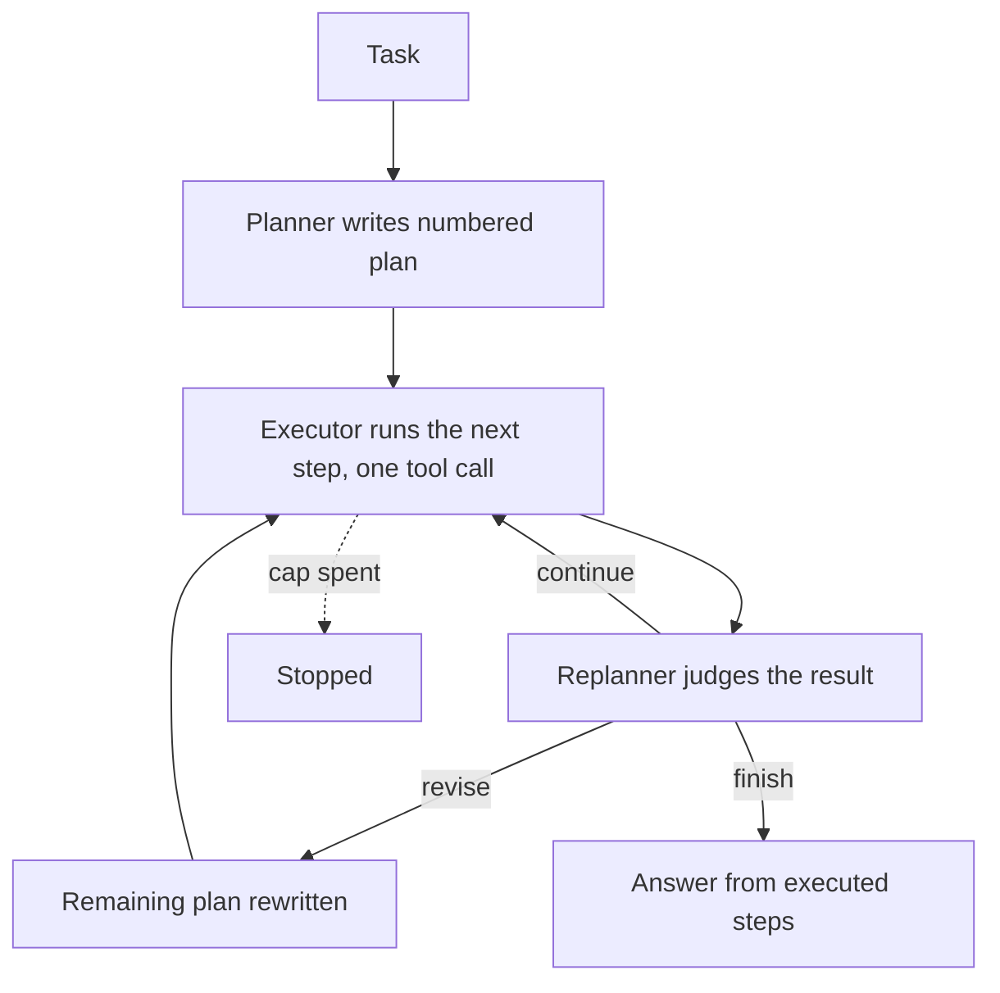
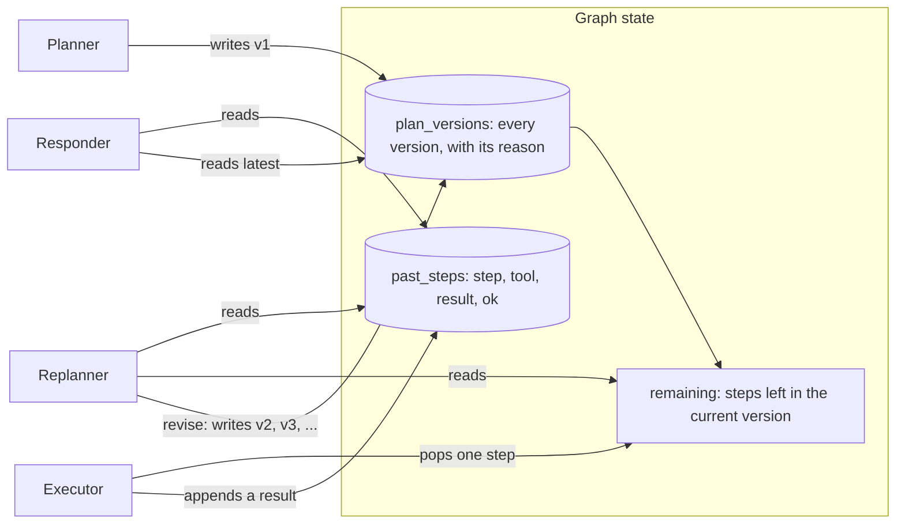

# Plan-and-Execute

## What it is

Plan-and-Execute separates *deciding what to do* from *doing it*. A planner
looks at the whole task once and writes a numbered plan — several steps,
committed up front, before any tool has run. An executor then works through the
plan one step at a time, each step a single tool call. After every step, a
third role — the replanner — looks at what came back and decides whether the
rest of the plan still holds, needs correcting, or is no longer needed because
there's already enough to answer.

The planner sees the task in full and nothing else; the executor sees one step
at a time and does not have to reason about the shape of the whole task; and
because the roles are separate, the planner and the executor can even be
different models — a strong one to plan, a cheap one to carry the plan out.
This is the trade against ReAct's think-act-observe loop (Step 1), where a
single model does both jobs on every single step and has to re-derive the
overall shape of the task from the transcript each time.

The variant that omits the replanner is usually called **Plan-and-Solve**: the
plan is fixed once and the executor just runs it. Without a replanner, an
execution result that contradicts an assumption the plan was built on — a
number that turns out to be wrong, a table that doesn't exist — has nowhere to
go. The plan carries on regardless, and the final answer is built on a premise
that was already known to be false by the time the answer was written. Adding
the replanner after every step is what this demo is built to show: a
correction, and the moment it happens, both visible on the track.

## Control flow

## State and memory

There is no long-term memory and no checkpoint — the graph runs start to finish
in one call, and nothing survives past the run that produced it. What's held is
all in-memory `StateGraph` state for the duration of one run: every plan
version ever written, the steps not yet run in the current version, and the
full record of every step that did run.

## Strengths

- **A global view, written once.** The plan sees the whole task before any
  tool has run, so it can order steps sensibly and avoid the myopia of a
  step-by-step loop that only ever sees what's directly in front of it.
- **Cheaper per step than ReAct.** The executor's prompt is one step and the
  results so far, not the entire transcript re-read on every call — it doesn't
  pay ReAct's quadratic cost.
- **The correction is visible and dated.** Every revision is a numbered plan
  version with its own reason, so a reader can see exactly what was believed at
  each point and what changed it.
- **Roles can use different models.** Nothing here requires the planner and
  the executor to be the same model or the same cost tier.

## Limitations

- **The first plan is a guess.** It is written before a single observation
  exists to test it, so a wrong assumption in the task — a stale number, a
  table that doesn't exist — is baked into every step until a replan catches it.
- **A replan costs a full model call, every single step.** Checking the plan
  after each step is what catches a bad assumption quickly, but it roughly
  doubles the number of model calls against a plan with no replanner at all —
  this demo's own step budget is raised above the shared default for exactly
  that reason (see *In this demo*).
- **A replanner tuned wrong fails in either direction.** Too eager to revise
  and the plan thrashes, rewriting itself every step without ever settling;
  too reluctant and it rubber-stamps `continue` past an observation that
  already contradicted the plan, and the run reaches `respond` on stale
  reasoning anyway.
- **The executor is not supervised mid-step.** It gets one tool call per step
  and no budget check of its own between deciding and calling — if it hallucinates
  arguments, the replanner is the only thing that catches it, and only after
  the fact.
- **Steps are executed strictly in order.** There is no branching and no
  parallel execution inside a single plan version; a plan with independent
  steps still runs them one after another.

## Where to use it

Use it for a task with a stable, plannable shape — several genuinely different
pieces of work where the order mostly doesn't depend on what earlier steps
return, but where at least one step's result *could* invalidate a later one
often enough that checking is worth a model call each time.

Reach for ReAct instead when the task is small enough that a plan buys nothing
over just reacting to each observation as it comes. Reach for reflexion when
the concern is the *quality* of a single answer rather than the *correctness*
of a multi-step sequence. Reach for a supervisor–worker split when the steps
need genuinely different specialisms rather than the same executor doing all
of them.

## In this demo

- **LangGraph `StateGraph`, hand-built.** `create_agent` gives one phase
  (think → act → observe); this demo has three distinct phases with different
  jobs, so the graph is built directly rather than forcing it through
  `create_agent`. Tool execution happens inside the `execute` node by calling
  `Toolbox.call()` directly — the same way ReAct's hand-written loop does —
  rather than through a `ToolNode`.
- **Structured output, not `create_agent`'s tool-calling loop.** The planner
  and replanner each call `.with_structured_output(...)` against a small
  Pydantic schema (`Plan`, `Replan`); the executor calls `.bind_tools(...)` and
  runs at most the first tool call in its reply, ignoring any extra ones (and
  saying so on the track).
- **Provider fallback, bound then wrapped.** `core.llm.agent_models()` gives
  the configured providers in order; each one is bound to its structured-output
  schema or its tools *first*, and the bound models are chained with
  `.with_fallbacks(...)` afterwards — `RunnableWithFallbacks` doesn't forward
  `bind_tools()`, so binding has to happen before the wrap, not after. This is
  a `StateGraph`-specific variant of the `ModelFallbackMiddleware` pattern
  `create_agent` demos use, documented in
  `taxonomy/plans/AGENTIC_IMPLEMENTATION_PLAN.md` under *Shared contracts*.
- **Tools:** `search_corpus`, `describe_schema`, `run_sql` from `core.tools`.
  No web search — it would make the presets non-deterministic.
- **Budget:** every model call (planner, executor, replanner, responder) is one
  step; `revise` makes no model call and is free. Because a replan runs after
  every executed step, this demo's own default step cap,
  `PLAN_EXECUTE_MAX_STEPS` (20), is higher than the shared `AGENT_MAX_STEPS`
  (12) — a 4-step plan with one revision is already 1 + 6 + 6 + 1 = 14 calls.
  `PLAN_EXECUTE_MAX_PLAN_STEPS` (6) caps how many steps the planner or a
  revision may write; a longer reply is truncated, and the track says so.
- **Break the first tool call** (sidebar) diverts the executor's first tool
  call to `core.tools`' `boom`, so the replanner has a genuine error to react
  to even on a task that would otherwise plan cleanly.
- **No checkpointer.** Nothing in this demo pauses — a run is one call to
  `compiled.invoke()` start to finish — so there is no `resume()`.
- **Storage:** finished runs go to the `plan_execute_runs` collection in
  `genai_agentic_lab`. `Clear my data` empties it.
- **Tracing:** `run()` carries Langfuse's `@observe` decorator, a no-op
  passthrough when no Langfuse keys are set.
