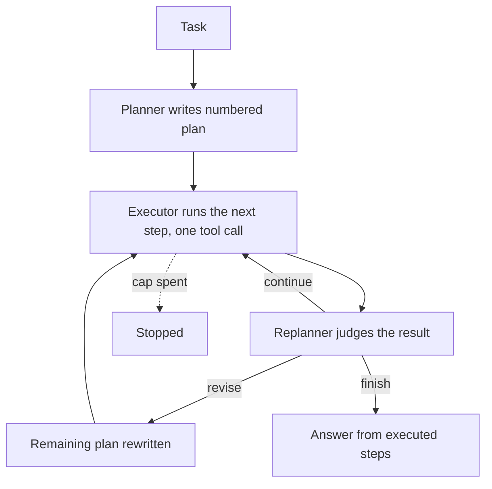
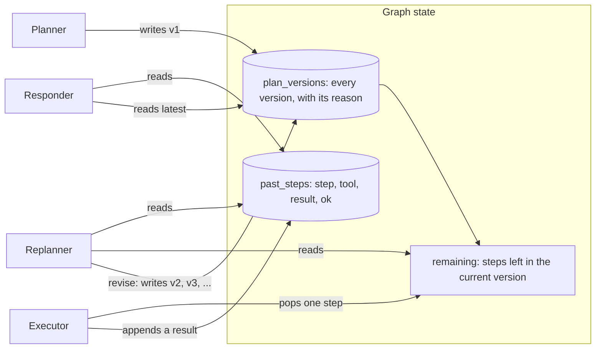

# Plan-and-Execute

## What it is

Plan-and-Execute splits *deciding what to do* from *doing it*. First a
**planner** reads the whole task and writes a numbered plan. Then an
**executor** carries out the plan one step at a time, one tool call per step.
After each step a **replanner** checks the result and decides: keep going, fix
the rest of the plan, or stop because there is enough to answer.

The version without a replanner is called **Plan-and-Solve**. It runs a fixed
plan, so a result that proves the plan wrong has nowhere to go. The replanner is
what lets the plan change when the facts do.

## Control flow

## State and memory

State holds every plan version, the steps still to run, and every step that ran.
It lives only for one run.

## Strengths

- **Sees the whole task first.** The plan is written with the full task in
  view, so steps can be ordered sensibly.
- **Cheaper per step than ReAct.** The executor sees one step and the results so
  far, not a growing transcript.
- **Changes are easy to follow.** Each revision is a new numbered plan with a
  reason.
- **Roles can use different models.** A strong model can plan and a cheap one
  can execute.

## Limitations

- **The first plan is a guess.** It is written before any results, so a wrong
  assumption sits in every step until a replan catches it.
- **Replanning is costly.** Checking after every step roughly doubles the number
  of model calls.
- **The replanner can be tuned wrong.** Too eager and the plan keeps changing;
  too lax and it waves through results that broke the plan.
- **Steps are not checked mid-way.** Bad tool arguments are only caught by the
  replanner, after the call.
- **Strictly in order.** No branching or parallel steps inside one plan.

## Where to use it

- Tasks with several distinct steps whose order is mostly known up front, but
  where a result could still break the plan.
- Use ReAct instead for small tasks where a plan adds nothing.
- Use Reflexion when the worry is the quality of one answer; use supervisor–worker
  when steps need different specialists.

## In this demo

- **LangGraph `StateGraph`, hand-built**, because there are three phases, not
  `create_agent`'s one. The `execute` node calls `Toolbox.call()` directly (like
  ReAct), not a `ToolNode`.
- **Models:** planner and replanner use `.with_structured_output(...)` with
  Pydantic schemas `Plan` and `Replan`. The executor uses `.bind_tools(...)` and
  runs only the first tool call in its reply; extra calls are ignored and noted
  on the track.
- **Provider fallback:** `core.llm.agent_models()` gives providers in order.
  Each is bound to its schema or tools first, then chained with
  `.with_fallbacks(...)`, because `RunnableWithFallbacks` doesn't forward
  `bind_tools()`. This `StateGraph` variant of `ModelFallbackMiddleware` is
  documented under *Shared contracts* in
  `taxonomy/plans/AGENTIC_IMPLEMENTATION_PLAN.md`.
- **Tools:** `search_corpus`, `describe_schema`, `run_sql` from `core.tools`. No
  web search, to keep presets deterministic.
- **Budget:** each planner, executor, replanner and responder call is one step;
  `revise` makes no model call. `PLAN_EXECUTE_MAX_STEPS` (20) is higher than
  the shared `AGENT_MAX_STEPS` (12) because a replan runs after every step — a
  4-step plan with one revision is already 1 + 6 + 6 + 1 = 14 calls.
- **`PLAN_EXECUTE_MAX_PLAN_STEPS`** (6) caps the steps in a plan or revision;
  longer ones are truncated, and the track says so.
- **Break the first tool call** (sidebar) sends the executor's first tool call
  to `core.tools`' `boom`, so the replanner has a real error to react to.
- **No checkpointer, no `resume()`.** A run is one `compiled.invoke()` call.
- **Storage:** runs go to `plan_execute_runs` in `genai_agentic_lab`.
  `Clear my data` empties it.
- **Tracing:** `run()` uses Langfuse's `@observe`; it does nothing without
  Langfuse keys.
