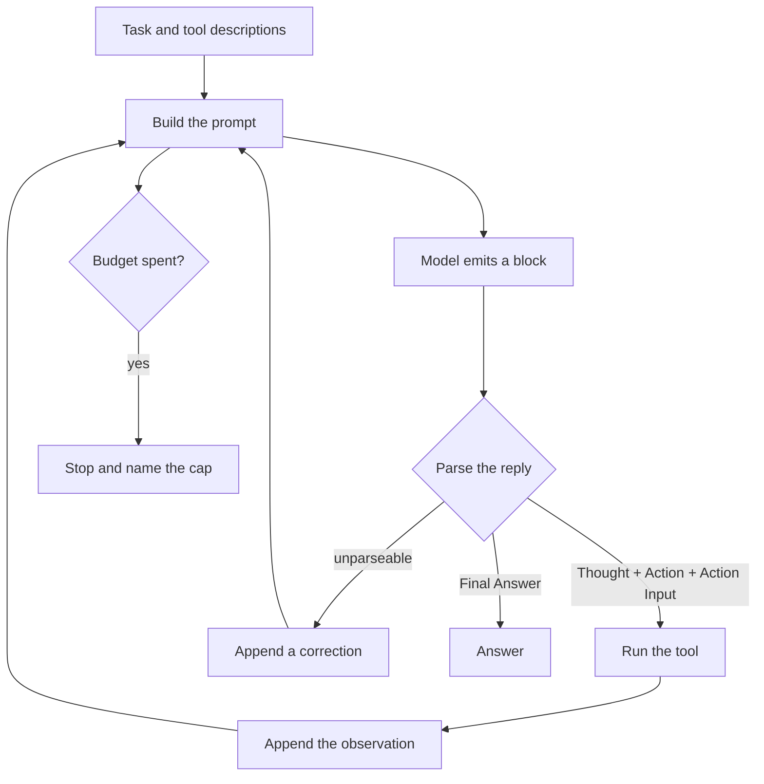
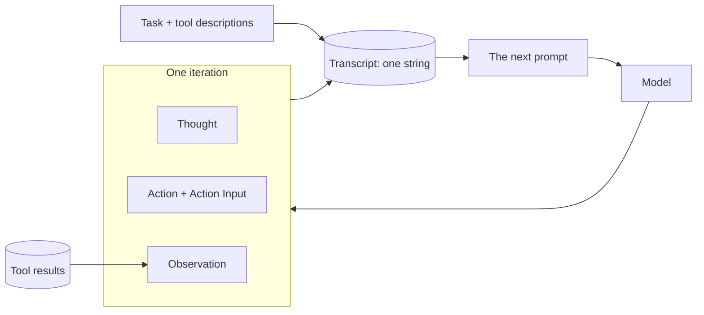

# ReAct

## What it is

ReAct — *reason + act* — is the loop underneath almost every agent. A model is
given a task and a list of tools described in text, and asked to reply in a fixed
shape: a **thought** about what it needs next, an **action** naming one tool, and
the **arguments** for it. The program stops reading there, runs that tool itself,
and appends the result to the transcript as an **observation**. Then it sends the
whole transcript back and asks for the next block. When the model writes a final
answer instead of an action, the loop ends.

The insight is that the model never does anything. It emits text; the program
around it decides that some of that text names a tool, calls it, and writes the
result back into the next prompt. Interleaving the two — reasoning *and* acting,
rather than one plan up front or one tool call in isolation — is what makes the
model able to correct course, because each observation is real evidence it can
react to rather than something it guessed.

Everything later in agent design is a modification of this loop. A planner runs
it with the steps decided in advance. Reflexion runs it twice with a critique in
between. A supervisor runs several of them and routes between them. Tool-calling
APIs move the action out of the text and into a structured field, which removes
the parser but changes nothing else.

## Control flow

## State and memory

There is no store. The transcript is the entire memory of the run, it is rebuilt
into the prompt on every call, and it is discarded when the run ends — so nothing
learned in one run is available to the next, and everything learned during a run
is paid for again on every subsequent call.

## Strengths

- **The mechanism is legible.** The prompt, the reply and the parse are all text
  you can read. When it goes wrong you can see exactly where, which is rarely
  true of an agent whose loop lives inside a framework.
- **It self-corrects within a run.** A failed tool call comes back as an
  observation, and the model gets to react to it on the very next step.
- **It needs almost nothing.** A chat model, a prompt and a `while` loop. No
  tool-calling API, no orchestration library, no schema support — which is why it
  still works on models that offer none of those.
- **It generalises.** The same loop serves search, SQL, file editing and
  arithmetic; only the tool descriptions change.

## Limitations

- **Cost grows quadratically.** Every call resends the whole transcript, so step
  *n* pays for all *n−1* observations before it. A long run spends most of its
  tokens re-reading itself, and a single large tool result inflates every
  remaining call.
- **The format is a contract the model can break.** Prose instead of an action, a
  missing `Action Input`, two actions in one block, invented tool names, or an
  `Observation:` the model writes itself and then reasons from as though it were
  real. Each one needs handling; the last is the dangerous one, because the run
  continues confidently on a fabricated result.
- **It loops.** Nothing in the loop notices that it has made the same call three
  times. Without a cap, a task with no clear end condition will run until
  something external stops it — which is why a step cap is not optional.
- **Reasoning is not verified.** A thought that sounds sound and leads nowhere
  costs exactly as much as a good one, and the loop has no critic. Errors
  compound: a wrong early observation stays in the transcript and colours every
  step after it.
- **It is myopic.** Each step sees the transcript and decides one action. There
  is no plan, so work is easily repeated and sub-goals are easily dropped.
- **Long transcripts degrade.** Once the context fills, the earliest
  observations are the ones trimmed — usually the task's own framing.

## Where to use it

Use it when the number of steps is small and knowable — a handful of lookups,
one or two queries, a tool whose result decides the next tool. It is the right
default for a task with maybe three to eight steps and genuine branching, and the
right thing to reach for first before assuming something more elaborate is
needed.

Reach for something else when the task has a stable shape that can be planned up
front (plan-and-execute), when the answer's quality needs checking rather than
its steps (reflexion), when the work splits cleanly across specialisms
(supervisor–worker), or when it runs long enough that the transcript stops
fitting (deep agents, which move state into files).

Do not use it unsupervised with tools that write, and do not use it without all
three caps.

## In this demo

- **Plain Python, no LangChain.** Nothing in this folder imports `langchain` in
  any form. `core.llm.get_chat_model()` returns the provider chain and
  `core.llm.count_tokens()` reads usage off the reply; the loop, the prompt, the
  parser and the tool dispatch are all in `agent.py` and all readable end to end.
  `core.llm.complete()` is not used here because it returns only the text, and the
  token budget needs the usage that comes with the reply.
- **The prompt** is built by `build_prompt()`. Tools are documented as text by
  `Toolbox.describe()`, which writes each tool's name, argument names and
  description into the prompt — the same information a tool-calling API would
  send as JSON schema.
- **The parser** is `parse_reply()`. It reads labelled blocks with one regex,
  and is deliberately forgiving in three specific ways: it discards anything
  after an `Observation:` the model wrote itself, it accepts a JSON object
  wrapped in prose or in a code fence, and it accepts a bare value for a tool
  that takes exactly one required argument. Anything left over is a genuine
  format failure: the reply and a correction are appended to the transcript and
  the model is asked again, up to `MAX_REPAIRS` (2) consecutive times. An
  *unknown tool name* is not treated as a parse failure — it is passed to the
  toolbox, which returns `ERROR[unknown_tool]` listing the real ones, so
  recovering from it happens on the track where it can be watched.
- **Tools:** `search_corpus`, `describe_schema`, `run_sql`, `web_search`, from
  `core.tools`. The file tools are left out on purpose — seven tools in the
  prompt bury the format instructions this demo exists to show.
- **Budget:** all three caps from `core/config.py` (`AGENT_MAX_STEPS` 12,
  `AGENT_MAX_TOKENS` 60000, `AGENT_DEADLINE_S` 180), overridable per run in the
  sidebar. `budget.check()` is called at the top of each iteration, before the
  work, so a stopped run keeps the trajectory it had already built. **One step =
  one iteration of the loop**, not one row on the track: a single iteration
  usually emits a think row, an act row and an observe row.
- **Break the first reply** (sidebar) substitutes prose with no `Action` line for
  the model's first reply, so the parse failure and the re-prompt can be seen on
  demand rather than waited for. The model is not called for that step, so it
  costs no tokens — but it does spend one step from the cap.
- **Storage:** finished runs go to the `react_runs` collection in
  `genai_agentic_lab`. There is no checkpoint and no long-term memory — this demo
  cannot pause and does not implement `resume()`. Any file a tool writes lands in
  `data/vfs/<run_id>/`. `Clear my data` empties `react_runs`.
- **Tracing:** `run()` carries Langfuse's `@observe` decorator, which is a
  no-op passthrough when no Langfuse keys are set.
- **Caveat:** the transcript is sent in full on every call and never trimmed. On
  a long run the token budget, not the step cap, is usually what stops it —
  which is the quadratic cost above, visible on the budget strip.
