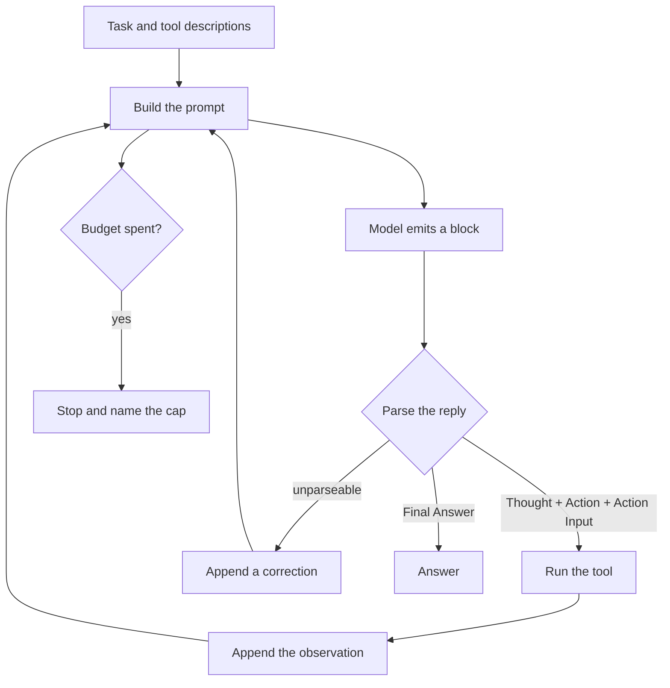
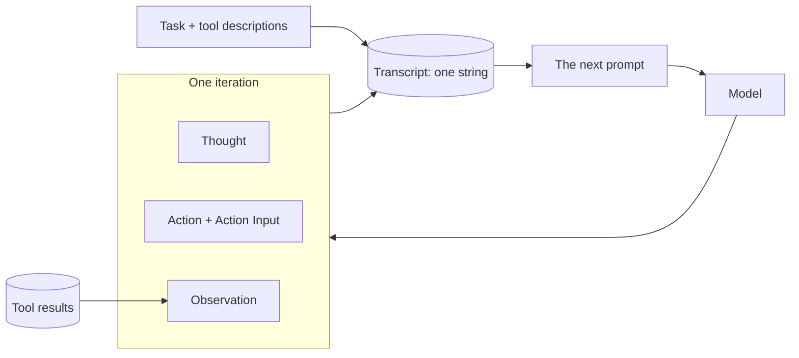

# ReAct

## What it is

ReAct (*reason + act*) is the basic agent loop. The model writes a **thought**,
picks one **action** (a tool and its arguments), and stops. The program runs the
tool and adds the result to the prompt as an **observation**. Then the model goes
again. The loop ends when the model writes a final answer instead of an action.

The model never runs anything itself. It only writes text; the program does the
work and feeds back the result. Because each step sees real results, the model
can change course when something goes wrong.

## Control flow

## State and memory

The transcript is the only memory. It is resent on every call and thrown away
when the run ends.

## Strengths

- **Easy to follow.** Every step is plain text you can read.
- **Fixes its own mistakes.** A failed tool call comes back as an observation,
  and the model can react on the next step.
- **Needs very little.** A chat model, a prompt and a loop — no tool-calling API.
- **Works for many tasks.** Only the tool list changes.

## Limitations

- **Gets expensive.** Every call resends the whole history, so long runs cost a
  lot.
- **The model can break the format.** It may skip the action, invent a tool, or
  make up an observation and trust it.
- **Can loop forever.** Nothing stops it repeating itself unless you add a cap.
- **No checking.** A wrong early step stays in the history and misleads later
  steps.
- **No plan.** It decides one step at a time, so it can repeat work or forget
  sub-goals.

## Where to use it

- Short tasks of roughly 3–8 steps where each result decides the next step.
- The first thing to try before reaching for something more complex.
- Not for tasks that need a plan up front, a quality check, or very long runs.

## In this demo

- **No LangChain.** The loop, prompt, parser and tool calls are all in
  `agent.py`. `core.llm.get_chat_model()` gives the model;
  `core.llm.count_tokens()` reads token usage from each reply.
- **Prompt:** `build_prompt()`. Tools are written into it as text by
  `Toolbox.describe()`.
- **Parser:** `parse_reply()`. It drops any `Observation:` the model wrote
  itself, accepts JSON inside prose or code fences, and accepts a bare value for
  one-argument tools. Other bad replies get a correction, up to `MAX_REPAIRS` (2)
  times in a row. An unknown tool name goes to the toolbox, which returns
  `ERROR[unknown_tool]` with the real names.
- **Tools:** `search_corpus`, `describe_schema`, `run_sql`, `web_search` from
  `core.tools`. File tools are left out to keep the prompt short.
- **Budget:** `AGENT_MAX_STEPS` 12, `AGENT_MAX_TOKENS` 60000,
  `AGENT_DEADLINE_S` 180 from `core/config.py`, changeable in the sidebar.
  Checked at the start of each loop. One step = one loop, which usually makes
  three rows (think, act, observe).
- **Break the first reply** (sidebar) swaps the first reply for bad prose, so you
  can see the parser fail and re-prompt. It costs a step but no tokens.
- **Storage:** runs go to `react_runs` in `genai_agentic_lab`. No checkpoint, no
  `resume()`. Tool-written files go to `data/vfs/<run_id>/`. `Clear my data`
  empties `react_runs`.
- **Tracing:** `run()` uses Langfuse's `@observe`; it does nothing without
  Langfuse keys.
- **Caveat:** the transcript is never trimmed, so on long runs the token cap
  usually stops it first.
