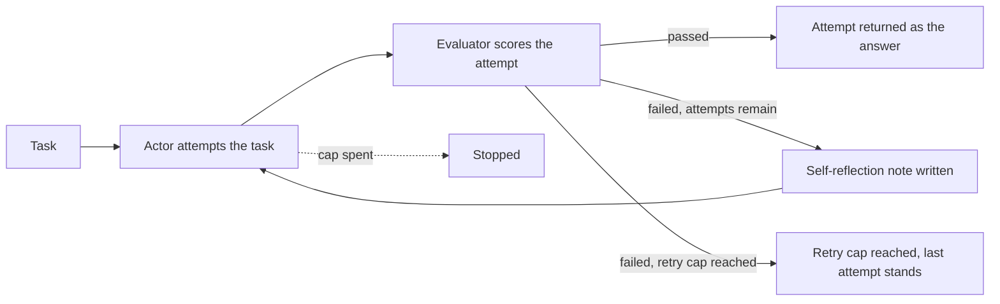
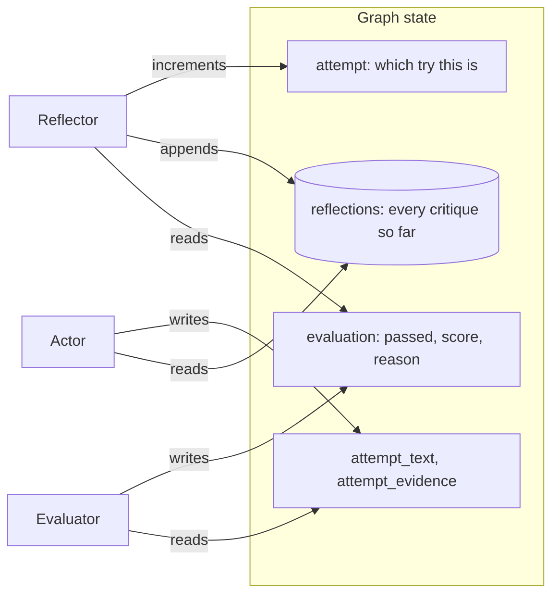

# Reflexion

## What it is

Reflexion separates *making an attempt* from *judging it* from *learning from the
judgement*. An actor produces an attempt at the task. An evaluator scores that
attempt — pass or fail, with a reason — using nothing but the task, the attempt,
and whatever evidence the actor gathered along the way. If it fails, a third
role, the reflector, writes one concrete note about what to do differently. That
note is carried into the next attempt's prompt, and the actor tries again.

This is "verbal reinforcement learning": there is no gradient update, no weight
change, nothing that persists outside the conversation. The entire mechanism by
which attempt 2 is better than attempt 1 is that the reflection sits in attempt
2's context. It is a cheap, model-agnostic way to get a self-correcting loop —
and it is entirely dependent on the reflection actually being a useful note and
the evaluator's judgement actually being trustworthy, neither of which is
guaranteed.

The evaluator here is worth dwelling on, because it is the part most demos of
this technique gloss over: it is an LLM with no more access to ground truth than
the actor had. It cannot know that a number is right. What it *can* check is
whether the attempt is complete, and whether every specific claim in it is
actually backed by the evidence the actor retrieved that attempt — an unsupported
number is a failure whether or not it happens to be correct. That is a real,
checkable signal, and it is also a real limit on what this loop can catch: an
attempt that is wrong but well-grounded in bad evidence will pass.

## Control flow

## State and memory

There is no checkpoint and no long-term memory — the graph runs start to finish
in one call, and `reflections` lives only in `StateGraph` state for the duration
of that one run. Unlike Step 5's memory demo, nothing here is written back for a
future run to recall: every reflection this demo produces dies with the run that
produced it.

## Strengths

- **Cheap self-correction, no training.** A failing first attempt gets a second
  chance from nothing but a written critique — no fine-tuning, no example
  collection, no change to the model at all.
- **The correction is legible.** The reflection is a plain sentence on the
  track, not a hidden adjustment — a reader can judge whether the advice was
  actually good, which a gradient update never lets you do.
- **Separates concerns cleanly.** The actor doesn't have to judge its own work
  mid-attempt, and the evaluator doesn't have to fix anything — each role has
  exactly one job.
- **Degrades honestly.** When nothing can make the attempt pass, the loop stops
  and says so (Preset 2) rather than quietly accepting an ungrounded guess.

## Limitations

- **The evaluator has no ground truth.** It is judging grounding and
  completeness, not correctness against a hidden answer key — see *What it is*.
  A plausible-sounding but wrong claim that happens to match bad or misread
  evidence can still pass.
- **A retry costs a full round trip, every time.** Each failed attempt is an
  actor call (sometimes two, when a tool ran), an evaluator call and a reflector
  call — for a task that was never going to succeed, the technique pays that
  cost `reflexion_max_attempts` times before giving up.
- **A critique can be wrong, vague, or aimed at the wrong problem.** The
  reflector's note is itself an LLM's guess at what went wrong; a bad note can
  send the next attempt in an unhelpful direction just as easily as a good one
  sends it in the right one.
- **Unanswerable tasks are the worst case, not a fixed one.** A task with no
  available evidence fails the same way on every attempt, for the same reason
  the reflector cannot fix — Preset 2 is built to show exactly this rather than
  hide it.
- **No mid-attempt correction.** The actor gets one uninterrupted attempt; if it
  goes wrong partway through, nothing catches that until the evaluator sees the
  finished result.

## Where to use it

Use it where the concern is the *quality* of a single answer and a second,
informed attempt is worth its cost — a written answer, a piece of analysis, a
claim that should be checked against evidence before it ships. Reach for
Plan-and-Execute (Step 3) instead when the concern is the *correctness of a
multi-step sequence*, not the quality of one output. Reach for escalation and
handoff (Step 7) when a task's failures aren't something a rewritten attempt
will fix at all — the honest move there is to stop and ask a person, not to keep
retrying against evidence that will never arrive.

## In this demo

- **LangGraph `StateGraph`, hand-built**, for the same reason as Step 3: actor,
  evaluator and reflector are three distinct prompts with three distinct jobs,
  which `create_agent` has no way to express as separate phases. The actor calls
  `Toolbox.call()` directly, the same way ReAct's loop and Plan-and-Execute's
  executor do.
- **Structured output for the evaluator and reflector**, `.bind_tools(...)` for
  the actor. Provider fallback follows the exact `StateGraph` variant Step 3
  established: each model is bound to its schema or its tools *first*, and the
  bound models are chained with `.with_fallbacks(...)` afterwards, because
  `RunnableWithFallbacks` doesn't forward `bind_tools()`.
- **Tools:** `search_corpus`, `run_sql`, `describe_schema` from `core.tools`. No
  web search, for the same determinism reason as Step 3.
- **Budget:** every model call — the actor's tool-decision call, its compose
  call when a tool ran, the evaluator, the reflector — is one step. No demo-own
  step cap is needed: three failing attempts, each using a tool, cost at most 11
  steps, under the shared `AGENT_MAX_STEPS` default of 12.
- **`REFLEXION_MAX_ATTEMPTS`** (default 3) is the retry cap: the number of
  attempts the actor gets before the evaluator's `stop` decision becomes "gave
  up" rather than "passed."
- **"Force the first attempt to answer from memory"** (sidebar) binds no tools
  on attempt 1, so it must answer from what the model already knows. This is a
  different mechanic from Step 3's "break the first tool call": the point isn't
  recovering from a tool error, it's giving the evaluator a genuinely ungrounded
  claim to catch, and the reflector something concrete to correct.
- **No checkpointer.** Nothing in this demo pauses — a run is one call to
  `compiled.invoke()` start to finish — so there is no `resume()`.
- **Storage:** finished runs go to the `reflexion_runs` collection in
  `genai_agentic_lab`. `Clear my data` empties it.
- **Tracing:** `run()` carries Langfuse's `@observe` decorator, a no-op
  passthrough when no Langfuse keys are set.
