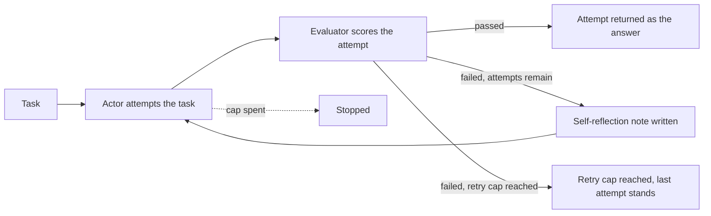
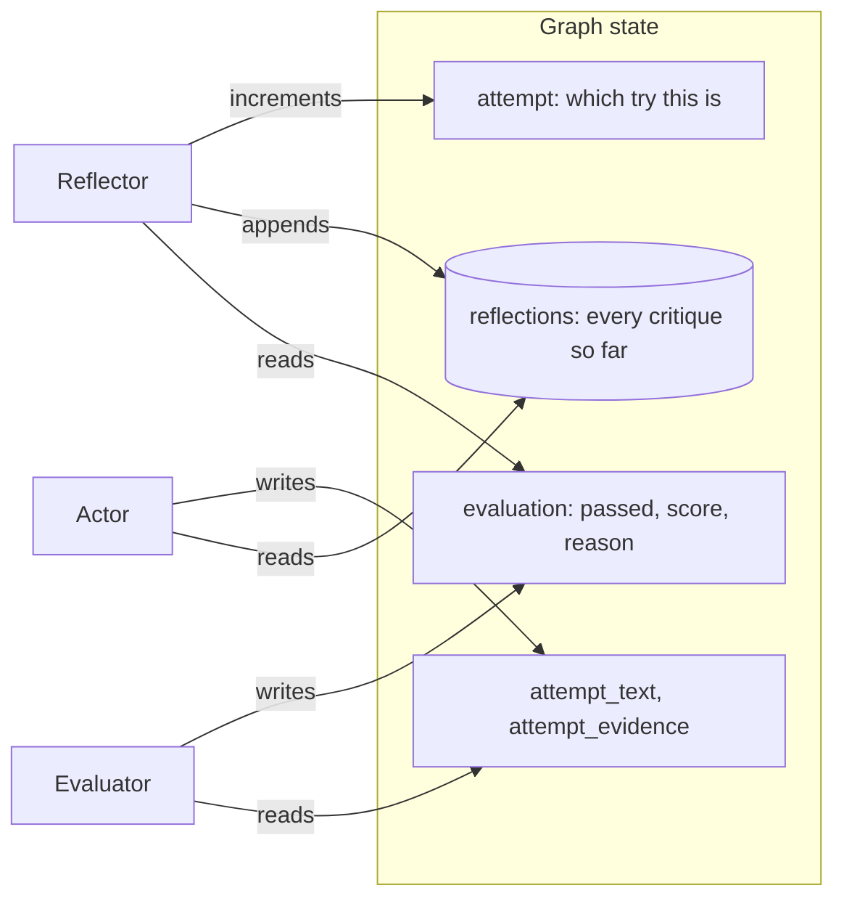

# Reflexion

## What it is

Reflexion lets an agent learn from a failed try. An **actor** attempts the task.
An **evaluator** grades the attempt: pass or fail, with a reason. On a fail, a
**reflector** writes one short note on what to do differently. That note goes
into the next attempt's prompt, and the actor tries again.

Nothing is trained; the model does not change. The only thing that improves the
next try is the note in its prompt. The evaluator is also a model with no answer
key, so it can check that claims are complete and backed by evidence, but not
that they are true.

## Control flow

## State and memory

The reflections live only for one run. Nothing is saved for a future run, unlike
the memory demo.

## Strengths

- **Self-correction without training.** A written critique is enough to give a
  failed attempt a better second try.
- **The fix is readable.** The reflection is a plain sentence you can judge.
- **Clear roles.** The actor does the work, the evaluator judges, the reflector
  advises.
- **Fails honestly.** When no attempt passes, the loop stops and says so instead
  of accepting a guess.

## Limitations

- **No ground truth.** The evaluator checks grounding and completeness, not
  correctness, so a wrong claim backed by bad evidence can pass.
- **Each retry is costly.** A failed attempt costs an actor, evaluator and
  reflector call, repeated up to the retry cap.
- **The note can be wrong.** A vague or misguided reflection can steer the next
  attempt the wrong way.
- **Can't fix missing evidence.** If the answer isn't available, every attempt
  fails for the same reason.
- **No mid-attempt checks.** A mistake is only caught once the attempt is done.

## Where to use it

- When the quality of one answer matters and a second, informed try is worth the
  cost.
- Use Plan-and-Execute when the concern is a correct multi-step sequence.
- Use escalation and handoff when retrying won't help and a person should decide.

## In this demo

- **LangGraph `StateGraph`, hand-built**, as in Plan-and-Execute: actor,
  evaluator and reflector are three separate prompts, which `create_agent`
  can't express. The actor calls `Toolbox.call()` directly.
- **Models:** evaluator and reflector use structured output; the actor uses
  `.bind_tools(...)`. Provider fallback binds each model to its schema or tools
  first, then chains them with `.with_fallbacks(...)`, because
  `RunnableWithFallbacks` doesn't forward `bind_tools()`.
- **Tools:** `search_corpus`, `run_sql`, `describe_schema` from `core.tools`. No
  web search, to keep presets deterministic.
- **Budget:** each model call is one step — the actor's tool-decision call, its
  compose call when a tool ran, the evaluator, the reflector. Three failing
  attempts that each use a tool cost at most 11 steps, under the shared
  `AGENT_MAX_STEPS` (12), so there's no demo-own step cap.
- **`REFLEXION_MAX_ATTEMPTS`** (default 3) is the retry cap; after it the
  outcome is "gave up" rather than "passed."
- **Force the first attempt to answer from memory** (sidebar) binds no tools on
  attempt 1, giving the evaluator an ungrounded claim to catch and the reflector
  something to correct.
- **Preset 2** is a task with no available evidence, to show the loop failing
  on every attempt and stopping honestly.
- **No checkpointer, no `resume()`.** A run is one `compiled.invoke()` call.
- **Storage:** runs go to `reflexion_runs` in `genai_agentic_lab`.
  `Clear my data` empties it.
- **Tracing:** `run()` uses Langfuse's `@observe`; it does nothing without
  Langfuse keys.
