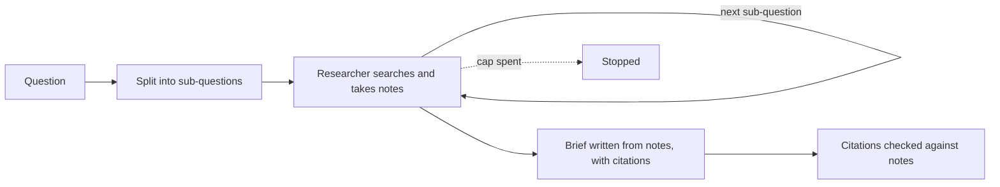
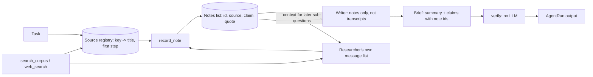

# Deep research

## What it is

A single agent asked a broad question tends to search once, skim, and answer --
the answer is only as good as whichever pages that one query happened to
surface. Deep research breaks the question into narrower sub-questions first,
researches each one on its own (its own search budget, its own reasoning, its
own chance to recover from a bad query), and only then writes the answer -- from
notes taken along the way, not from the raw search transcripts.

The order matters as much as the split. Writing the final answer from *notes*
rather than from everything every search returned keeps the writer's context
small and each fact traceable to where it came from, at the cost of whatever the
note-taking step chose to drop. And because a note carries its source, the
synthesis step can be held to a rule a plain chat answer never is: a claim is
only allowed to say something a note actually backs, and a claim that cites
nothing real can be caught by checking ids against a list, not by re-reading the
whole research transcript.

This is the shape behind OpenAI's and Google's "Deep Research" products, and
academic systems like STORM that write long, cited documents by first
decomposing the topic into questions an outline can be built from. The general
lesson generalises past research specifically: any task that is better answered
by "several narrower passes, each accountable for its own evidence" than by one
broad pass benefits from the same decompose-then-synthesise shape.

## Control flow

## State and memory

Each sub-question's researcher gets a fresh message list -- no sub-question sees
another's search transcript, only the notes recorded so far, passed in as plain
text context. The source registry and the notes list are the only state carried
between sub-questions, and both are read back from the trajectory afterwards
(nothing extra is stored on `AgentRun`): a source is remembered the first time an
observation returns it, and a note is only ever created for a source already in
that registry.

## Strengths

- **Coverage a single pass misses.** A question with several independent parts
  (a discrepancy, its cause, and what to do about it) gets a dedicated search
  budget for each part, rather than one query trying to carry all three.
- **Every claim is checkable, not just written with a citation-shaped string
  attached.** `record_note` refuses a source the run never actually saw
  returned, and `verify` drops a note id from a claim that never existed --
  citation is enforced against real observations, not trusted from the model's
  own text.
- **A bad search recovers within its own sub-question.** A rephrase or a
  tool switch (`search_corpus` <-> `web_search`) happens without disturbing the
  other sub-questions' progress, and a sub-question that still finds nothing
  becomes a visible gap rather than a silently thin answer.

## Limitations

- **Citation is not the same as support.** A note can misquote or
  over-interpret its source; `verify` checks that a claim's note ids exist, not
  that the note actually says what the claim says. A citation that resolves is
  a necessary check, not a sufficient one.
- **Web evidence is a snippet, not a page.** `web_search` returns a title, a
  URL and a short body -- a note taken from it is a note taken from that
  snippet, and a source can be badly misread from a few lines of context in a
  way a full page would have corrected.
- **Cost scales with the number of sub-questions.** Each one is its own
  `create_agent` run with its own search-and-note turns; a question that
  decomposes into more parts costs roughly that many times the research budget
  of a single pass.
- **Decomposition quality bounds everything downstream.** A sub-question that
  misses part of the question, or splits it along the wrong seam, cannot be
  recovered from later -- the researcher only ever sees the sub-question it was
  given, not the original.
- **A search failure only helps the reader if it surfaces.** The system prompt
  asks the researcher to rephrase or switch tool rather than skip a
  sub-question silently, and a sub-question that still finds nothing is shown
  as a gap -- but this is a prompted behaviour, not a structural guarantee; a
  model that quietly gives up produces a thin note set that looks the same as
  a well-covered one unless the gap line is actually read.

## Where to use it

Any question that is naturally several narrower questions -- "what happened,
why, and what to do about it," or "what does our policy say, and what does
general practice say" -- benefits from being split before it is searched, so
each part gets its own evidence rather than sharing one query's worth. It is
overkill for a question one search already answers, where the decomposition
step only adds latency and cost for no coverage gained.

## In this demo

- **Framework:** LangChain `create_agent` for the per-sub-question researcher,
  with the same three middleware hooks as Step 2's `tool_design`:
  `before_model` calls `budget.check()` and this demo's own per-sub-question
  step counter, jumping to `end` when either is spent; `wrap_model_call` times
  the call and charges its tokens; `wrap_tool_call` charges one tool call,
  times it, diverts the fault-injected call, and updates the source registry
  right after a successful `search_corpus` / `web_search` call returns.
  `decompose` and `synthesise` are single `with_structured_output(...,
  include_raw=True)` calls, not `create_agent` runs; `verify` makes no model
  call at all.
- **Model:** `core.llm.agent_models()`, unpacked as `primary, *fallbacks` --
  `ModelFallbackMiddleware(*fallbacks)` for the researcher, `.with_fallbacks()`
  on the bound structured-output runnables for `decompose` and `synthesise`.
- **Tools:** `core.tools.Toolbox` with `search_corpus` and `web_search` (plus
  `boom` when the fault toggle is on), and one demo-local tool,
  `record_note(claim, source, quote)`, built fresh per sub-question but
  reading and writing the run-wide source registry and notes list by
  reference. No new tool is added to `core/tools.py`.
- **The source registry and the guard it enables:** every `search_corpus` /
  `web_search` observation is parsed for source keys (`parse_sources()`) --
  a corpus hit's file name, a web hit's URL -- the first time each key is
  seen, against the step it was seen on. `record_note` refuses any `source`
  not already in that registry, with an `ERROR[bad_argument]: ... Hint: cite
  one of: ...` observation naming what would be accepted.
- **`verify` (no LLM):** every claim's note ids are checked against the notes
  that exist; an unknown id is dropped from that claim and the claim is
  flagged `unsupported` (shown, never hidden); the distinct sources behind
  every surviving citation are counted and checked against the "at least
  three" target.
- **Failed search recovery:** the sidebar toggle **"Break the first
  search"** diverts the first search call in the run -- `search_corpus` or
  `web_search`, since the researcher is told to try the corpus first -- to
  `core.tools`' `boom`, so the researcher sees a genuine `ERROR[failed]: ...` observation.
  The system prompt asks it to rephrase or switch tool rather than repeat the
  call or skip the sub-question; `recoveries(steps)` (a pure function, no
  model call) counts a search error immediately followed, within the same
  sub-question, by a successful search, and the page shows the count next to
  how many searches actually failed. A sub-question that still ends with no
  notes is shown as a gap under the brief, never silently dropped.
- **Panels:** sub-questions (with note count and answered/gap status), a
  notes table, the source registry against the ≥3-source target, the brief
  with inline `[n]` citation markers on each claim (unsupported claims
  called out separately), a "Citations → steps" table linking claim → note →
  the step a source was found on and the step the note was recorded on, and
  the recovery line. None of this is stored anywhere new -- every panel is
  rebuilt from `AgentRun.steps` by functions in `agent.py`
  (`subquestions_from_steps`, `notes_from_steps`, `sources_from_steps`,
  `brief_from_steps`, `citations_table`), the same way `plan_execute` rebuilds
  its plan-versions panel from its own `decide` rows.
- **Caps:** `research_max_subquestions` (4, existing) truncates the
  decomposer's list with a note if it overruns; `research_max_steps_per_question`
  (6) is a per-sub-question researcher step cap -- spending it moves on to the
  next sub-question with a `decide` row saying so, and does not stop the run;
  the shared budget (default step cap `research_max_steps`, 30, set as this
  page's own sidebar default in place of the shared `AGENT_MAX_STEPS`) still
  stops everything, and a shared-cap stop is raised as `BudgetExceeded` and
  caught once, at the top of `run()`. The token budget also has its own page
  default, `research_max_tokens` (60,000): every sub-question re-sends its own
  growing history, so the shared `AGENT_MAX_TOKENS` ran out before the brief.
- **A reserve for the brief.** Research stops starting new model calls once a
  quarter of the token budget, or the last step, is all that is left
  (`BRIEF_TOKEN_RESERVE`). Sub-questions not yet researched become gaps, and
  `synthesise` always gets to run -- a research run that spends everything on
  searching and never writes the brief has failed at the one thing it was for.
- **Storage:** `research_runs`. No checkpoint and no long-term memory -- this
  demo cannot pause and does not implement `resume()`. `Clear my data` empties
  `research_runs`.
- **Tracing:** `core.tracing.get_callbacks()` passed into every LangChain call,
  and the whole `run()` wrapped in `core.tracing.observe(name="research.run")`
  -- both no-ops when Langfuse is not configured.
- **Caveat:** decomposition quality is not itself checked by anything in this
  demo -- a sub-question that badly splits the question produces thin or
  off-target notes with no separate signal pointing at the split as the cause,
  only at the resulting gap or a source count under the target.
