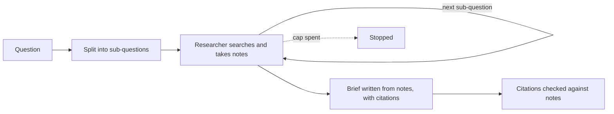
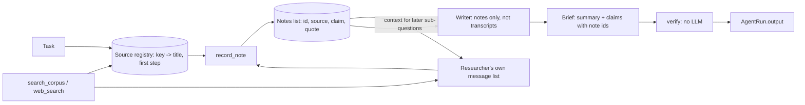

# Deep research

## What it is

Asked a broad question, a single agent tends to search once, skim, and answer.
Deep research first splits the question into smaller sub-questions. Each one is
researched on its own, with its own searches and its own chance to recover from
a bad query. The agent takes short notes as it goes, each tied to a source.

The final answer is written from those notes, not from the raw search results.
That keeps the writer's input small, and every claim can be traced back to the
note, and source, that supports it.

## Control flow

## State and memory

Each sub-question starts with a fresh message list and sees only the notes so
far. The source registry and the notes list are the only state carried between
sub-questions.

## Strengths

- **Better coverage.** Each part of a many-part question gets its own searches.
- **Checkable claims.** Every claim points to a note, and every note to a source.
- **Local recovery.** A bad search is fixed inside its own sub-question without
  disturbing the others.
- **Visible gaps.** A sub-question that finds nothing shows up as a gap, not a
  quietly thin answer.

## Limitations

- **A citation is not proof.** A note can misquote its source, and checking that
  a citation exists does not check what it says.
- **Costs grow with the split.** Each sub-question is its own research run.
- **A bad split can't be fixed later.** Researchers only see their own
  sub-question, so a missed part stays missed.
- **Notes lose detail.** Anything the note-taker skipped never reaches the
  writer.
- **Giving up can look like success.** A researcher that quietly stops early
  leaves few notes, which looks like a question with little to find.

## Where to use it

- Questions that are really several questions: "what happened, why, and what
  now", or "what does our policy say, and what does common practice say".
- Answers that need sources for each claim.
- Not for questions one search already answers: the split only adds time and
  cost.

## In this demo

- **Framework:** LangChain `create_agent` for each sub-question's researcher,
  with three middleware hooks (as in `tool_design`): `before_model` checks
  `budget.check()` and the per-sub-question step counter and jumps to `end`
  when either is spent; `wrap_model_call` times the call and charges tokens;
  `wrap_tool_call` charges a tool call, times it, diverts the fault-injected
  call, and updates the source registry after a successful search.
- `decompose` and `synthesise` are single `with_structured_output(...,
  include_raw=True)` calls; `verify` makes no model call.
- **Model:** `core.llm.agent_models()` as `primary, *fallbacks` --
  `ModelFallbackMiddleware(*fallbacks)` for the researcher, `.with_fallbacks()`
  for `decompose` and `synthesise`.
- **Tools:** `search_corpus` and `web_search` from `core.tools.Toolbox` (plus
  `boom` when the fault toggle is on), and one demo-local tool,
  `record_note(claim, source, quote)`, built per sub-question but sharing the
  run-wide registry and notes list. Nothing new in `core/tools.py`.
- **Source registry:** `parse_sources()` reads source keys (corpus file name,
  web URL) out of each search observation, with the step each was first seen
  on. `record_note` refuses any source not in the registry with
  `ERROR[bad_argument]: ... Hint: cite one of: ...`.
- **`verify` (no LLM):** drops unknown note ids from a claim and flags it
  `unsupported` (shown, never hidden); counts distinct cited sources against
  the "at least three" target.
- **Web evidence is a snippet.** `web_search` returns title, URL and a short
  body, so a web note is taken from that snippet, not the full page.
- **Break the first search** (sidebar) diverts the first `search_corpus` or
  `web_search` call to `boom`, giving a real `ERROR[failed]: ...`. The prompt
  asks the researcher to rephrase or switch tool. `recoveries(steps)` counts a
  failed search followed by a successful one in the same sub-question; the
  page shows it next to the failed count. Recovery is prompted, not
  guaranteed.
- **Panels:** sub-questions (note count, answered/gap), notes table, source
  registry vs. the ≥3 target, the brief with `[n]` markers (unsupported claims
  called out), a "Citations → steps" table, and the recovery line. All rebuilt
  from `AgentRun.steps` by `subquestions_from_steps`, `notes_from_steps`,
  `sources_from_steps`, `brief_from_steps`, `citations_table` -- nothing extra
  stored.
- **Caps:** `research_max_subquestions` (4) truncates the decomposer's list
  with a note. `research_max_steps_per_question` (6) moves on to the next
  sub-question with a `decide` row, without stopping the run. The page's own
  defaults replace the shared ones: `research_max_steps` (30) and
  `research_max_tokens` (60,000), because each sub-question resends its own
  history. A shared-cap stop raises `BudgetExceeded`, caught once at the top of
  `run()`.
- **Brief reserve:** research stops starting model calls once a quarter of the
  token budget, or the last step, is left (`BRIEF_TOKEN_RESERVE`). Unresearched
  sub-questions become gaps, and `synthesise` always runs.
- **Storage:** `research_runs`. No checkpoint, no long-term memory, no
  `resume()`. `Clear my data` empties `research_runs`.
- **Tracing:** `core.tracing.get_callbacks()` on every LangChain call and
  `run()` wrapped in `core.tracing.observe(name="research.run")`; both no-ops
  without Langfuse.
- **Caveat:** nothing checks the decomposition itself. A bad split shows up
  only as gaps or a source count under target.
