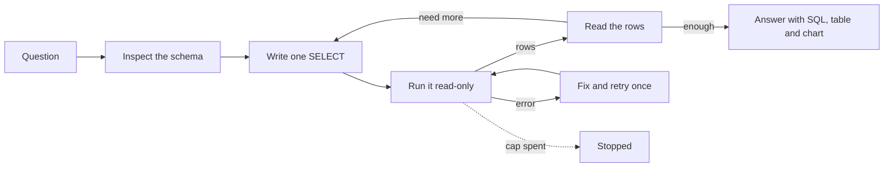
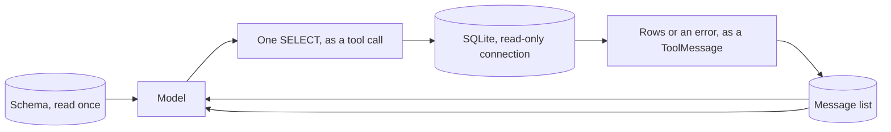

# Text-to-SQL analyst

## What it is

A text-to-SQL agent answers questions about a database by writing queries. It is
shown the schema (the tables and columns), not the data. It writes a query, runs
it, reads the result, and either answers or writes the next query.

The database does the counting, joining and totalling, which it does exactly.
The model only turns the question into correct SQL. It checks the schema first,
because real column names can't be guessed from the question. If a query fails,
the database's error message (like "no such column") goes back to the model as a
hint for the fix.

## Control flow

## State and memory

Nothing is remembered between runs. Within a run, the schema, every query and
every result live only in the message list.

## Strengths

- **Exact answers.** Totals and rankings are computed by the database, not
  guessed by the model.
- **Errors explain themselves.** A database error names the problem, so the
  model can fix it by reading it.
- **Scales to big tables.** A `GROUP BY` over a million rows still returns just
  a few numbers to the model.

## Limitations

- **Schemas are ambiguous.** Unclear column names or look-alike tables are easy
  to misread.
- **Wrong but valid SQL is the real danger.** A query that runs but uses the
  wrong column returns a confident, wrong number.
- **Joins can double-count.** A one-to-many join repeats rows, so a `SUM` after
  it can be silently too big.
- **Row caps can hide data.** Fetching raw rows and adding them up loses
  whatever the cap cut off.
- **Data can carry instructions.** Text stored in the database can be written to
  look like a command to the model.
- **Read-only must be enforced by the system.** A prompt that says "never write"
  can be ignored; only the database connection can guarantee it.

## Where to use it

- Questions answered by computing over structured data: totals, rankings,
  trends, anything a `GROUP BY` or `JOIN` expresses.
- Not for what a document *says*; use retrieval for that.
- Not for schemas so large or messily named that reading them doesn't clear up
  the question.

## In this demo

- **Framework:** LangChain `create_agent`, as in Step 2 (`tool_design/`). Three
  middleware hooks: `before_model` checks the budget and jumps to `end` on a
  spent cap; `wrap_model_call` times and charges each model call;
  `wrap_tool_call` charges each tool call and holds the fix-and-retry rule.
- **Model:** `core.llm.agent_models()` as `primary, *rest` with
  `ModelFallbackMiddleware(*rest)` (see `core/llm.py`).
- **Database:** bundled `samples/chinook.db`, reached only through `core.tools`'
  `describe_schema` and `run_sql`. No new tool or guard here. The Chinook schema
  shows why the schema step matters: a "genre" is a `Genre` table joined through
  `Track`, and an amount is `UnitPrice * Quantity` summed over `InvoiceLine`.
- **Read-only, twice:** in `core.tools._run_sql`, a regex refuses anything but
  `SELECT`/`WITH`, and the SQLAlchemy engine opens the file with SQLite's
  `mode=ro` flag. Results are capped at `sql_row_limit` rows.
- **Fix-and-retry once** (`sql_analyst_max_sql_retries`, default `1`): the
  middleware counts consecutive `run_sql` failures. A failed query returns its
  real error, and the next call still runs so the fix can be tried. Past the
  cap, the next call is refused without reaching SQLite: `ERROR[refused]: The
  retry limit for failed queries is reached. Hint: answer with what you have,
  and say which query failed.` A success resets the count. Retried rows show
  `attempt=2` (`04′`), under the failed attempt.
- **Skip the schema tool** (sidebar) removes `describe_schema`, so the
  wrong-column preset reliably errors and the model must learn the real name
  from SQLite's message.
- **Output panel** (between trajectory and final answer): for each successful
  `run_sql`, the SQL (`st.code`), the table (parsed from the observation by
  `parse_rows`; queries are never re-run), and a chart where it fits
  (`chart_spec`). One text + one numeric column with 2–25 rows gives a sorted
  horizontal bar; a date/year-like column + one numeric gives a line; anything
  else gives a caption saying why not. Only the last chartable query's chart is
  expanded; earlier ones sit behind "Show chart". `st.bar_chart` and
  `st.line_chart` use the app theme, so no colour literals.
- **Presets:** aggregate-then-drill-down over genres and artists; the same over
  billing countries and customers, with a real tie for third the answer should
  mention; a wrong column (`amount` instead of `Total`) for use with "Skip the
  schema tool"; and a write request the tool must refuse.
- **The prompt does not forbid writes.** It says the database enforces
  read-only and to send any change through `run_sql` and report the result. An
  earlier "never modify data" prompt made the model decline on its own, so the
  real guard never showed on the track.
- **Data as injection:** the read-only sandbox limits what following an
  injected instruction could do, but doesn't stop the model reading it.
- **Budget:** `agent_max_steps` / `agent_max_tokens` / `agent_deadline_s` from
  `core/config.py`, changeable in the sidebar.
- **Storage:** `sql_analyst_runs`. No checkpointer, no `resume()`. `Clear my
  data` empties `sql_analyst_runs`.
- **Tracing:** `core.tracing.get_callbacks()` passed to `agent.stream()` and
  `core.tracing.observe()` around `run()`; both no-ops without Langfuse.
