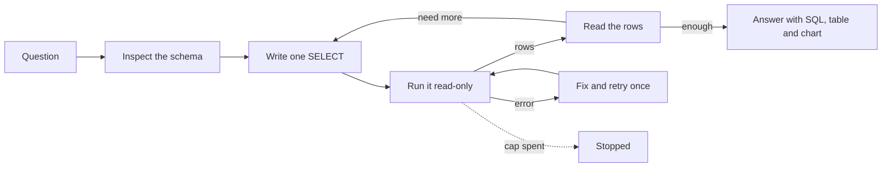
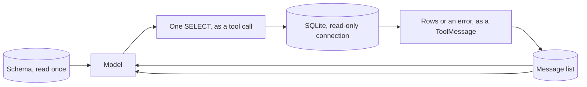

# Text-to-SQL analyst

## What it is

Give a model a database and a question, and there are two ways to let it answer.
One is retrieval: treat the database like a document, embed some rendering of its
rows, and pull the ones that look relevant back into the prompt. The other is what
this demo does — hand the model the *schema*, not the data, and let it write the
query that computes the answer itself. The database does the counting, the joining
and the filtering; the model's job is narrower and more mechanical: turn a question
in English into one correct statement in a language that already has an exact
answer for it.

This only works if the model is grounded in the real schema before it writes
anything. Column and table names are not guessable from the question alone — a
"genre" the question means informally is a `Genre` table joined through
`Track`, and an amount is `UnitPrice * Quantity` summed across `InvoiceLine`
rows, not a column called `amount` that a first guess might reach for. So the
loop always starts the same way: inspect the schema, then write. From there it is
the same generate → execute → observe cycle every tool-using agent runs: write a
statement, run it, read what came back, and either that is enough to answer or it
tells the model what to ask next. An error is not a dead end — SQLite's own
message ("no such column: amount") is usually the most direct signal available for
what the *real* name is, so it goes back to the model as the next thing to read,
the same way any other tool error would.

The case for doing the aggregation in SQL rather than in the model is not just
convenience. `SUM`, `GROUP BY` and `ORDER BY ... LIMIT` are exact and scale to
however many rows the table holds; a model asked to eyeball a page of fetched rows
and total them by hand is doing arithmetic it is not reliable at, on a subset it
had to choose somehow. The tool exists so the model never has to.

## Control flow

## State and memory

Nothing here is remembered between runs. The schema is fetched once per run, the
same way any other tool result is, and lives only in that run's message list
alongside every query and every observation; the next run starts cold. State
within a run is exactly the message list `create_agent` already keeps — there is
no separate cache of "facts learned about the schema" the way a hand-rolled loop
might build one.

## Strengths

- **The database is the source of truth, and it stays that way.** The model never
  sees the underlying rows unless a query puts them in front of it — an aggregate
  computed in SQL is exactly right, not a model's best guess from a sample.
- **Errors are recoverable by construction.** SQLite's rejection of a bad query
  already names the problem in a form built for exactly this kind of correction;
  the agent doesn't need a bespoke retry strategy, it needs to read the message.
- **It scales past what a model's context window could ever hold.** A retrieval
  approach eventually runs out of rows it can afford to embed and re-rank; a
  `GROUP BY` over a million rows costs the database the same query it always would
  and returns the model a handful of numbers either way.

## Limitations

- **Schema ambiguity and naming are the actual bottleneck.** A `Total` column that
  means something specific to whoever named it, two tables that could both
  plausibly hold "customer," a foreign key that isn't obviously one — none of
  this is visible from the question, only from a schema a model has to interpret
  correctly on the first read.
- **Silently wrong but valid SQL is the dangerous failure, not the loud one.** A
  query that references the wrong column but happens to run, or joins two tables
  in a way that fans out and double-counts, returns a confident, plausible,
  incorrect number — and nothing on the track distinguishes it from a correct one
  unless a reader checks the SQL itself.
- **Joins are where silent errors concentrate.** A one-to-many join multiplies
  every row on the "one" side by however many matches it has on the "many" side
  before an aggregate runs over it, so a `SUM` after an unguarded join is
  frequently a real number that is simply wrong, not an error at all.
- **A row cap can hide the true answer without saying so.** `sql_row_limit` caps
  what any single query can return; a query that should aggregate but doesn't
  (fetching raw rows to sum client-side, say) silently loses the rows past the
  cap rather than computing the full total the database could have given it.
- **The data itself is an injection surface.** A value pulled back from the
  database — a customer's name, a note field — is still text a model reads and
  can be written to look like an instruction; this demo's sandboxed, read-only
  connection limits the blast radius of following one, but doesn't stop the model
  from reading it.
- **Read-only has to be enforced below the model, not requested of it.** A system
  prompt that says "never write" is a preference the model can misread, forget
  mid-run, or be talked out of by a persuasive enough task. The refusal in this
  demo comes from two independent guards inside `core.tools._run_sql` — a regex
  that rejects anything but `SELECT`/`WITH`, and a SQLite connection opened with
  `mode=ro` at the OS level — neither of which the model's own behaviour can
  affect.

## Where to use it

Anywhere the answer is a computation over structured data that already lives in a
real database: totals, rankings, trends, anything a `GROUP BY` or a `JOIN`
naturally expresses. It is a poor fit for a question about what a document *says*
— that's retrieval's job, over passages, not a table's job, over rows — and a poor
fit for a schema so large or so inconsistently named that inspecting it doesn't
actually resolve the ambiguity a question raises.

## In this demo

- **Framework:** LangChain `create_agent`, the same as Step 2 (`tool_design/`).
  Budget accounting is three middleware hooks: `before_model` checks the budget
  and jumps to `end` on a spent cap; `wrap_model_call` times and charges each
  model call; `wrap_tool_call` charges each tool call and is also where the
  fix-and-retry-once rule lives.
- **Model:** `core.llm.agent_models()`, unpacked as `primary, *rest` with
  `ModelFallbackMiddleware(*rest)` — see `core/llm.py`.
- **Database:** the bundled `samples/chinook.db`, reached only through
  `core.tools`' `describe_schema` and `run_sql` — no new tool, no guard added in
  this demo's own code. `run_sql` is read-only twice over: a regex refuses
  anything but `SELECT`/`WITH`, and the SQLAlchemy engine itself opens the file
  with SQLite's `mode=ro` URI flag. Results are capped at `sql_row_limit` rows.
- **Fix-and-retry once** (`sql_analyst_max_sql_retries`, default `1`): the
  middleware tracks consecutive `run_sql` failures. A query that fails is still
  run and its real error returned — that's the first attempt's honest cost. The
  *next* `run_sql` call after a failure is still executed, so the model's fix gets
  to run; only once retries in a row exceed the cap does the following call get
  refused outright, with the observation `ERROR[refused]: The retry limit for
  failed queries is reached. Hint: answer with what you have, and say which query
  failed.` — never sent to SQLite at all. A success resets the count. The retried
  call's rows (both its `act` and its `observe`) render with `attempt=2`
  (`04′`), stacked under the failed attempt it follows.
- **"Skip the schema tool"** (sidebar toggle): removes `describe_schema` from the
  run's tools entirely, so the wrong-column preset lands its error on the track
  even against a model that would otherwise check the schema first and avoid the
  mistake — the model then has to learn the real column name from SQLite's own
  rejection.
- **Output panel** (between the trajectory and the final answer): for every
  successful `run_sql` call, in order, the SQL (`st.code`), the result table
  (parsed from the observation text with the pure helper `parse_rows` — the page
  never re-runs a query), and, where the shape suits it, a chart
  (`chart_spec`): one text column plus one numeric column and 2–25 rows renders a
  horizontal bar sorted by value; a date/year-like column plus one numeric
  renders a line; anything else renders no chart, with a caption naming why. At
  most one chart is shown expanded — the last query whose shape suits one —
  and earlier eligible charts sit behind a "Show chart" expander so the panel
  doesn't repeat the same story for every step. Both `st.bar_chart` and
  `st.line_chart` read the app's own chart theme, so no colour literal appears in
  this demo's code.
- **Presets:** a two-query aggregate-then-drill-down over genres and artists; the
  same shape over billing countries and customers, including a genuine tie for
  third place the answer should mention; a wrong column name (`amount` instead
  of `Total`) meant to be run with "Skip the schema tool" on; and a write request
  the tool must refuse.
- **The prompt does not forbid writes.** It tells the model the database enforces
  read-only access itself and to send a requested change through `run_sql` and
  report what comes back. An earlier draft said "never attempt to modify data",
  and the model then declined on its own every time -- the refusal never reached
  the track, which hid the one guard that actually matters (see Limitations).
- **Budget:** `agent_max_steps` / `agent_max_tokens` / `agent_deadline_s` from
  `core/config.py`, overridable per run in the sidebar, same as every other demo.
- **Storage:** `sql_analyst_runs`. No checkpointer and no `resume()` — this demo
  cannot pause. `Clear my data` empties `sql_analyst_runs`.
- **Tracing:** `core.tracing.get_callbacks()` passed into `agent.stream()` and
  `core.tracing.observe()` wrapping `run()` — both no-ops when Langfuse isn't
  configured.
