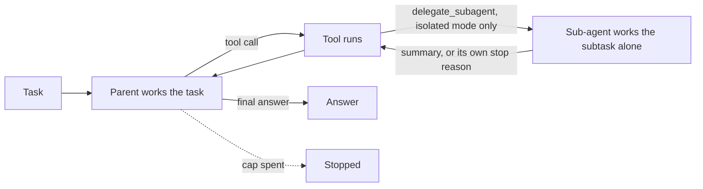
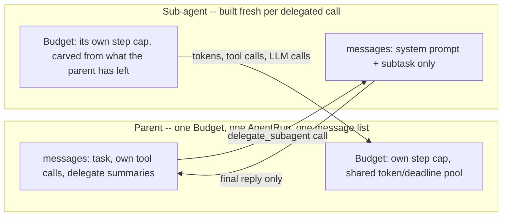

# Sub-agent delegation

## What it is

A single agent's context is one growing list of messages: every tool call it
makes and every observation that comes back sits in that list for the rest of
the run, because the next LLM call has to see the whole history to stay
coherent. That's fine for a task that stays small, but it doesn't stay fine --
a long task accumulates raw tool output (rows, search hits, file contents) that
the agent needed once, to get one fact, and now carries forward on every
subsequent call whether or not it's still relevant. The context gets bigger, the
prompts get more expensive, and the parts of the history that matter get harder
to find in the parts that don't.

Sub-agent delegation is the fix: instead of working a self-contained piece of
the task inline, the agent hands it to a sub-agent -- a fresh instance with its
own message history, starting from nothing but the subtask itself, its own tools
and its own bounded budget. The sub-agent does whatever work the subtask needs,
however many tool calls that takes, and then reports back exactly once, in a
short reply. The parent's own context only ever grows by that one reply -- never
by the sub-agent's intermediate tool calls, its reasoning, or anything it tried
and abandoned. The isolation is the whole point: the sub-agent's *process* is
invisible to the parent on purpose, so its *cost* is too.

This is also why the technique composes: nothing about "hand this bounded piece
of work to an isolated context and take back a summary" depends on there being
only one sub-agent, or on it running before the parent continues. The same
primitive extended to routing between several specialists is Supervisor-worker
(next); running several such delegations at once rather than one at a time is a
scheduling detail on top of the same isolation, not a different mechanism.

## Control flow

`delegate_subagent` is a tool like any other from the parent's point of view --
it shows up in the same bound-tools list, the model calls it the same way, and
`tools` is where it actually runs. The difference is what happens inside that
one call: instead of a single sandboxed function, it's a whole nested loop (its
own `act`/`tool`/`observe` cycle, bounded by its own step cap) that only returns
once it has a final answer or has exhausted that cap. Either way, exactly one
`ToolMessage` comes back to the parent, and the loop continues from `act` as
if any other tool had just returned.

## State and memory

Nothing here is checkpointed -- this demo never pauses, so there's no MongoDB
saver and no `resume()`, unlike Human-in-the-loop gates or Escalation. Both
`Budget` and `AgentRun` objects live only for the duration of one `run()` call;
`_run_subagent` builds a brand new `Toolbox` and message list every time it's
called, and rolls its real spend (tokens, tool calls, LLM calls) into the
parent's own `Budget` before returning, so the budget strip always reflects the
true total cost -- delegated work included -- even though the sub-agent's own
step cap is a separate, smaller number the parent's step cap never sees.

## Strengths

- **The parent's context stays flat regardless of how much work a delegated
  subtask actually took.** A sub-agent that needed six tool calls and a false
  start to answer a one-sentence question still only ever costs the parent one
  short reply's worth of tokens on every subsequent turn.
- **A sub-agent's failure is contained by construction, not by a try/except
  someone remembered to add.** `_run_subagent` catches its own `BudgetExceeded`
  and returns a stopped-early observation instead of raising, so the failure
  mode is "the parent gets a worse observation," never "the run crashes."
- **The technique generalises for free.** Nothing about handing a bounded,
  self-contained subtask to an isolated context and taking back a summary
  changes if there are several sub-agents, or if they're specialists, or if
  they run at once instead of one after another -- this demo just shows the
  smallest version of the primitive.

## Limitations

- **The parent can only act on what the sub-agent chose to report, not on how
  it got there.** If the sub-agent's reasoning went wrong in a way its final
  reply doesn't reveal, the parent has no way to notice -- it never sees the
  intermediate steps at all. (This is exactly the failure mode Escalation's
  judge exists to catch for a single agent's own answer; nothing here plays
  that role for a sub-agent's.)
- **Deciding what's "self-contained enough to delegate" is the model's own
  judgement call, not a guarantee.** A subtask that turns out to need context
  the parent has but didn't pass along fails quietly inside the sub-agent
  instead of failing loudly where the missing context would be obvious.
- **Delegation here is never load-bearing.** The parent and every sub-agent
  share the exact same tools (see "In this demo"), so when a delegated call
  fails or is skipped, the parent can simply do that part itself -- which is
  what makes the "force the sub-agent to fail" recovery path a graceful retry
  rather than a real gap in the final answer. A design where only the
  sub-agent can reach a given tool is a different, stronger claim; this demo
  doesn't make it.
- **Isolation trades context size for latency and duplicated setup.** Every
  delegated call builds a fresh `Toolbox` and pays for its own tool round
  trips serially in this demo; the tokens saved on the parent's side are real,
  but they are not free in wall-clock time.
- **A sub-agent that quietly gets the wrong answer is worse than one that
  fails loudly.** Its own step cap catches "ran out of budget," not "confidently
  wrong" -- there's no check here on whether its short reply is actually
  correct, only on whether it finished.

## Where to use it

Anywhere a task has a genuinely bounded, self-contained piece that the parent
doesn't need the process for, only the result -- a fact lookup, a calculation,
a search-and-summarize -- especially once that piece would otherwise dump a lot
of raw tool output into a long-running context. It pairs naturally with Deep
agents (Step 12), which uses the same delegation primitive as one of several
long-horizon tools, and it's the building block Supervisor-worker (next)
specialises by giving each sub-agent a fixed role and a router that chooses
between them instead of leaving the choice to a single tool call.

## In this demo

- **LangGraph `StateGraph`, hand-built**, two nodes (`act`, `tools`) looping
  until a final answer -- the same skeleton Escalation and Plan-and-Execute use,
  with no judge/escalate/wait pieces. No checkpointer, no `resume()`: this demo
  never pauses.
- **`delegate_subagent`** is a `StructuredTool` bound alongside the normal
  toolbox tools when isolation is on; dispatched by hand inside `tools_node`,
  exactly like every other tool call in this codebase (none of these demos use
  LangGraph's `ToolNode`). Its own bound function is a stub that raises if ever
  actually invoked.
- **Isolate sub-agent context (sidebar toggle, default on).** Off, the tool
  isn't bound at all -- the parent does the whole task itself, in one shared
  context, so every tool result stays in its history for the rest of the run.
  This is the "shared context" comparison the plan calls for: not a second,
  differently-wired delegation, just no separation at all.
- **Force the sub-agent to fail (sidebar toggle, isolated mode only).** Clamps
  the sub-agent's own `Budget.max_steps` to 0, so its first `check()` raises
  before any LLM call -- a deterministic way to exercise the recovery path
  without depending on model behaviour to reproduce it.
- **Budget:** the sub-agent's own cap is `subagent_max_steps` (default 6,
  `SUBAGENT_MAX_STEPS` in config, overridable per run from the sidebar's
  "Sub-agent step cap" slider); its token and deadline caps are whatever the
  parent has left when it's called. Its real spend (tokens, tool calls, LLM
  calls -- never steps) is charged onto the parent's `Budget`, so the strip
  always shows true total cost.
- **Tools:** `search_corpus`, `describe_schema`, `run_sql` -- the identical set
  for the parent and every sub-agent (no `web_search`, so the presets stay
  deterministic, same choice Reflexion, Escalation and Plan-and-Execute make).
  The parent is never missing a tool a sub-agent has; delegating only keeps a
  piece of work out of the parent's own context, it doesn't reach a capability
  the parent lacked. Splitting tools between dedicated specialists, chosen by
  a router, is Step 9 (Supervisor-worker)'s subject, not this demo's.
- **Storage:** `subagents_runs` only -- no checkpoints, no long-term memory.
  `Clear my data` empties it.
- **Tracing:** `run()` carries Langfuse's `@observe` decorator, a no-op
  passthrough when no Langfuse keys are set.
