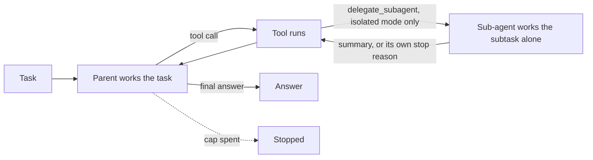
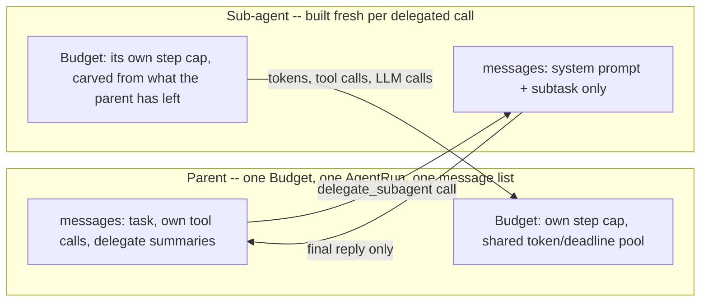

# Sub-agent delegation

## What it is

An agent's context keeps every tool call and result for the rest of the run. On
a long task that fills up with raw output it needed only once, so every call
gets bigger and costlier.

Sub-agent delegation fixes this. The agent hands a self-contained piece of work
to a **sub-agent**: a fresh agent with its own empty history, tools and budget.
The sub-agent does the work, however many steps it takes, and sends back one
short reply. The parent's context grows only by that reply. Supervisor–worker
builds on the same idea with several specialists.

## Control flow

To the parent, `delegate_subagent` is just a tool. Inside, it runs a whole
bounded loop and returns one `ToolMessage`.

## State and memory

The sub-agent's history is thrown away after each call; only its reply reaches
the parent. Its spend is added to the parent's budget, so the total stays true.

## Strengths

- **The parent's context stays small.** A subtask that took many tool calls
  costs the parent one short reply.
- **Failures stay contained.** A sub-agent that runs out of budget returns a
  weaker answer instead of crashing the run.
- **Scales up easily.** The same idea works with several sub-agents,
  specialists, or sub-agents running in parallel.

## Limitations

- **The parent sees only the reply.** If the sub-agent reasoned badly but its
  reply looks fine, the parent can't tell.
- **Choosing what to delegate is a guess.** A subtask that needs context the
  parent didn't pass along fails quietly inside the sub-agent.
- **Confidently wrong is the worst case.** A step cap catches running out of
  budget, not a wrong answer.
- **Costs time.** Each delegation has its own setup and tool calls, so tokens are
  saved but wall-clock time is not.

## Where to use it

- A bounded piece of work where the parent needs only the result — a lookup, a
  calculation, a search-and-summarize — especially if it would dump a lot of raw
  output into a long context.
- Pairs with Deep agents, which uses delegation as one of its tools.
- Use Supervisor–worker when sub-agents need fixed roles and a router to choose
  between them.

## In this demo

- **LangGraph `StateGraph`, hand-built**: two nodes (`act`, `tools`) looping
  until a final answer, like Escalation and Plan-and-Execute but with no
  judge/escalate/wait. No checkpointer, no `resume()`.
- **`delegate_subagent`** is a `StructuredTool` bound next to the normal tools
  when isolation is on, and dispatched by hand in `tools_node` (no demo uses
  `ToolNode`). Its bound function is a stub that raises if ever called.
- **`_run_subagent`** builds a fresh `Toolbox` and message list per call,
  catches its own `BudgetExceeded` and returns a stopped-early observation.
  Delegations run one after another.
- **Isolate sub-agent context** (sidebar, default on). Off, the tool isn't
  bound: the parent does everything in one shared context, as the comparison.
- **Force the sub-agent to fail** (sidebar, isolated mode only) sets the
  sub-agent's `Budget.max_steps` to 0, so its first `check()` raises before any
  LLM call — a reliable way to show recovery.
- **Budget:** the sub-agent's step cap is `subagent_max_steps` (default 6,
  `SUBAGENT_MAX_STEPS` in config, "Sub-agent step cap" slider). Its token and
  deadline caps are whatever the parent has left. Its tokens, tool calls and
  LLM calls (never steps) are charged to the parent's `Budget`.
- **Tools:** `search_corpus`, `describe_schema`, `run_sql`, the same set for
  parent and sub-agents (no `web_search`, to keep presets deterministic). So
  delegation is never load-bearing: if it fails, the parent can do the work
  itself. Splitting tools between specialists is Supervisor-worker's subject.
- **No correctness check** on a sub-agent's reply, only on whether it finished.
- **Storage:** `subagents_runs` only — no checkpoints, no long-term memory.
  `Clear my data` empties it.
- **Tracing:** `run()` uses Langfuse's `@observe`; it does nothing without
  Langfuse keys.
