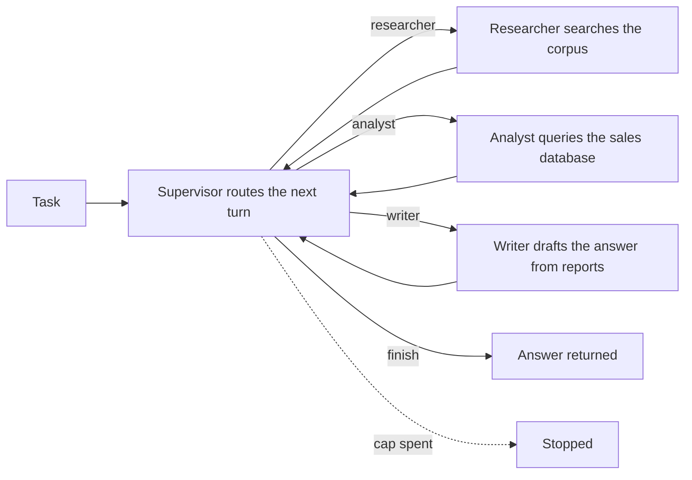
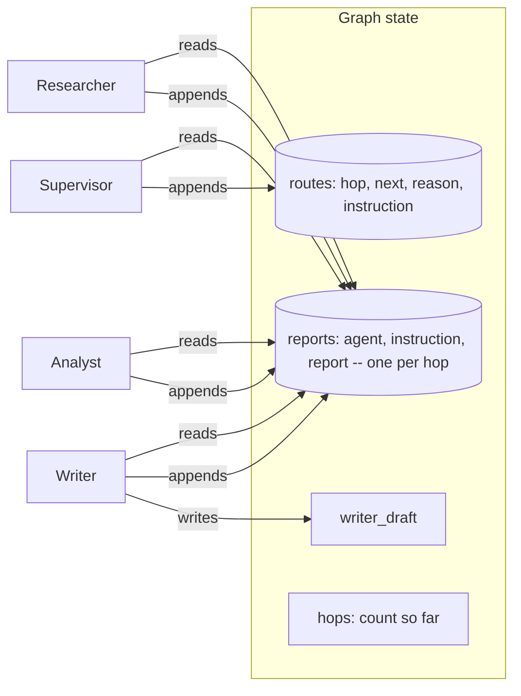

# Supervisor-worker

## What it is

A supervisor-worker system splits a task across **specialists**, each good at
one kind of work. One agent, the **supervisor**, is in charge. It uses no tools
itself. Each turn it reads the reports so far, picks the next specialist, gives
it a short instruction, and reads its report before deciding again.

Workers never see each other's conversations. They see only the task, their
instruction and the shared reports. This keeps each worker simple and makes
every routing choice easy to see — at the cost of extra calls through the
supervisor.

## Control flow

## State and memory

Memory lasts one run. A worker's tool calls stay inside its own turn; only its
final report goes on the shared board that later turns read.

## Strengths

- **Each specialist stays narrow.** It only gets the tools it needs, so it
  can't reach for the wrong one.
- **Routing is visible.** You can see which worker ran, on what instruction,
  and why.
- **Failures stay small.** A bad report costs one hop; the supervisor can route
  around it or ask again.
- **Easy to extend.** A new specialist is one more routing option and one more
  worker.

## Limitations

- **Costs more calls.** Every hop goes through the supervisor, so a task one
  agent could do in three calls may take five or more.
- **Only as good as the router.** A wrong pick or a vague instruction wastes a
  hop, and the mistake is harder to spot.
- **Can loop between workers.** A supervisor that never decides to finish keeps
  going until a cap stops it.
- **Reports can conflict.** Nothing reconciles an old report with a newer one
  that contradicts it.

## Where to use it

- Tasks that split cleanly by tool or domain, with one dispatcher choosing who
  goes next.
- When seeing the routing decision matters as much as the answer.
- Use sub-agent delegation (Step 8) when one agent does most of the work and
  only hands off small pieces.
- Use a swarm (Step 10) when there is no natural dispatcher and workers should
  hand off to each other.

## In this demo

- **Hand-built LangGraph `StateGraph`** (as in Steps 3 and 4): routing, a
  worker's tool loop and the writer's draft are separate phases with separate
  prompts, which `create_agent` can't express. Each worker calls
  `Toolbox.call()` inside its own node.
- **Models:** structured output for the supervisor (`Route`, or `RouteNoFinish`
  with the fault toggle on); `.bind_tools(...)` for the researcher and analyst.
  Each model is bound first, then chained with `.with_fallbacks(...)`, because
  `RunnableWithFallbacks` doesn't forward `bind_tools()` (same as Step 3).
- **Tools per specialist:** researcher gets `search_corpus`; analyst gets
  `describe_schema` and `run_sql`; the writer gets none. No `web_search`, so
  presets stay deterministic.
- **Budget:** every model call (supervisor, worker, writer) is one step against
  the shared caps. `SUPERVISOR_MAX_HOPS` (default 8) is a softer second cap:
  once hit, the supervisor's next choice is overridden to `finish` (the same
  override-after-the-call shape as Reflexion). A hop costs at least two steps,
  so with the sidebar defaults the step cap is usually hit first.
- **"Supervisor can't declare done"** (sidebar) removes `finish` from the
  routing schema, so the run hands off between workers until the step cap (or
  hop cap) stops it.
- **Caveat:** worker reports are never reconciled; the writer sees all of them
  and has to notice a conflict itself.
- **No checkpointer.** A run is one `compiled.invoke()` call, so there is no
  `resume()`. State lives only in the `StateGraph` for that run.
- **Storage:** runs go to `supervisor_runs` in `genai_agentic_lab`.
  `Clear my data` empties it.
- **Tracing:** `run()` uses Langfuse's `@observe`; it does nothing without
  Langfuse keys.
