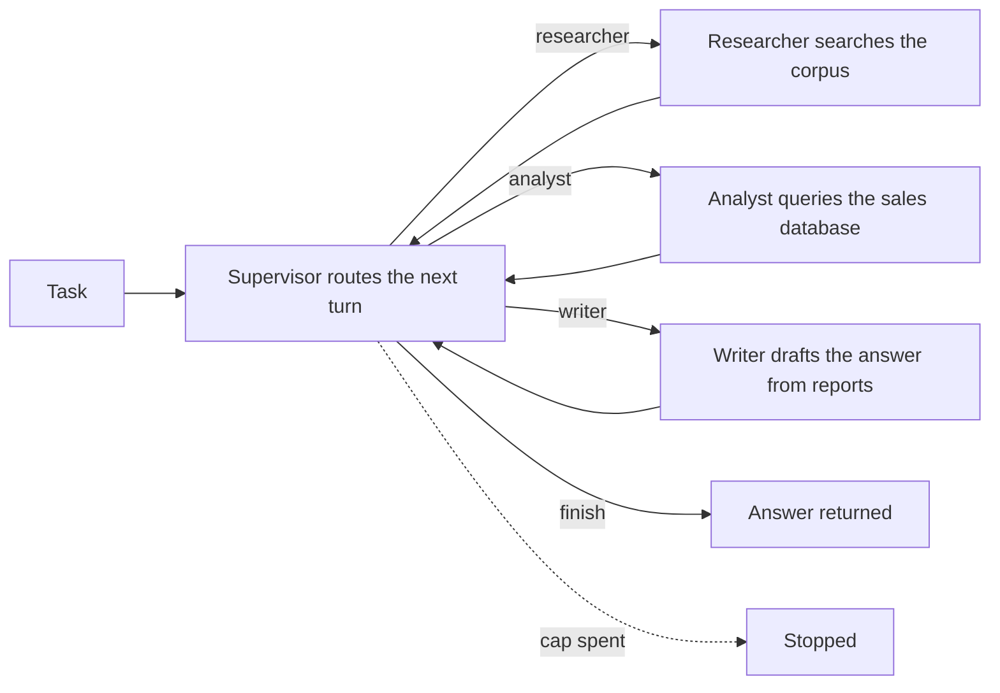
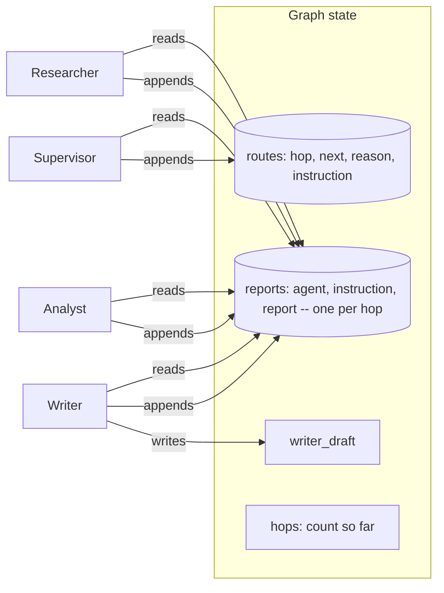

# Supervisor-worker

## What it is

A supervisor-worker system splits a task across specialists that each do one
kind of work, and puts one agent in charge of deciding, turn by turn, which
specialist goes next and when the task is done. The supervisor never touches a
tool itself -- its only job is routing: read what has been reported so far,
pick the specialist best suited to the next piece of the task, give it a short
instruction, and read its report before deciding again. A worker never sees
another worker's conversation, only the task, the supervisor's instruction for
that turn, and the reports gathered so far -- a shared board, not a shared
history.

This buys two things a single agent working alone does not get. First, each
specialist's tools and prompt stay narrow and legible -- a researcher that only
searches documents never has to be told when *not* to write SQL, because it was
never given the option. Second, the routing decision itself becomes visible and
inspectable: a reader can see exactly which specialist ran, on whose
instruction, and why, rather than inferring it from one long agent's mixed
trajectory. The cost is the mirror image of the benefit: every hop is a full
round trip through the supervisor, so a task that one competent generalist
could finish in three calls easily costs the supervisor-worker version five or
six, and the whole system now depends on the supervisor's routing judgement
being good -- a bad route wastes a hop, and enough bad routes waste the budget
before the task is answered.

## Control flow

## State and memory

There is no checkpoint and no long-term memory -- the graph runs start to
finish in one call, and every field above lives only in `StateGraph` state for
the duration of that one run. Nothing here is written back for a future run to
recall, and a worker's own tool-calling messages never leave its own turn: only
its final report is appended to `reports`, which is what every later turn --
including the supervisor's own next decision -- actually reads.

## Strengths

- **Each specialist stays narrow.** The researcher only ever sees
  `search_corpus`, the analyst only `describe_schema` and `run_sql` -- a prompt
  never has to carve out exceptions for tools it shouldn't reach for, because it
  was never handed them.
- **The routing decision is legible on its own.** A reader sees exactly which
  worker ran on which hop, on what instruction, and why the supervisor chose it
  -- not an inference from a mixed trajectory, a fact on the record.
- **Failure is contained to one hop.** A bad report from one worker costs one
  hop, not the whole run; the supervisor reads it like any other report and can
  route around it or ask again.
- **Composable.** Adding a fourth specialist means adding a routing option and
  a worker node -- nothing else in the graph changes.

## Limitations

- **Every hop is a full round trip.** The supervisor call, the worker's own
  call (or calls, if it uses a tool more than once), and eventually the
  writer's call all cost their own step -- a task a single competent agent
  could finish in three or four calls easily costs this shape five or more.
- **The system is only as good as the router.** A supervisor that routes to the
  wrong specialist, or gives a vague instruction, wastes a hop the same way a
  wrong tool call wastes one in a single-agent loop -- except here the mistake
  is one level removed from the work itself, so it can be harder to see coming.
- **A stuck router can loop between workers forever.** Nothing about the shape
  stops a supervisor that never decides `finish` -- see "Supervisor can't
  declare done" below, which forces exactly this so the step cap catching it is
  something a reader can watch rather than take on faith.
- **The reports board can go stale.** A worker's report is a snapshot from the
  turn it ran; if a later report contradicts an earlier one, nothing here
  reconciles them -- the writer sees both and has to notice the conflict itself.

## Where to use it

Use it where the task genuinely splits along the lines of the tools or the
domains involved -- one team of specialists, one dispatcher deciding who's up
next -- and where seeing that routing decision matters as much as the answer.
Reach for Step 8 (Sub-agent delegation) instead when one agent should keep
doing most of the task itself and only hand off the occasional bounded,
self-contained piece; reach for Step 10 (Swarm) when there is no natural
single dispatcher and the specialists themselves are better placed to decide
who picks up the task next.

## In this demo

- **LangGraph `StateGraph`, hand-built**, for the same reason as Steps 3 and 4:
  the supervisor's routing decision, a worker's own tool loop, and the writer's
  draft are distinct jobs with distinct prompts, which `create_agent` has no
  way to express as separate phases. Each worker calls `Toolbox.call()`
  directly inside its own node, the same way every other hand-built graph in
  this codebase does.
- **Structured output for the supervisor** (`Route`, or `RouteNoFinish` when
  the fault toggle is on), `.bind_tools(...)` for the researcher and analyst.
  Provider fallback follows the exact `StateGraph` variant Step 3 established:
  each model is bound to its schema or its tools *first*, and the bound models
  are chained with `.with_fallbacks(...)` afterwards, because
  `RunnableWithFallbacks` doesn't forward `bind_tools()`.
- **Tools, split by specialist, not shared wholesale:** researcher gets
  `search_corpus`; analyst gets `describe_schema` and `run_sql`; the writer
  gets none. No `web_search` (presets stay deterministic, same reasoning every
  earlier demo in this repo uses).
- **Budget:** every model call anywhere in the graph -- the supervisor's
  routing decision, a worker's tool-decision calls, the writer's draft -- is
  one step against the shared caps. `SUPERVISOR_MAX_HOPS` (default 8) is a
  second, softer cap: once reached, the supervisor's next choice is overridden
  to `finish` regardless of what it picked, the same "override after the model
  call" shape Reflexion uses for its own retry cap. A hop costs at least two
  steps, so with the sidebar defaults the shared step cap is usually reached
  first on a run that never finishes on its own -- the hop cap is a backstop
  for a cheaper hop shape, not the mechanism the fault toggle below is built to
  exercise.
- **"Supervisor can't declare done"** (sidebar) removes `finish` from the
  supervisor's routing schema entirely, so nothing in the run can end it early
  -- it keeps handing off between the three workers until the step cap (or the
  hop cap, whichever is reached first) stops it.
- **No checkpointer.** Nothing in this demo pauses -- a run is one call to
  `compiled.invoke()` start to finish -- so there is no `resume()`.
- **Storage:** finished runs go to the `supervisor_runs` collection in
  `genai_agentic_lab`. `Clear my data` empties it.
- **Tracing:** `run()` carries Langfuse's `@observe` decorator, a no-op
  passthrough when no Langfuse keys are set.
