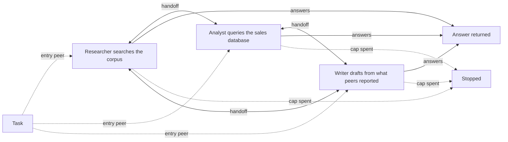
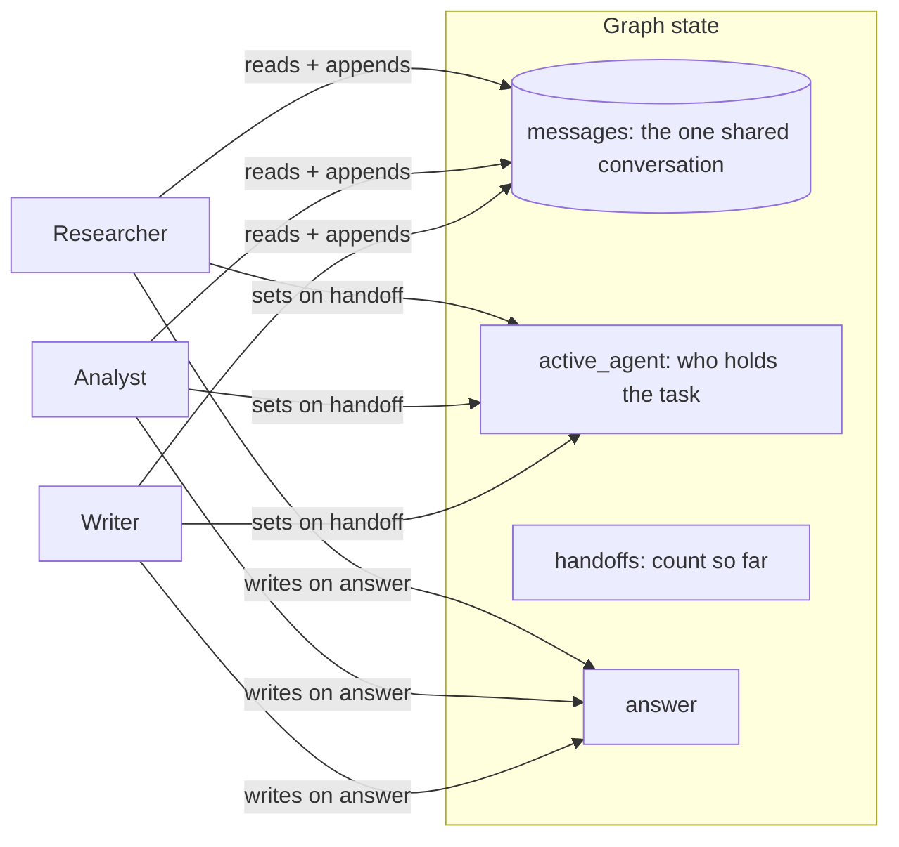

# Swarm

## What it is

A swarm is a team of agents with no boss. Each peer has its own tools and
skills, and they all share one conversation. Whoever holds the task decides, in
its own turn, whether to keep working, hand off to another peer, or answer.

A handoff is just a tool call: the peer names who should take over and why.
Nobody picks routes for the others, so no extra call is spent on "who goes
next". The catch: nobody watches the whole run, so peers can pass the task back
and forth with nothing but a cap to stop them.

## Control flow

There is no hub. The entry peer can hand off to either of the others, and the
task can come straight back.

## State and memory

Every peer reads the real shared conversation, including other peers' tool
calls and results, not a summary. It lives only for one run.

## Strengths

- **No routing overhead.** The handoff happens in the same call as the work.
- **No single router to fail.** Each peer only judges its own next move.
- **Full context on handoff.** The next peer sees the whole trail, not a
  summary.
- **Cheap for quick handoffs.** Borrowing one fact from a peer costs one
  handoff.

## Limitations

- **Nobody sees the big picture.** Two peers passing the task back and forth
  looks like progress to each of them.
- **Only caps stop loops.** Without a hard limit, ping-pong can run until the
  budget is gone.
- **Every peer must judge well.** Each one has to do the work and know when
  someone else should take over.
- **Shared history can confuse the model API.** A peer sees tool calls for
  tools it was never given, which some providers may reject.

## Where to use it

- When the specialists themselves know best who should go next, such as peer
  review or work where the next step only becomes clear mid-task.
- Use a supervisor instead when one place should see the whole route and decide
  when it's done.
- Use sub-agent delegation when one agent does most of the work and hands off
  only small, self-contained pieces.

## In this demo

- **LangGraph `StateGraph`, hand-built**, as in Step 9: each peer's tool loop is
  its own node with its own prompt, and `Command(goto=<peer>, update=...)`
  routing has no `create_agent` equivalent.
- **Handoffs are hand-rolled, not `langgraph-swarm`**, which isn't a pinned
  dependency and would hide the mechanism: a `transfer_to_<peer>` tool bound
  with each peer's tools, and the node returning `Command(goto=target)` when
  it's called.
- **Peers and tools:** researcher has `search_corpus`; analyst has
  `describe_schema` and `run_sql`; writer has no work tools. Each peer holds
  `transfer_to_<peer>` for the other two. No `web_search`, so presets stay
  deterministic.
- **Provider fallback** (as in Steps 3 and 9): each model is bound to its
  peer's tools first, then chained with `.with_fallbacks(...)`, because
  `RunnableWithFallbacks` doesn't forward `bind_tools()`.
- **Budget:** every model call is one step against the shared caps.
  `SWARM_MAX_HANDOFFS` (default 6) is soft: a refused transfer comes back as
  `ERROR[refused]: ...`, like any tool error. The shared step cap is the real
  backstop.
- **Nobody may answer** (sidebar) tells every peer in its system prompt that it
  may only hand off. It's enforced by instruction, since there's no schema to
  strip an option from (unlike Step 9's "Supervisor can't declare done"). It
  reliably produces ping-pong that the handoff refusals don't stop; the step
  cap ends the run.
- **Provider compatibility:** each `ToolMessage` still directly follows its
  `AIMessage` tool call, which OpenAI- and Groq-style APIs require; both were
  used to build and check this demo. Gemini is unchecked; if it rejects the
  shape, `run()`'s `except Exception` shows a "could not finish" message. A fix
  would be turning other peers' tool pairs into plain text in the prompt,
  without changing shared state.
- **Entry peer** (sidebar) picks who starts. Preset 1 pairs with researcher,
  preset 2 with analyst.
- **No checkpointer, no `resume()`:** a run is one `compiled.invoke()` call.
- **Storage:** `swarm_runs` in `genai_agentic_lab`. `Clear my data` empties it.
- **Tracing:** `run()` uses Langfuse's `@observe`; a no-op without Langfuse
  keys.
