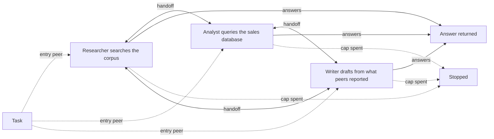
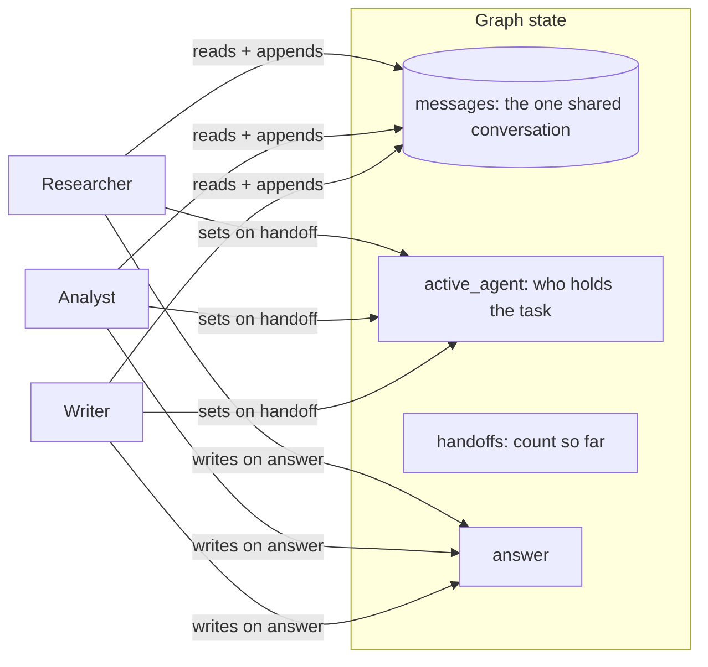

# Swarm

## What it is

A swarm is a multi-agent system with no router. Several peers, each with their
own tools and their own slice of expertise, share one conversation, and
whoever is currently holding the task decides -- inside its own turn -- whether
to keep working, hand the task to another peer, or answer. A handoff is just a
tool call: the peer names who should take over and why, and the runtime moves
control there. There is no third agent reading reports and picking a route,
and no agent that is "in charge" for the whole run; authority moves with the
task itself.

This buys something a supervised system cannot: zero routing overhead. A peer
that already knows it needs another specialist says so in the same call that
produced everything else it did that turn -- no separate decision, no separate
prompt, no separate LLM call spent purely on "who goes next." It also removes
a single point of failure: nothing breaks the whole run just because one
agent's judgement about routing was bad, because no one agent owns that
judgement. The cost is the mirror image of a supervisor's cost: nobody is
watching the shape of the whole run. A peer only ever decides its own next
move, so nothing catches two peers handing the task back and forth for no
reason, and nothing but a shared cap stops it. Every peer also has to be
trusted to decide competently *and* to recognise when it's the wrong peer for
what's left -- a supervisor at least separates "do the work" from "decide who
does it next" into two different judgements; a swarm asks every peer to make
both, on every turn.

## Control flow

There is no hub node. Whichever peer starts holding the task (the entry peer,
picked in the sidebar) can hand off to either of the other two, who can hand
off again, including straight back to where the task started.

## State and memory

There is no checkpoint and no long-term memory -- like Step 9, the graph runs
start to finish in one call, and every field above lives only in `StateGraph`
state for that one run. The difference from Step 9 is what `messages` holds:
there, each worker got a fresh prompt built from a reports board; here, every
peer reads the actual conversation, including another peer's own tool calls
and results, not a summary of them.

## Strengths

- **No routing overhead.** A peer that already knows it needs another
  specialist says so inside the same call that did the rest of its turn --
  no separate decision, no separate LLM call spent purely on choosing who
  goes next.
- **No single point of failure for routing.** Nothing about the shape depends
  on one agent's judgement of the whole run; a peer only ever has to judge its
  own next move.
- **Context carries forward untouched.** Because every peer reads the same
  conversation, a peer that receives the task already has the full trail
  another peer left -- not a summary of it, the actual tool calls and results.
- **Naturally cheap for short hand-offs.** A task that needs one quick fact
  from another peer costs exactly one handoff, with nothing else in the loop
  to pay for.

## Limitations

- **Nothing watches the shape of the whole run.** No agent has the job Step
  9's supervisor has -- noticing that the task is going in circles. Two peers
  handing the task back and forth is indistinguishable, from either peer's own
  point of view, from real progress.
- **The handoff cap is the only backstop, and it is soft by design.** Reaching
  it doesn't stop the run -- it refuses the next transfer and hands the
  refusal back as a tool error, same as any other tool failure. A peer that
  can't recover from that keeps trying anyway, and only the shared step cap
  (or token or deadline cap) actually ends it. See "Nobody may answer" below.
- **Every peer needs the same judgement a supervisor would have needed.**
  Deciding *and* recognising when someone else should decide are one skill
  here, asked of every peer, every turn -- there's no separation of concerns
  to fall back on if a peer's judgement is weak.
- **Provider compatibility is not guaranteed.** Because the shared history
  includes tool calls bound to a peer other than the one currently answering
  (the researcher's `search_corpus` call is still in the conversation when the
  analyst is holding the task, even though the analyst was never given that
  tool), a provider that validates function-call names against its own
  declared tool set on replay could reject the turn. See "In this demo" below.

## Where to use it

Use it where the specialists themselves are genuinely better placed than any
outside router to decide who picks up the task next -- peer review, or work
where the next right move only becomes obvious once you're holding the
context, not before. Reach for Step 9 (Supervisor-worker) instead when the
task benefits from one place that can see the whole route and decide when
it's actually done; reach for Step 8 (Sub-agent delegation) when one agent
should keep doing most of the task itself and only hand off the occasional
bounded, self-contained piece.

## In this demo

- **LangGraph `StateGraph`, hand-built**, for the same reason as Step 9: each
  peer's own tool loop is its own node with its own prompt, and
  `Command`-based routing (a node returning `Command(goto=<peer>, update=...)`
  to name its own successor) has no `create_agent` equivalent.
- **Handoffs are hand-rolled, not `langgraph-swarm`.** That package is not a
  pinned dependency (see the plan's Step 10 entry) -- adding it would hide the
  three lines of mechanism (a `transfer_to_<peer>` tool bound alongside each
  peer's own tools, and the node returning `Command(goto=target)` when that
  tool is called) this demo exists to show, the same reasoning Step 1 (ReAct)
  used to write its own loop by hand instead of using `create_agent`.
- **Peers and their tools:** researcher gets `search_corpus`; analyst gets
  `describe_schema` and `run_sql`; the writer gets no work tools. Every peer
  also holds `transfer_to_<peer>` for each of the other two. No `web_search`
  (presets stay deterministic, same reasoning every earlier demo uses).
- **Provider fallback** follows the exact `StateGraph` variant Step 3 and Step
  9 established: each model is bound to its own peer's tool set *first*, and
  the bound models are chained with `.with_fallbacks(...)` afterwards, because
  `RunnableWithFallbacks` doesn't forward `bind_tools()`.
- **Budget:** every model call anywhere in the graph is one step against the
  shared caps, exactly like Step 9. `SWARM_MAX_HANDOFFS` (default 6) is
  enforced differently from Step 9's hop cap, though: it is *soft*. Reaching
  it does not override anything in code -- the refused transfer comes back to
  the peer holding the task as a structured tool error (`ERROR[refused]: ...`,
  the same protocol every tool failure uses), which the peer has to recover
  from like any other error. The shared step cap is the actual backstop.
- **"Nobody may answer"** (sidebar) tells every peer, in its system prompt,
  that it may never reply with a final answer -- only hand off. There is no
  schema to remove an option from here (a peer's choice is free-form tool
  calling, not structured output the way Step 9's supervisor route is), so
  this is enforced by instruction rather than by removing a literal from a
  type. In practice this reliably produces a long ping-pong that the handoff
  cap's refusals do not stop (peers keep trying to hand off anyway), and the
  shared step cap ends the run -- the swarm equivalent of Step 9's "Supervisor
  can't declare done," demonstrated by a softer mechanism because there's no
  central schema to strip the option from.
- **Provider compatibility risk (see Limitations):** the shared `messages`
  list means a peer sometimes sees another peer's tool calls for tools it was
  never bound to. Every `ToolMessage` still immediately follows its matching
  `AIMessage`'s tool call, which is what OpenAI- and Groq-style APIs actually
  require on replay, and both have been used to build and check this demo.
  Gemini has not been checked against this shape; if it rejects a replayed
  call to a tool it wasn't given, the run fails softly through the same
  `except Exception` in `run()` every other demo uses (a clear "could not
  finish" message, never a stack trace) rather than crashing the page. If this
  turns out to bite in practice, the fix is to change how each peer's prompt
  is built -- turning other peers' tool-call/result pairs into plain-text
  lines for a peer that wasn't given that tool -- without touching the shared
  state itself.
- **Entry peer** (sidebar) picks who starts holding the task -- who goes first
  matters in a swarm the way it never does in Step 9, where the supervisor
  always starts. Preset 1 pairs with researcher, preset 2 with analyst.
- **No checkpointer.** Nothing in this demo pauses -- a run is one call to
  `compiled.invoke()` start to finish -- so there is no `resume()`.
- **Storage:** finished runs go to the `swarm_runs` collection in
  `genai_agentic_lab`. `Clear my data` empties it.
- **Tracing:** `run()` carries Langfuse's `@observe` decorator, a no-op
  passthrough when no Langfuse keys are set.
