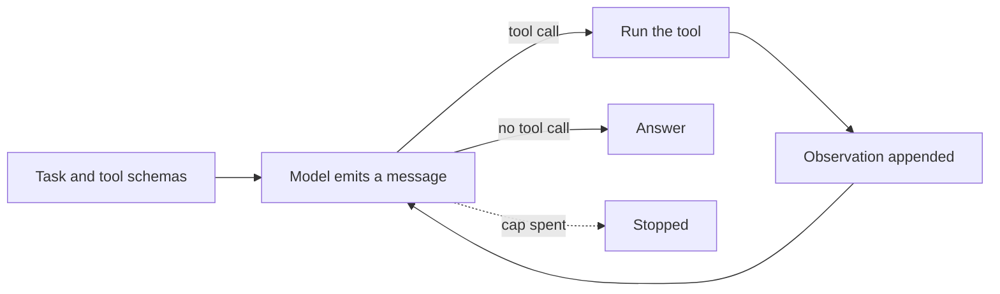
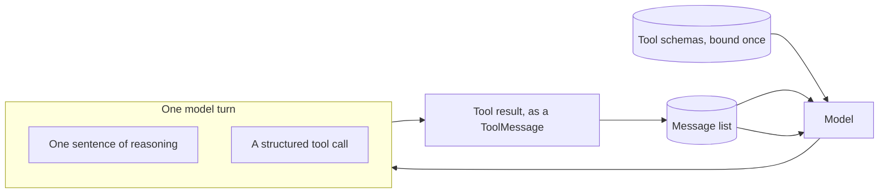

# Tool design

## What it is

An agent only knows a tool exists through the text a model reads about it: its
name, the shape of its arguments, and a sentence or two of description. A
tool-calling API turns that description into a JSON schema and offers it to the
model alongside every other tool, and the model picks one (or none) based on
nothing but that surface — it has never seen the function behind it and never
will.

That makes tool design a language design problem, not a plumbing problem. A
name that states the domain (`run_sql` rather than `lookup`) removes a guess. An
argument that is typed and named (`sql: str` rather than a generic `input: str`)
removes a translation step the model would otherwise perform badly. A
description that says what the tool is *for* is only half the job; the more
useful half is often what it is *not* for, because two tools that could plausibly
apply to the same request are where selection actually fails. And what a failed
call looks like matters as much as what a successful one does: an error that
names the problem and suggests a different call is something a model can act on
directly, while a bare `"Error."` gives it nothing to revise.

None of this is unique to any one framework. It is exactly as true of a
hand-written ReAct prompt (Step 1) as it is of a tool-calling API — the surface
just moves from prose in a prompt to a JSON schema the framework builds for you.
Getting it right earns back many of the failures agent design otherwise spends
effort compensating for after the fact: added examples, longer system prompts,
retry logic around a tool the model kept reaching for by mistake.

## Control flow

## State and memory

There is no separate transcript string to parse, the way ReAct has one — LangGraph
keeps the run as a list of typed messages (`HumanMessage`, `AIMessage` with
`tool_calls`, `ToolMessage`), and the model reasons over that list directly on
every turn. The schemas are bound once, before the first call, and sent again
with every subsequent one; nothing here is remembered between runs.

## Strengths

- **The lesson isolates cleanly.** Same model, same task, same budget, same
  underlying sandboxed functions — the only variable is the toolset, so a
  difference in behaviour is attributable to it and nothing else.
- **A good toolset compounds.** A precise name and a description that states the
  boundary reduce wrong picks on the first call; a structured error reduces them
  on the second, because the model gets something to act on rather than a dead
  end.
- **It generalises past this demo.** Every later demo in this lab hands a model
  a toolset; the naming, schema and error habits this page argues for are used,
  not just described, everywhere `core.tools` is wired up from here on.

## Limitations

- **Tool design cannot fix task ambiguity.** A precisely named toolset still
  fails on a task that genuinely admits two readings; good tool design narrows
  *which* tool gets picked, not *whether* the task itself was clear.
- **More tools cost more regardless of quality.** Every schema bound to the
  model is tokens spent on every call, and a longer tool list is a harder
  selection problem even when every entry in it is well-designed — the "Crowd
  both toolboxes" toggle on this page makes that cost visible on a toolset that
  is otherwise fine.
- **A capable model can paper over a bad toolset on an easy task.** A single run
  is stochastic; the presets on this page are chosen so the ambiguity in the
  first-draft toolset actually bites, but neither side is guaranteed to fail or
  succeed on any one run, and both are worth re-running.
- **The comparison table's metrics are heuristics, not ground truth.** "Off-task"
  is measured against one task's declared expectation, not a general notion of
  correctness, and a model that reaches the right answer by a route this table
  scores poorly is a real possibility (Step 16 exists because trajectory
  quality and outcome quality are genuinely different measurements).

## Where to use it

Spend the design effort here before reaching for anything more elaborate — a
better toolset is the cheapest fix available to almost every agent failure that
looks like "it called the wrong thing" or "it couldn't recover from an error."
Treat a tool's name, argument schema, and error text as much a part of the
product as the function behind it, because it is the only part of that function
the model ever actually sees.

Do not expect tool design alone to fix a task that is genuinely underspecified,
or a toolset that is missing the capability the task actually needs — those need
a clearer task and a new tool, respectively, not a better description of an
existing one.

## In this demo

- **Framework:** LangChain `create_agent`, unlike Step 1's hand-written loop —
  the schema goes to the model as JSON via `bind_tools()`, and the reply's
  `tool_calls` field replaces the parser. Budget accounting moves from a
  `while` loop into three middleware hooks: `before_model` calls
  `budget.check()` before every model call and jumps the graph to `end` when a
  cap is spent; `wrap_model_call` times the call and charges its tokens;
  `wrap_tool_call` charges one tool call and is also where fault injection
  happens.
- **Model:** `core.llm.agent_models()`, unpacked as `primary, *rest` and passed
  to `create_agent` with `ModelFallbackMiddleware(*rest)` — `create_agent`
  needs a real `BaseChatModel` for `bind_tools()`, which the wrapper
  `get_chat_model()` returns does not forward. See `core/llm.py`.
- **The two toolsets**, in `toolsets.py`, both wired to the same four
  `core.tools` functions (`search_corpus`, `describe_schema`, `run_sql`,
  `web_search`) — no new tool is added to the shared toolbox. **Revised** is
  `Toolbox.as_langchain_tools()`: the precise names, typed arguments,
  descriptions and structured `ERROR[kind]: ... Hint: ...` errors `core.tools`
  already has. **First draft** wraps the same functions behind `query`,
  `get_data`, `lookup` and `search` — one free-text `input: str` argument each,
  a description with no guidance on when to use or avoid the tool, `get_data`
  ignoring its argument entirely, and every error flattened to the single word
  `"Error."`.
- **Fault injection** (**Break the first tool call**, sidebar): the first tool
  call on *both* sides is diverted to `core.tools`' `boom` tool, which always
  raises. The revised side sees the real `ERROR[failed]: ... Hint: ...`; the
  first draft sees `"Error."` — the same failure, with the actionable half
  removed.
- **Decoy tools** (**Crowd both toolboxes**, sidebar): six tools (`fetch`,
  `check`, `find`, `read_info`, `get_details`, `list_all`) that do nothing —
  no sandboxed resource behind them, a fixed stub reply — added identically to
  both sides, so the cost of tool count is observed apart from the
  naming/schema/error comparison.
- **Presets** cover a corpus-only task, a three-step corpus → schema → SQL
  chain where `lookup` reliably receives English where SQL belongs, and a short
  task meant to be re-run with fault injection on, for the recovery contrast on
  its own.
- **Comparison table**, built in this folder rather than `core/` (moves there
  the day a second demo needs it): tool calls, LLM calls, steps, tokens,
  elapsed time, errored calls, repeated identical calls, off-task calls against
  the preset's declared expectation, and recoveries (an error observation that
  was not the run's last step).
- **Budget:** each side gets its own `Budget` with the same caps from
  `core/config.py` (`AGENT_MAX_STEPS` 12, `AGENT_MAX_TOKENS` 60000,
  `AGENT_DEADLINE_S` 180), overridable per run in the sidebar — caps are per
  side, not split between them, so a two-run click can cost up to twice one
  side's spend.
- **Storage:** both runs land in the `tool_design_runs` collection as separate
  records, told apart by their steps' `agent` field (`"first draft"` /
  `"revised"` -- every `Step` a run adds carries it). No
  checkpoint and no long-term memory — this demo cannot pause and does not
  implement `resume()`. `Clear my data` empties `tool_design_runs`.
- **Tracing:** both runs pass `core.tracing.get_callbacks()` into
  `agent.stream()`, Langfuse's LangChain callback handler — a no-op when no
  Langfuse keys are set.
- **Caveat:** the two runs execute sequentially and each is wrapped in its own
  `try/except` inside `_run_side()`, so a rate limit or an unconfigured
  provider on one side still lets the other render rather than losing the whole
  page.
