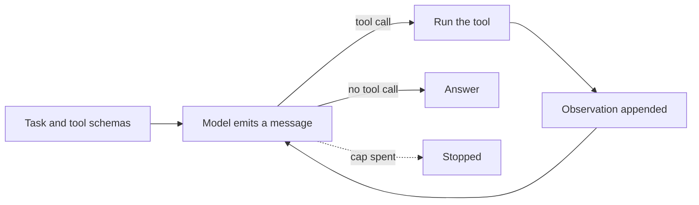
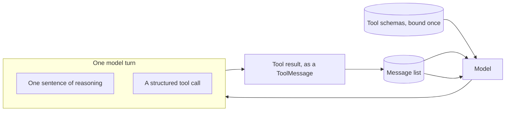

# Tool design

## What it is

A model only knows a tool through the text it reads about it: a **name**, the
**arguments** it takes, and a short **description**. It never sees the code
behind it. So how you describe a tool decides whether the model picks it and
calls it correctly.

Good tool design means clear names (`run_sql`, not `lookup`), typed and named
arguments, descriptions that say when *not* to use the tool, and errors that
explain what went wrong and what to try instead. A bare `"Error."` gives the
model nothing to fix.

## Control flow

## State and memory

The run is a list of typed messages, not one text string. Tool schemas are sent
with every call; nothing is kept between runs.

## Strengths

- **Cheapest fix available.** Better names and descriptions cut wrong tool picks
  without changing the model or the loop.
- **Helps on every call.** Clear boundaries prevent wrong first picks; clear
  errors help the model recover on the next try.
- **Works everywhere.** The same habits apply to a text prompt and to a
  tool-calling API.
- **Easy to test.** Change only the toolset, keep everything else fixed, and
  compare.

## Limitations

- **Can't fix an unclear task.** If the task can be read two ways, good tools
  won't decide which one was meant.
- **More tools cost more.** Every schema is sent on every call, and a longer
  list is harder to choose from even when each tool is well made.
- **Hard to measure from one run.** Runs vary, and a strong model can get past a
  bad toolset on an easy task.
- **Can't add a missing capability.** If no tool can do the job, a better
  description of the existing ones won't help.

## Where to use it

- The first fix to try when an agent calls the wrong tool or can't recover from
  an error.
- Any time you give a model tools: treat the name, schema and error text as part
  of the product.
- Not a fix for an underspecified task (clarify the task) or a missing
  capability (add a tool).

## In this demo

- **Framework:** LangChain `create_agent`, unlike Step 1's hand-written loop.
  Schemas go to the model as JSON via `bind_tools()`; the reply's `tool_calls`
  replace the parser. The run is kept as `HumanMessage`, `AIMessage` (with
  `tool_calls`) and `ToolMessage`; schemas are bound once. Budget runs in three middleware hooks: `before_model`
  calls `budget.check()` and jumps to `end` when a cap is spent;
  `wrap_model_call` times the call and charges tokens; `wrap_tool_call` charges
  one tool call and does fault injection.
- **Model:** `core.llm.agent_models()`, unpacked as `primary, *rest`, with
  `ModelFallbackMiddleware(*rest)`. `create_agent` needs a real `BaseChatModel`
  for `bind_tools()`, which the `get_chat_model()` wrapper doesn't forward. See
  `core/llm.py`.
- **Two toolsets** in `toolsets.py`, both over the same four `core.tools`
  functions (`search_corpus`, `describe_schema`, `run_sql`, `web_search`); no
  new tool is added. **Revised** is `Toolbox.as_langchain_tools()`: precise
  names, typed arguments, clear descriptions and `ERROR[kind]: ... Hint: ...`
  errors — the same toolbox every later demo wires up. **First draft** uses `query`, `get_data`, `lookup`, `search`: one
  free-text `input: str` each, no when-to-use guidance, `get_data` ignores its
  argument, and every error is just `"Error."`.
- **Break the first tool call** (sidebar): the first call on both sides goes to
  `core.tools`' `boom`, which always raises. Revised sees the real
  `ERROR[failed]: ... Hint: ...`; first draft sees `"Error."`.
- **Crowd both toolboxes** (sidebar): adds six do-nothing decoys (`fetch`,
  `check`, `find`, `read_info`, `get_details`, `list_all`) with a fixed stub
  reply to both sides, so tool count is tested on its own.
- **Presets:** a corpus-only task; a corpus → schema → SQL chain where `lookup`
  reliably gets English instead of SQL; and a short task to re-run with fault
  injection on. Neither side is guaranteed to win on one run — re-run both.
- **Comparison table** (built in this folder, not `core/`): tool calls, LLM
  calls, steps, tokens, time, errored calls, repeated identical calls, off-task
  calls (against the preset's expected tools) and recoveries (an error that
  wasn't the last step). These are heuristics: off-task is judged against one
  preset's expectation, and a run can score badly yet still answer correctly
  (see Step 16).
- **Budget:** each side gets its own `Budget` with the `core/config.py` caps
  (`AGENT_MAX_STEPS` 12, `AGENT_MAX_TOKENS` 60000, `AGENT_DEADLINE_S` 180),
  changeable in the sidebar. Caps are per side, so one click can cost up to
  twice one side's spend.
- **Storage:** both runs go to `tool_design_runs` as separate records, told
  apart by each step's `agent` field (`"first draft"` / `"revised"`). No
  checkpoint, no long-term memory, no `resume()`. `Clear my data` empties
  `tool_design_runs`.
- **Tracing:** both runs pass `core.tracing.get_callbacks()` (Langfuse's
  LangChain handler) into `agent.stream()`; it does nothing without Langfuse
  keys.
- **Caveat:** the runs go one after the other, each in its own `try/except` in
  `_run_side()`, so a failure on one side still lets the other render.
